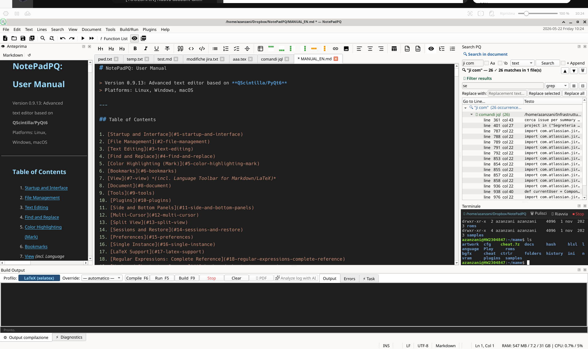

# NotePadPQ: User Manual

> Version 0.9.13: Advanced text editor based on **QScintilla/PyQt6**
> Platforms: Linux, Windows, macOS

---

## Table of Contents

1. [Startup and Interface](#1-startup-and-interface)
2. [File Management](#2-file-management)
3. [Text Editing](#3-text-editing)
4. [Find and Replace](#4-find-and-replace)
5. [Color Highlighting (Mark)](#5-color-highlighting-mark)
6. [Bookmarks](#6-bookmarks)
7. [View](#7-view) *(incl. Language Toolbar for Markdown/LaTeX)*
8. [Document](#8-document)
9. [Tools](#9-tools)
10. [Plugins](#10-plugins)
11. [Side and Bottom Panels](#11-side-and-bottom-panels)
12. [Multi-Cursor](#12-multi-cursor)
13. [Split View](#13-split-view)
14. [Sessions and Restore](#14-sessions-and-restore)
15. [Preferences](#15-preferences)
16. [Single Instance](#16-single-instance)
17. [LaTeX Support](#17-latex-support)
18. [Regular Expressions: Complete Reference](#18-regular-expressions-complete-reference)
19. [Keyboard Shortcuts: Summary](#19-keyboard-shortcuts-summary)
20. [LSP: Language Server Protocol](#20-lsp-language-server-protocol)
21. [AI Assistant](#21-ai-assistant)
22. [Spreadsheet](#22-spreadsheet)
23. [Rich Text Editor](#23-rich-text-editor)
24. [Search PQ](#24-search-pq)
25. [Terminal](#25-terminal)

---

## 1. Startup and Interface

```bash
python main.py                    # opens with previous session or empty tab
python main.py file1.py file2.md  # opens the specified files
```

If NotePadPQ is already open, files are sent to the existing session without opening a second one; see [section 16](#16-single-instance).

The interface consists of:

- **Menubar**: File / Edit / Search / View / Document / Tools / Plugins / Help (the **Help → Manual** entry opens this manual in the editor as a normal tab; **F1** opens context-sensitive help for the word under the cursor)
- **Toolbar**: common actions with icons (icon set selectable: Lucide, Material, System)
- **Tab bar**: one tab per open file; modified files show `*` in the title
- **Editor**: main text area with syntax highlighting, line numbers, fold margin, symbol margin (bookmarks)
- **Statusbar**: line/column, encoding, line ending, zoom, insert mode; with selected text shows `(selection: N chars / M bytes, K lines)`
- **Dock panels**: File Browser, Project Manager, Function List, Preview, Build and Terminal panel

---

## 2. File Management

| Action | Shortcut |
|---|---|
| New file | `Ctrl+N` |
| Open file | `Ctrl+O` |
| Open selected file in editor | `Shift+Ctrl+O` |
| Save | `Ctrl+S` |
| Save as | (nessuna) |
| Save all | `Shift+Ctrl+S` |
| Reload from disk | `Shift+Ctrl+R` |
| File properties | `Shift+Ctrl+V` |
| Print | `Ctrl+P` |
| Close tab | `Ctrl+W` |
| Close all | `Shift+Ctrl+W` |
| Exit | `Ctrl+Q` |

### Recent Files
**File → Recent Files** shows the last opened files. Click to reopen. The maximum count is configurable in Preferences.

### New from Template
**File → New from Template** creates a file with a ready-made header for: Python, HTML, LaTeX, Markdown, Bash, C/C++, JavaScript.

### Drag & Drop
Drag one or more files directly onto the window or editor to open them.

### External Change Detection
NotePadPQ monitors open files and responds in two distinct ways:

**File modified by another program**: a dialog appears with three options:
- **Reload**: discard local changes and reload from disk
- **Compare**: opens the Compare dialog between the in-memory version and the version on disk
- **Overwrite**: writes the in-memory version to disk

**File deleted from disk**: a separate dialog appears ("File X has been deleted") with two options:
- **Close tab**: closes the corresponding tab
- **Keep open** *(default)*: the tab stays open with the in-memory content (not saved to disk)

---

## 3. Text Editing

### Basic Operations

| Action | Shortcut |
|---|---|
| Undo | `Ctrl+Z` |
| Redo | `Ctrl+Y` |
| Cut | `Ctrl+X` |
| Copy | `Ctrl+C` |
| Paste | `Ctrl+V` |
| Select all | `Ctrl+A` |
| Delete selection | `Del` |
| Copy file path | (none) |
| Copy file name | (none) |
| Insert date/time | (none) |
| Word count | (none) |
| Word frequency | (none) |
| Sort lines (dialog) | (none) |
| Column Editor | `Alt+C` |

**Copy file path / Copy file name**: copies the full path of the current file, or just the filename (without directory), to the clipboard. Useful for pasting into a terminal or another document.

**Insert date/time**: inserts the current date and time at the cursor position in ISO format `YYYY-MM-DD HH:MM:SS` (e.g. `2026-05-12 14:30:00`).

**Word count**: shows a dialog with the number of characters, words, and lines. If text is selected, counts only the selection; otherwise counts the entire document.

### Word Frequency

**Edit → Word Frequency** analyzes the document (or selection) and shows a table with the top 50 most frequent words sorted by occurrence count. The dialog also reports the total number of words and the number of distinct (unique) words. Words are compared case-insensitively. Useful for detecting redundancy in technical or literary texts.

### Sort Lines

**Edit → Sort Lines** opens a dialog with five sorting criteria:

| Criterion | Effect |
|---|---|
| Alphabetical ascending (A→Z) | Standard lexicographic order |
| Alphabetical descending (Z→A) | Reverse order |
| By length ascending | Shorter lines first |
| By length descending | Longer lines first |
| Random | Shuffle lines randomly |

The sort applies to the selection (if active) or the entire document.
Additional line operations (remove duplicates, remove empty lines, etc.) are in **Tools → Line Operations**.

### Column Editor (`Alt+C`)

Opens a dialog to insert values on multiple lines at the same column position. The insertion column is determined by the starting column of the current selection (or the cursor position if there is no selection). The dialog has two modes:

**Numbers mode**: generates a numeric sequence with the following options:
- **Initial value**: the number to start from (can be negative)
- **Increment**: how much to increase (or decrease) per line
- **Format**: Decimal, Hexadecimal, Octal, Binary
- **Padding**: minimum width with leading zeros (e.g. padding=3 → `001`, `002`)
- **Prefix / Suffix**: text added before/after each number (e.g. prefix `0x` → `0x1A`)

**Text mode**: inserts the same fixed text on all lines in the selected range.

A real-time preview shows the values that will be inserted before you confirm.

### Text Formatting

Accessible from **Edit → Format**:

| Action | Shortcut |
|---|---|
| Join lines | (none) |
| Hard wrap | (none) |
| Break long lines at N columns | (none) |
| UPPERCASE | (none) |
| lowercase | (none) |
| Title Case | (none) |
| Invert case | `Ctrl+Alt+U` |
| Toggle comment | `Ctrl+E` |
| Comment lines | (none) |
| Uncomment lines | (none) |
| Indent | `Ctrl+Shift+I` |
| Unindent | `Ctrl+U` |
| Smart indentation | (none) |
| Remove trailing spaces | (none) |
| Tabs to spaces | (none) |
| Spaces to tabs | (none) |
| Bold (Markdown/LaTeX) | `Ctrl+B` |
| Italic (Markdown/LaTeX) | `Ctrl+I` |
| Strikethrough (Markdown/LaTeX) | `Ctrl+Shift+X` |
| Wrap in Environment / HTML Tag | `Alt+E` |
| Align Table (Markdown/LaTeX) | `Alt+T` |

> **Note: Word wrap vs. Break lines**
> **View / Document → Word wrap** (`Alt+Z`) is a display option: text appears wrapped on screen without modifying the file.
> **Edit → Format → Break long lines** physically inserts `\n` into the text; the file is modified. Use with care.

#### Formatting operations in detail

**Join lines**: merges all selected lines into a single line, joining them with a space. Empty lines are ignored. Operates on the selection or the entire document if there is no selection. Example: three lines `alpha`, `beta`, `gamma` become `alpha beta gamma`.

**Hard wrap (line break)**: inserts a newline character (`\n`) at the exact cursor position, pushing the text to the right onto the next line. Equivalent to pressing Enter, but accessible as a menu action (useful in macros).

**Break long lines at N columns**: opens a dialog asking for the target column width (default 80, min 20, max 500). Reflows the selected text (or the entire document) distributing words across lines so that none exceeds the specified width. Paragraphs separated by blank lines are preserved as separate blocks. This operation **physically modifies the file**, unlike "Word wrap".

**UPPERCASE**: converts all selected text to uppercase. Example: `Hello World` → `HELLO WORLD`. Has no effect without a selection.

**lowercase**: converts all selected text to lowercase. Example: `Hello World` → `hello world`.

**Title Case**: capitalizes the first letter of every word and lowercases the rest. Example: `hello beautiful world` → `Hello Beautiful World`.

**Invert case** (`Ctrl+Alt+U`): swaps uppercase and lowercase character by character in the selected text. Example: `Hello` → `hELLO`, `ALPHA beta` → `alpha BETA`. Particularly useful for correcting text accidentally typed with CAPS LOCK on.

**Toggle comment** (`Ctrl+E`): inspects the first selected line (or the current line) to automatically decide whether to comment or uncomment the entire selection:
- If the first line is already commented → removes the comment from all selected lines
- If the first line is not commented → adds a comment to all selected lines

The comment prefix depends on the current file's language:

| Language | Prefix |
|---|---|
| Python, Bash, Ruby, R | `#` |
| C, C++, Java, JavaScript, TypeScript | `//` |
| LaTeX | `%` |
| SQL, Lua, Haskell | `--` |
| VHDL | `--` |

Indentation is preserved: the comment is inserted after the leading whitespace, not at the absolute start of the line. Empty lines are skipped.

**Comment lines**: always adds the comment prefix to the selected lines, regardless of their current state. Unlike the toggle, it does not check whether lines are already commented.

**Uncomment lines**: removes the comment prefix from the selected lines (if present). Has no effect on lines that are not commented.

**Indent** (`Ctrl+Shift+I`): adds one indentation level to the current line. With a multi-line selection, indents all lines in the selection. The indentation width (tabs or spaces) follows the document settings (Document → Indentation type and Indentation width).

**Unindent** (`Ctrl+U`): removes one indentation level from the current line or all selected lines, respecting the configured tab width.

**Smart indentation**: adapts the current line's indentation to the surrounding code context using QScintilla's native auto-indent engine. Useful for realigning a line after manually moving it.

**Remove trailing spaces**: scans every line of the document (or the selection) and removes all spaces and tabs at the end of the line, before the line terminator. Does not affect line content or leading indentation. This operation can also run automatically on save via the preference "Remove trailing spaces on save".

**Tabs to spaces**: converts every tab character (`\t`) to N spaces, where N is the tab width configured for the current document (shown in the status bar and adjustable from Document → Indentation width). Operates on the entire document.

**Spaces to tabs**: opens a dialog asking for the tab size to use. Converts groups of leading spaces on each line into tabs: only indentation spaces at the start of the line are converted; spaces in the middle of the text are left unchanged. Incomplete groups (e.g. 3 spaces with tab size 4) remain as spaces.

**Bold** (`Ctrl+B`): wraps the selected text in the appropriate markup for the current language:
- **Markdown**: `**selected text**`
- **LaTeX**: `\textbf{selected text}`

Without a selection, inserts empty delimiters (`****` or `\textbf{}`) and places the cursor inside, ready to type. Has no effect on other file types.

**Italic** (`Ctrl+I`): works like Bold but for italic:
- **Markdown**: `*text*`
- **LaTeX**: `\textit{text}`

**Strikethrough** (`Ctrl+Shift+X`): applies strikethrough formatting:
- **Markdown**: `~~text~~`
- **LaTeX**: `\sout{text}` (requires `\usepackage{ulem}` in the preamble)

**Wrap in Environment / HTML Tag** (`Alt+E`): asks for an environment name (LaTeX) or tag name (HTML). Based on the file type:
- **LaTeX** (and by default): generates `\begin{name}` ... `\end{name}` with the selected text indented by 4 spaces inside
- **HTML / Markdown**: generates `<name>` ... `</name>`

Without a selection, creates the empty environment and positions the cursor on the indented inner line, ready for typing. Example: typing `itemize` in a LaTeX file with text selected produces:
```latex
\begin{itemize}
    selected text
\end{itemize}
```

**Align Table** (`Alt+T`): aligns the columns of a selected table vertically by padding each cell with spaces to match the widest cell in its column. The separator is chosen automatically:
- **Markdown**: separator `|`; the separator row (`|---|---|`) is extended with dashes
- **LaTeX**: separator `&`; the row terminator `\\` is preserved
- **Generic files and plain text**: the separator is auto-detected by counting which of `|`, `&`, or `tab` appears most in the selected lines

You must select the table rows before activating this function. If no recognizable separator is found in generic text, a warning appears in the status bar.

### Auto-close Brackets
**Edit → Auto-close Brackets** (toggle): automatically closes `(`, `[`, `{`, `"`, `'` when you type them.

---

## 4. Find and Replace

### Command Palette (`Ctrl+Shift+P`)

Opens a fuzzy-search palette over all editor commands. Type any word from the command name, navigate with `↑`/`↓`, press `Enter` to execute. Useful for accessing functions without memorizing shortcuts.

### Goto Anything (`Ctrl+Shift+G`)

Sublime Text-style quick navigation. Opens a palette that behaves differently based on the prefix typed:

| Prefix | Behavior |
|---|---|
| *(none)* | Fuzzy search among **open files** by name or path |
| `:42` | Jump to **line 42** in the current file |
| `@funcName` | Jump to **symbol** (def/class/function) in the current file |
| `>text` | Search among **commands** (like the Command Palette) |

Navigate with `↑`/`↓`, confirm with `Enter`, close with `Esc`.

### Find Dialog (`Ctrl+F`)

The dialog has 4 tabs.

#### Tab "Find"

**Available options:**

| Option | Effect |
|---|---|
| Case sensitive | Distinguishes `Foo` from `foo` |
| Whole word | Finds only `hello` and not `helloworld` |
| Regular expression | Enables Python regex syntax |
| Wrap search | Restarts from beginning/end at document end |
| In selection | Searches only within selected text |

**Buttons:**

- **Find Next**: finds the next occurrence (`F3`)
- **Find Previous**: finds the previous occurrence (`Shift+F3`)
- **Mark all**: highlights all occurrences with an orange border
- **Count**: populates the list with all occurrences and shows the total

**Occurrence list:**
Populated automatically while typing (after 2 characters) and via the Count button. Double-click on a row jumps to the corresponding position in the document.

**Regex manual:**
Appears automatically when "Regular expression" is activated; see also [section 18](#18-regular-expressions-complete-reference).

#### Tab "Replace"

Same options as the Find tab, plus:

- **Replace**: replaces the selected occurrence and moves to the next
- **Replace all**: replaces all occurrences in the document

In the "Replace with" field you can use `\1`, `\2`, ... to refer to regex capture groups.

#### Tab "Find in Files"

Search (and optionally replace) across all files in a directory, with extension filter and recursive option. Results show files and lines; double-click opens the file at the corresponding line.

The **Replace with** field enables two replacement modes:

- **↔ Replace in Files** — replaces all matches in every matching file (with a confirmation prompt before modifying files on disk). Files already open in the editor are updated automatically.
- **↻ Replace One by One** — opens each file and highlights every match in the editor; for each one you can choose **Replace**, **Skip**, **Replace All** (remaining without further prompts), or **Cancel**. Modified files are saved automatically when done.

#### Tab "Find in All Documents"

Search (and optionally replace) in all files open in tabs.

### Navigation

| Action | Shortcut |
|---|---|
| Go to line | `Ctrl+G` |
| Go to matching bracket | `Ctrl+]` |
| Inline incremental search | `Ctrl+Shift+F2` |

---

## 5. Color Highlighting (Mark)

Accessible from **Search → Highlight in [color]** or with shortcuts:

| Shortcut | Color |
|---|---|
| `Ctrl+1` | Red |
| `Ctrl+2` | Green |
| `Ctrl+3` | Blue |
| `Ctrl+4` | Orange |
| `Ctrl+5` | Purple |
| `Ctrl+0` | Remove all marks |

**How it works:**

- **With text selected**: highlights/removes the mark on the selected text (toggle)
- **Without selection**: marks all occurrences of the word under the cursor

Marks are independent: you can have red, green, and blue text simultaneously. Indicators draw a colored border **under** the text; text remains fully readable regardless of theme.

### Smart Highlight (automatic)

When the cursor rests on a word for more than 300ms, all its occurrences are automatically highlighted with a light grey-blue box. The system is optimized to not interfere with typing: it never triggers while writing, only updates when the word under the cursor changes, and uses a single pass over the text without slowing the editor even on large documents.

It is separate from the 5 manual colors and does not interfere with them.

**Enable/disable:** **Search → Automatic word highlight** (checkable item). The state is saved between sessions.

---

## 6. Bookmarks

Bookmarks mark lines of interest with a colored circle in the left margin of the editor.

| Action | Shortcut |
|---|---|
| Toggle bookmark on current line | `Ctrl+F2` |
| Toggle bookmark via click | Click on symbol margin |
| Next bookmark | `F2` |
| Previous bookmark | `Shift+F2` |
| Remove all bookmarks | Search menu |

Navigation is circular: from the last bookmark it goes back to the first and vice versa.
Bookmarks are saved in the session and restored when the file is reopened.

---

## 7. View

### Toolbar and Statusbar
**View → Toolbar** and **View → Status Bar**: show/hide.

### Editor Options

| Action | Shortcut |
|---|---|
| Line numbers | (nessuna) |
| Fold margin | (nessuna) |
| Show whitespace | (nessuna) |
| Show end of line (¶) | (nessuna) |
| Word wrap | `Alt+Z` |
| Minimap | (nessuna) |
| Typewriter scrolling | (nessuna) |
| Git Blame inline | (nessuna) |

> **Word wrap** is present both in **View** and **Document**: it is the same action; checking it in one menu updates the other automatically.

### Plain Text Mode (`Ctrl+Alt+N`)

**View → Plain Text Mode**: toggle per tab. When active, disables on the current tab:

- Syntax highlighting (lexer removed)
- Brace matching
- Smart highlight (word-under-cursor highlighting)
- Autocomplete

On deactivation, everything is restored to the file's original language. Each tab maintains its own independent state.

### Writing Mode: Distraction-Free (`F11`)

**View → Writing Mode**: hides everything except the editor and goes fullscreen:

- Toolbar hidden
- Status bar hidden
- Menu bar hidden
- All dock panels hidden
- Window in fullscreen mode

Press `F11` again (or `Ctrl+Shift+F11` or `Ctrl+F11`) to exit and restore the previous visibility of all elements. Ideal for focused writing sessions.

### Zoom

| Action | Shortcut |
|---|---|
| Zoom in | `Ctrl+=` |
| Zoom out | `Ctrl+-` |
| Reset zoom | `Ctrl+0` |

Also `Ctrl+Mouse wheel` directly in the editor.

### Minimap
The minimap is a proper dock panel, just like the File Browser, Preview, and other panels. It can be moved, floated, docked to any side (top, bottom, left, right), or detached as an independent window. Activate it from **View → Minimap**. Once visible, drag the title bar to reposition it like any other panel.

### Minimap: Hover Preview
When enabled (**View → Minimap: hover preview**, or in **Preferences → Editor**), holding the mouse still on the minimap for approximately 300ms shows a floating popup with a preview of the code at that position.

### Typewriter Scrolling
**View → Typewriter scrolling**: when active, the cursor line is always kept vertically centered on screen. Useful for long writing sessions.

### Git Blame Inline
**View → Git Blame inline**: shows, below the line where the cursor is positioned, the author, relative age ("3 days ago"), and commit message of the last git commit that touched that line. Uses QScintilla annotations. Only works on files inside a git repository. Can be toggled from the View menu or **Preferences → Editor**.

### Language Toolbar (`View → Language Toolbar`)

A context-sensitive toolbar that appears automatically when the open file is **Markdown** or **LaTeX**. It contains the most common formatting buttons for that format, using Lucide icons consistent with the main toolbar.

**Markdown** — buttons from left to right:

| Group | Buttons |
|---|---|
| Headings | H1, H2, H3 |
| Character formatting | Bold, Italic, Underline, Strikethrough |
| Blocks | Blockquote, Inline code, Code block |
| Lists | Bullet list, Numbered list, Task list, Horizontal rule (`---`) |
| Elements | Table, Link, Image |
| Alignment | Left, Center, Right |

All buttons operate on the current selection or insert a placeholder at the cursor. The toolbar updates automatically when a new file is opened or saved with the `.md` extension.

**LaTeX** — shows buttons for common environments (begin/end, align, equation, lists, tables, etc.) contextually.

### Preview (`F12`)
Opens the Preview panel alongside the editor. Supports:

- **Markdown**: HTML rendering in background, does not block the editor during typing. Supports LaTeX math formulas (`$...$`, `$$...$$`) via MathJax and Mermaid diagrams (` ```mermaid ` blocks) via Mermaid.js — both require an internet connection and are loaded automatically when present in the document. Mermaid rendering can be toggled in **Preferences → Preview**.
- **HTML**: direct preview in the integrated web widget
- **LaTeX**: navigable structure tree (sections, labels, figures, tables)
- **reStructuredText**: rendering via docutils
- **PDF**: display with PyMuPDF, page navigation, zoom, SyncTeX

The preview updates automatically with a configurable delay (default 500ms). It does not update when the panel is hidden (saves CPU).

### Hover Preview (mouse-over)

Holding the cursor still for half a second over certain elements, NotePadPQ shows a floating popup:

- **Images**: hover over `\includegraphics{...}`, ``, or `` to see an image preview. Supports PNG, JPG, and also the first page of vector PDF files.
- **Math equations**: in LaTeX and Markdown files, hover over a formula (`$E=mc^2$`, `$$...$$`, `\[...\]`, `\begin{equation}...\end{equation}`) to see it rendered at high resolution on a dark background.

> These features require the optional libraries `pymupdf` (for PDFs) and `matplotlib` (for equations); see [section 17](#17-latex-support).

---

## 8. Document

### Current Document Settings

- **Indentation type**: Tab or Spaces
- **Indentation width**: number of spaces
- **Auto-indent**: automatically re-indents the new line based on the previous one
- **Auto-indent on paste**: when pasting text with multiple lines (`Ctrl+V`), lines are re-aligned to the current context indentation. Can be disabled from the Document menu if not desired.
- **Read only**: blocks edits
- **Write BOM**: adds Byte Order Mark for UTF-8/UTF-16
- **Word wrap** (`Alt+Z`): wraps text on screen without modifying the file
- **Spell Check (`F4`)**: activates red squiggle underlines for misspelled words. The dictionary language is independent of the interface language and is selected from **Document → Dictionary Language** (Italian, English, German, French, Spanish). Right-clicking a highlighted word shows up to 8 correction suggestions, "Add to dictionary", and "Ignore all". Ignores all-caps acronyms and words shorter than 3 characters.
- **Dictionary Language**: Document submenu that selects the spell checker language independently of the interface language. The choice is saved between sessions.
- **Smart typography**: automatically converts "raw" characters to their proper typographic equivalents: `"..."` → `"..."`, `'...'` → `'...'`, `--` → `—`, `...` → `…`. Does not activate inside code blocks. Toggle from **Document → Smart typography** or from **Preferences → Editor → Writing**.
- **Paragraph focus**: dims all text outside the current paragraph (delimited by blank lines) to aid concentration. The dim color adapts to light/dark themes automatically. Toggle from **Document → Paragraph focus**. Updates in real time while typing and when switching tabs.
- **Toggle task (`Ctrl+Shift+L`)**: on a Markdown task list line (`- [ ] text` or `- [x] text`), toggles between completed and not completed. Works with `-`, `*`, `+` markers.

### File Type (Syntax Highlighting)

**Document → Set File Type**: manually select the highlighting language. NotePadPQ automatically detects the type from the file extension and shebang (`#!/usr/bin/env python3`).

The **Automatic** entry (at the top of the menu) re-runs automatic detection based on file extension, special filename (Makefile, Dockerfile, .gitignore...) and content (shebang, `<?xml`, `\\documentclass`, etc.).

**Languages with native QScintilla lexer** (fast, with code folding): Bash/Shell, Batch, C/C++, C#, CMake, CSS, Diff, Fortran, HTML, INI/Config, Java, JavaScript, JSON, LaTeX, Lua, Makefile, Markdown, Pascal, Perl, PostScript, Python, reStructuredText, Ruby, SPICE, SQL, TypeScript, Verilog, VHDL, XML, YAML.

**Additional languages via Pygments** (more precise syntax coverage): Dart, Elixir, Go, Haskell, Julia, Kotlin, PHP, R, Rust, Scala, Swift, TOML.

Opening a file with extension `.go`, `.rs`, `.php`, `.swift`, `.kt`, `.scala`, `.dart`, `.r`, `.toml`, `.hs`, `.ex`, `.jl` automatically activates the corresponding Pygments lexer.

### Encoding

**Document → Set Encoding**: changes the encoding for the next save. Supported encodings: UTF-8, UTF-8 BOM, Latin-1, CP1252, UTF-16 LE/BE, GB2312.

### Line Endings

**Document → Set Line Endings**: LF (Unix), CRLF (Windows), CR (Mac). You can also convert the current document's line endings to the new mode.

### Document Operations

| Action | Effect |
|---|---|
| Clone document | Opens a copy of the file in a new tab |
| Remove trailing spaces | Removes trailing spaces from every line |
| Tabs to Spaces | Converts tabs to spaces |
| Spaces to Tabs | Converts space groups to tabs |
| Fold all | Closes all foldable blocks |
| Expand all | Opens all foldable blocks |

---

## 9. Tools

### Preferences (`Ctrl+Alt+P`)
Opens the configuration dialog; see [section 15](#15-preferences).

### Build / Compile
Runs the command associated with the current file type and shows output in the "Build Output" panel.

| Action | Shortcut |
|---|---|
| Compile | `F6` |
| Build | `F7` |
| Stop build | Stop button in panel |

#### Build Profiles and Variables

Build profiles are configured from **Tools → Build Profiles**. Each profile associates a file type (e.g. `LaTeX`, `Python`, `Markdown`) with one or more commands (Compile, Build, Clean).

The following variables are available in commands, accepted in both `${VAR}` and `$(VAR)` form:

| Variable | Description | Example |
|---|---|---|
| `${FILE}` | Full file path | `/home/user/doc/thesis.tex` |
| `${DIR}` | Directory containing the file | `/home/user/doc` |
| `${FILENAME}` | File name with extension | `thesis.tex` |
| `${BASENAME}` | File name without extension | `thesis` |
| `${BASEFILE}` | Full path without extension | `/home/user/doc/thesis` |
| `${EXT}` | File extension (without dot) | `tex` |
| `${LINE}` | Current cursor line | `42` |
| `${COL}` | Current cursor column | `7` |

Example: LaTeX compilation with pdflatex:
```
pdflatex -interaction=nonstopmode -synctex=1 ${FILE}
```

Example: conversion with pandoc:
```
pandoc ${FILE} -o ${BASEFILE}.pdf
```

Example: script using directory and base name:
```
cd ${DIR} && python ${FILENAME}
```

Output appears in the bottom panel in real time. Errors are clickable; a click brings the cursor to the corresponding line in the source file.

### Macros

Record and replay keystroke sequences:

| Action | Function |
|---|---|
| Start/Stop recording | Records every key pressed in the editor |
| Play | Executes the macro once |
| Play N times | Executes the macro N consecutive times |
| Save to file | Saves the macro as a `.json` file |
| Load from file | Loads a saved macro |

### Other Tools

| Tool | Function |
|---|---|
| **Color Translator** | Select a color and view: HTML/CSS name, `#HEX` upper/lower, `rgb(r,g,b)`, `rgb(r%,g%,b%)`, `hsl(h,s%,l%)`; Insert and Copy buttons for each format |
| **Lorem Ipsum** | Generate placeholder text with options: number of paragraphs, sentences per paragraph, separator, classic first paragraph; preview and insert into document |
| **Regex Tester** | Interactive dialog to test regular expressions on sample text |
| **Numeric Converter** | Conversion between decimal, hexadecimal, binary, octal |
| **Column Statistics** | Statistical analysis of numeric values in the current column |
| **Shortcut Editor** | Customize keyboard shortcuts |
| **Named Sessions** | Save and restore groups of files as named sessions |

### Line Operations (Tools → Line Operations)

Advanced operations on document lines. Applied to the selection (if present) or the entire document.

**Sorting:**

| Entry | Effect |
|---|---|
| Sort A→Z | Ascending lexicographic order (case-sensitive) |
| Sort Z→A | Descending lexicographic order |
| Sort by length (↑) | Shorter lines first |
| Sort by length (↓) | Longer lines first |
| Sort randomly | Random permutation of lines |

**Duplicates:**

| Entry | Effect |
|---|---|
| Remove duplicates (sorted) | Removes duplicate lines after sorting; the result is sorted |
| Remove duplicates (original order) | Keeps the first occurrence of each line and removes subsequent ones, preserving original order |
| Remove unique lines | Keeps only lines that appear more than once (removes singletons) |
| Keep only unique lines | Keeps only lines that appear exactly once (removes duplicates) |

**Blank lines:**

| Entry | Effect |
|---|---|
| Remove empty lines | Deletes lines that contain no characters at all |
| Remove whitespace-only lines | Deletes lines composed entirely of spaces and/or tabs |

**Other:**

| Entry | Effect |
|---|---|
| Remove every N-th line | Opens a dialog asking for N, then deletes lines 1, 1+N, 1+2N, ... (useful for tabular data with periodic header rows) |

---

## 10. Plugins

Plugins are loaded automatically from the `plugins/` folder. To install them, copy them into `plugins/` or place them in `plugins_to_copy/` and re-run `setup.sh`.

All plugins show Lucide icons in the Plugins menu (same style as the main toolbar). If the icons have not been downloaded yet, use **Help → Download icons** or the banner that appears at startup.

| Plugin | Shortcut | Function |
|---|---|---|
| **Clipboard History** | `Ctrl+Shift+V` | Clipboard history with ability to paste previous items |
| **Compare & Merge** | `F7` | Visual side-by-side comparison of two files or tabs |
| **Database** | — | SQL client for SQLite, PostgreSQL, MySQL with AI query generation |
| **Encrypt/Decrypt** | `Ctrl+Shift+E` / `Ctrl+Shift+W` | AES-256-GCM and ChaCha20-Poly1305 encryption of selected text or the entire file |
| **FTP Browser** | — | Browse and edit files on FTP servers |
| **Rich Text Editor** | — | WYSIWYG editor for .docx, .odt, .rtf, .html powered by Jodit (see [section 23](#23-rich-text-editor)) |
| **Spreadsheet** | — | Full editor for CSV, XLSX, XLS, ODS (see [section 22](#22-spreadsheet)) |
| **Git Integration** | — | Full Git panel (see below) |
| **Hex Viewer** | `Ctrl+Alt+H` | View the current file in hexadecimal format |
| **PDF Viewer** | — | View PDF files in a dedicated tab |
| **Search PQ** | `Ctrl+Alt+F` | Advanced search and replace in the document: TEXT/REGEXP/LIKE modes, result queue, inline filter, replacement (see [section 24](#24-search-pq)) |
| **Terminal** | `Ctrl+Alt+N` | xterm.js terminal with native PTY as an independent dock panel (see [section 25](#25-terminal)) |
| **Web Search** | — | Web and Wikipedia search on selected text from the context menu |

### Git Plugin: Details

The Git panel (`Plugins → Git Panel`) updates automatically on tab change and detects the repository from the path of the open file. It has 5 tabs:

**Status**: list of modified files with color indicator (M=yellow, A=green, D=red, ?=grey). Right-click for: `git add`, `git reset HEAD`, `git checkout --`, open in editor, blame, open on GitHub/GitLab.

**Log**: last 60 commits with hash, date, author, message. Filterable by branch. Right-click for: show full diff, copy SHA, checkout, cherry-pick.

**Diff**: color-coded diff (green=added, red=removed, blue=hunk header) of the current file or the entire repo, with staged option.

**Branch**: list of local and remote branches. Double-click to checkout. Buttons: New, Merge, Rebase, Delete. Right-click to push to remote.

**Config**: current name and email, complete `git config --local`, button for the credentials dialog.

**Quick actions** (top bar): Pull (with `--rebase` option), Push (with `--force-with-lease` option), Commit (dialog with file selection and amend option), Stash, Fetch.

**Credential configuration** (`Plugins → Git: Configure user & token` or Config tab):

- Local (for current repo) and global Git name and email
- GitHub token: saved in keyring or `~/.config/notepadpq/git_tokens.json`
- GitLab token: with self-hosted URL support

With tokens configured, you can create Pull Requests (GitHub) and Merge Requests (GitLab) directly from the panel. Requires `PyGithub` and/or `python-gitlab` (installed by the setup script).

---

## 11. Side and Bottom Panels

All panels are dock widgets: they can be moved, resized, detached as floating windows, or re-docked by dragging the title bar.

### File Browser (`Ctrl+Shift+E`)
Left panel with the directory structure. Double-click a file to open it in the editor.

### Project Manager (`View → Project Manager`)
PSPad-style dock panel for organizing files into projects. The project is saved as a `.npqproj` file (JSON).

- **Toolbar**: New, Open, Save project; +File (adds file to selected group), +Group (creates a group), Remove
- **Tree**: expandable groups with associated files; double-click to open the file
- **Context menu** (right-click): open file, add file/group, remove
- Files are saved with absolute paths; the project is portable by copying both the `.npqproj` and the referenced files

### Function List (`Ctrl+Shift+F`)
Panel with the list of functions, classes, and methods in the current file. Updates automatically while typing.

- **Lazy update**: if the panel is hidden, the refresh is deferred to when it is opened (no unnecessary CPU usage)
- **Filter**: incremental search by function name
- **Sorting**: order of appearance in the file (default) or alphabetical (A↓ button)
- **Double-click**: jumps directly to the line in the file
- **Context menu**: go to line, copy function name

Languages with dedicated parser: Python, JavaScript/TypeScript, C/C++, Java, Bash, SQL, LaTeX, Markdown.

### Build Panel (`` Ctrl+` ``)

A single bottom dock with three tabs. The terminal and search results have been moved to independent dock plugins (see [section 24](#24-search-pq) and [section 25](#25-terminal)).

**Tab "Build Output"**: text output of the build command. The error list is clickable; click an error to jump to the line in the source file. After a successful LaTeX compilation, the **📄 PDF** button opens the document in the Preview panel.

**Tab "⚡ Tasks"**: quick task runner for arbitrary commands:
- Auto-discovery of project tasks: `Makefile` targets, `npm scripts` from `package.json`, tasks from `pyproject.toml`
- Double-click on a discovered task to run it
- Text field for manual commands (e.g. `pytest`, `cargo test`, `make lint`)
- Color-coded output with error/warning detection

**Tab "⚡ Diagnostics"**: list of errors/warnings emitted by Language Servers (LSP):
- Grouped by file, with severity (ERR/WARN/INFO/HINT)
- Double-click: jumps to the exact file and line

---

## 12. Multi-Cursor

Multi-cursor allows editing multiple points in the text simultaneously. The feature is powered by Scintilla's native multiple-selection API: typing, backspace, delete, and all standard editing operations work across all cursors at the same time.

| Action | Shortcut |
|---|---|
| Select next occurrence | `Ctrl+D` |
| Select all occurrences | `Ctrl+Shift+D` |
| Add cursor above | `Ctrl+Alt+↑` |
| Add cursor below | `Ctrl+Alt+↓` |
| Insert incremental numbers | `Ctrl+Shift+Alt+C` |
| Remove extra cursors | `Esc` |

### Detailed Behavior

**`Ctrl+D` — Select next occurrence:**
- First press with no selection: selects the word under the cursor.
- Each subsequent press: finds the next occurrence of the current selection in the document and adds it as an additional cursor/selection.
- If the end of the document is reached, the search wraps around to the beginning.
- Once multiple selections are active, typing replaces all of them simultaneously.

**`Ctrl+Shift+D` — Select all occurrences:**
- Selects all occurrences of the current word or selection in one operation.
- All occurrences become active cursors immediately.

**`Ctrl+Alt+↑` / `Ctrl+Alt+↓` — Add cursor above/below:**
- Adds a cursor on the line above/below the topmost/bottommost existing cursor, at the same column.
- Repeating the shortcut continues adding cursors in the same direction.
- Column is clamped to the actual line length if the target line is shorter.

**`Ctrl+Shift+Alt+C` — Insert incremental numbers:**
- Requires multiple active cursors/selections.
- Replaces each selection (from top to bottom) with 1, 2, 3, etc.
- Useful for numbering lists or creating indexed identifiers.

**`Esc` — Remove extra cursors:**
- Clears all additional cursors and returns to a single cursor/selection (the main one).

### Typical Workflow

1. Place the cursor on a word you want to rename.
2. Press `Ctrl+D` to select the word.
3. Press `Ctrl+D` again to add the next occurrence.
4. Repeat until all desired occurrences are selected (or use `Ctrl+Shift+D` to select all at once).
5. Type the new name; all selected occurrences are replaced simultaneously.
6. Press `Esc` if you want to exit multi-cursor mode without typing.

---

## 13. Split View

Divides the editor area into two panels for working on two files (or two points of the same file) simultaneously.

| Action | Shortcut |
|---|---|
| Vertical split (side by side) | `Ctrl+Alt+2` |
| Horizontal split (top/bottom) | `Ctrl+Alt+3` |
| Rotate split orientation | `Ctrl+Alt+R` |
| Move tab to other panel | `Ctrl+Alt+M` |
| Sync cursor between panels | View menu → Split View |
| Remove split | `Ctrl+Alt+1` |

---

## 14. Sessions and Restore

NotePadPQ automatically saves the session on close:

- Open files (path, cursor position, encoding)
- Dock widget layout (position and size of panels)
- Bookmark state

On next startup, files are reopened automatically (if enabled in Preferences → File → Restore session).

**Auto-backup:** if enabled in Preferences, saves a `.bak` copy of every modified file at regular intervals in the configured folder.

**Auto-save on focus loss:** if enabled in Preferences → File → Auto-save, silently saves all modified files with a path on disk every time the window loses focus (e.g. switching to another application).

**Named sessions:** via **Tools → Named Sessions** you can save and restore groups of files as named sessions independent of the automatic session.

---

## 15. Preferences

Open with `Ctrl+Alt+P` or **Tools → Preferences**. Changes can be applied immediately with **Apply** without closing the dialog.

### Editor Tab
- Font and size
- Tab width and indentation type (tabs/spaces)
- Auto-indent
- The Display section presents options in a 2-column layout. Checkboxes include: Line numbers, Code folding margin, Show spaces/tabs, Show end of line, Word wrap, Minimap, Minimap: hover preview, Git changes in margin, Git Blame inline
- Panels visible at startup (build output, document structure)
- **Writing**: group with two options for Markdown and plain text:
  - *Smart typography*: auto-converts quotes, em dashes and ellipses
  - *Paragraph focus*: enables dimming of text outside the current paragraph

### Appearance Tab
- **Active theme**: selectable from combo; the change applies immediately to all open editors
- **Theme editor**: edit colors of the current theme with real-time preview
- **Import / Export theme**: JSON format, for sharing themes between installations
- **Toolbar icon set**: Lucide (linear, modern), Material (Google, filled), System (native OS icons). If the set is not available locally, it is automatically downloaded from the internet when selected.

### Files Tab
- Default encoding (UTF-8, UTF-8 BOM, Latin-1, CP1252, UTF-16, GB2312)
- Default line ending (LF, CRLF, CR)
- Backup on save (`.bak`)
- Remove trailing spaces on save
- Add newline at end of file
- Restore session at startup
- Maximum number of recent files
- **Periodic auto-backup**: interval in minutes and destination folder
- **Auto-save**: automatically saves modified files when the window loses focus

### Autocomplete Tab
- Enable/disable autocomplete
- Sources: words in document, all open tabs, per-language snippets, API dictionaries, LSP
- Activation threshold (minimum number of characters)

### Preview Tab
- Enable side preview panel
- Editor cursor ↔ preview synchronization
- Update delay in milliseconds
- **Mermaid diagram rendering**: enable/disable automatic rendering of ` ```mermaid ` blocks (requires internet connection)

### Build Tab
- Auto-save before building
- Always keep output panel visible

### Language Tab
- Select the interface language among: Italian, English, German, French, Spanish
- The change is applied immediately without restart

---

## 16. Single Instance

NotePadPQ manages single instance via a local socket. If it is already open and you try to launch a second instance (e.g. with "Open with..." from the file manager), the file is sent to the already-open window and the second instance terminates immediately.

The existing window is automatically brought to the foreground even if it was minimized.

```bash
# If NotePadPQ is already open, this opens the file in the existing session
python main.py new_file.py
```

Works automatically on Linux, Windows, and macOS without any configuration.

---

## 17. LaTeX Support

NotePadPQ has comprehensive LaTeX support, but **advanced** features require optional libraries. The `setup.sh` script interactively asks whether to install them: choose component **[1] Advanced LaTeX** when prompted. If you already have TeX Live installed, `synctex` is already available.

### Features Always Available (no extra dependencies)
- **Full LaTeX syntax highlighting**
- **Code folding** for environments (`\begin{...}` / `\end{...}`)
- **Contextual autocomplete**: typing `\cite{` → BibTeX keys; `\ref{` → labels; `\begin{` → environments; `\usepackage{` → packages; `[` → command/environment/package options
- **Package-specific autocomplete**: when the document uses `\usepackage{multicol}`, `\usepackage{tabularx}`, `\usepackage{longtable}`, `\usepackage{tabulary}`, etc., package-specific commands are automatically suggested (e.g. `\columnbreak`, `\endhead`, `\endfirsthead`, column templates `X`, `lX`, `LCR`...)
- **Build panel**: configurable compilation profiles (pdflatex, xelatex, lualatex, latexmk, etc.)
- **Clickable errors**: click an error in the build output to jump to the line in the source
- **Markup shortcuts**: `Ctrl+B` → `\textbf{...}`, `Ctrl+I` → `\textit{...}`, `Ctrl+Shift+X` → `\sout{...}`
- **Document structure** (Function List): sections, labels, figures, tables of the `.tex` file
- **Multi-file support**: labels, BibTeX keys, and custom commands extracted from the entire project following `\input{}`, `\include{}`, `\subfile{}`
- **Balance checker**: detects unbalanced `\begin{}`/`\end{}` in real time with gutter markers
- **Table column checker**: in `tabular`, `tabular*`, `tabularx`, `tabulary`, `array`, `longtable`, `supertabular`, and `xltabular` environments, compares the number of columns declared in the column spec (e.g. `{lXXXXXXX}`) against the actual number of columns in each body row. If a row has **more** columns than declared, only the excess part is underlined in amber (from the extra `&` onward); if the column spec declares **more** columns than any row actually uses, only the excess letters (`X`, `l`, `c`, `r`, `p`…) in the column spec itself are underlined. `\multicolumn{N}{...}{...}` is correctly counted as N columns.

### Features Requiring Optional Libraries

| Feature | Required library | Installation |
|---|---|---|
| PDF preview (hover on `\includegraphics`) | `pymupdf` | `pip install pymupdf` |
| PDF preview in Preview panel | `pymupdf` | `pip install pymupdf` |
| Equation hover rendering (`$...$`, `$$...$$`) | `matplotlib` | `pip install matplotlib` |
| Symbolic computation | `sympy` | `pip install sympy` |
| SyncTeX (editor cursor ↔ PDF position) | `synctex` | included in TeX Live |

**Install via setup.sh** (recommended):
```bash
bash setup.sh   # select [1] Advanced LaTeX when prompted
```

**Manual install:**
```bash
pip install pymupdf matplotlib sympy
```

On **Arch Linux**:
```bash
sudo pacman -S python-pymupdf python-matplotlib python-sympy texlive-bin
```

> On Debian/Ubuntu, if `pip` is blocked by the system package manager, `setup.sh` automatically offers to install packages in a dedicated virtualenv (`<project>/.venv`).

Optional features activate automatically if the libraries are present; no additional configuration is needed.

---

## 18. Regular Expressions: Complete Reference

Regexes use Python syntax (`re` module). Available wherever the "Regular expression" option is present. The inline manual appears automatically in the Find dialog when the checkbox is activated.

### Basic Metacharacters

| Pattern | Meaning |
|---|---|
| `.` | Any character except newline |
| `\d` | Decimal digit `[0-9]` |
| `\D` | Non-digit |
| `\w` | "Word" character `[a-zA-Z0-9_]` |
| `\W` | Non-word character |
| `\s` | Whitespace (space, tab, `\n`, `\r`) |
| `\S` | Non-whitespace |
| `\b` | Word boundary (between `\w` and `\W`) |
| `\B` | Non-word boundary |
| `\n` | Newline |
| `\t` | Tab |

### Quantifiers

| Pattern | Meaning |
|---|---|
| `*` | 0 or more times (greedy) |
| `+` | 1 or more times (greedy) |
| `?` | 0 or 1 time |
| `*?` | 0 or more times (non-greedy) |
| `+?` | 1 or more times (non-greedy) |
| `{n}` | Exactly n times |
| `{n,}` | At least n times |
| `{n,m}` | Between n and m times |

### Anchors

| Pattern | Meaning |
|---|---|
| `^` | Start of line |
| `$` | End of line |

### Character Classes

| Pattern | Meaning |
|---|---|
| `[abc]` | One of a, b, c |
| `[^abc]` | None of a, b, c |
| `[a-z]` | Any lowercase letter |
| `[A-Z]` | Any uppercase letter |
| `[0-9]` | Any digit |
| `[a-zA-Z0-9]` | Alphanumeric |

### Groups and Alternation

| Pattern | Meaning |
|---|---|
| `(...)` | Capturing group |
| `(?:...)` | Non-capturing group |
| `(?P<n>...)` | Named group |
| `a\|b` | Alternation: a or b |

### References (in the Replace field)

| Pattern | Meaning |
|---|---|
| `\1`, `\2` | Value of group 1, 2, ... |
| `\g<n>` | Value of named group |

### Practical Examples

| Find | Replace | Effect |
|---|---|---|
| `\d+` | `NUM` | Replace all numbers with `NUM` |
| `\bdef\s+(\w+)` | `def \1` | Normalize spaces after `def` |
| `(\w+)@(\w+)\.(\w+)` | `[\1 at \2 dot \3]` | Obfuscate emails |
| `^\s+` | `` | Remove leading spaces from each line |
| `\s+$` | `` | Remove trailing spaces from each line |
| `^(.+)$` | `> \1` | Add `>` to each line (quote) |
| `  +` | ` ` | Reduce multiple spaces to one |
| `#.*$` | `` | Remove Python comments (simplified) |

---

## 19. Keyboard Shortcuts: Summary

### File

| Shortcut | Action |
|---|---|
| `Ctrl+N` | New file |
| `Ctrl+O` | Open |
| `Ctrl+S` | Save |
| `Shift+Ctrl+S` | Save as / Save all |
| `Ctrl+W` | Close tab |
| `Shift+Ctrl+W` | Close all |
| `Ctrl+Q` | Exit |
| `Shift+Ctrl+R` | Reload from disk |
| `Ctrl+P` | Print |

### Edit

| Shortcut | Action |
|---|---|
| `Ctrl+Z` | Undo |
| `Ctrl+Y` | Redo |
| `Ctrl+X` / `C` / `V` | Cut / Copy / Paste |
| `Ctrl+A` | Select all |
| `Ctrl+E` | Toggle comment |
| `Ctrl+Shift+I` | Indent |
| `Ctrl+U` | Unindent |
| `Ctrl+Alt+U` | Invert case |
| `Ctrl+B` | Bold (Markup) |
| `Ctrl+I` | Italic (Markup) |
| `Ctrl+Shift+X` | Strikethrough (Markup) |
| `Alt+E` | Wrap in Environment / Tag |
| `Alt+T` | Align Table |

### Search and Navigation

| Shortcut | Action |
|---|---|
| `Ctrl+Shift+P` | **Command Palette** |
| `Ctrl+Shift+G` | **Goto Anything (open file / line / symbol / command)** |
| `Ctrl+F` | Open Find dialog |
| `Ctrl+H` | Open Replace dialog |
| `F3` | Find next |
| `Shift+F3` | Find previous |
| `Ctrl+Shift+F2` | Inline incremental search |
| `Ctrl+G` | Go to line |
| `Ctrl+]` | Go to matching bracket |

### Color Highlighting

| Shortcut | Action |
|---|---|
| `Ctrl+1` | Highlight in Red |
| `Ctrl+2` | Highlight in Green |
| `Ctrl+3` | Highlight in Blue |
| `Ctrl+4` | Highlight in Orange |
| `Ctrl+5` | Highlight in Purple |
| `Ctrl+0` | Remove all marks |

### Bookmarks

| Shortcut | Action |
|---|---|
| `Ctrl+F2` | Toggle bookmark on current line |
| `F2` | Next bookmark |
| `Shift+F2` | Previous bookmark |

### View

| Shortcut | Action |
|---|---|
| `Alt+Z` | Word wrap |
| `Ctrl+=` | Zoom in |
| `Ctrl+-` | Zoom out |
| `Ctrl+0` | Reset zoom |
| `F11` | **Writing mode (distraction-free)** |
| `F12` | Preview |
| `Ctrl+Shift+E` | File Browser |
| `Ctrl+Shift+F` | Function List |
| `` Ctrl+` `` | Build and Terminal panel |
| `Ctrl+Alt+N` | Plain text mode (per tab) |
| `F4` | Spell check |
| `Ctrl+Shift+L` | Toggle task (Markdown task list `[ ]` ↔ `[x]`) |

### Multi-Cursor

| Shortcut | Action |
|---|---|
| `Ctrl+D` | Select next occurrence |
| `Ctrl+Shift+D` | Select all occurrences |
| `Ctrl+Alt+↑` | Add cursor above |
| `Ctrl+Alt+↓` | Add cursor below |
| `Ctrl+Shift+Alt+C` | Insert incremental numbers |
| `Esc` | Remove extra cursors |

### Split View

| Shortcut | Action |
|---|---|
| `Ctrl+Alt+1` | Remove split |
| `Ctrl+Alt+2` | Vertical split |
| `Ctrl+Alt+3` | Horizontal split |
| `Ctrl+Alt+R` | Rotate orientation |
| `Ctrl+Alt+M` | Move tab to other panel |

### Other

| Shortcut | Action |
|---|---|
| `Ctrl+Alt+P` | Preferences |
| `Insert` | Overwrite mode |
| `F6` | Compile |
| `F7` | Build |
| `F8` | Build profiles |
| `Ctrl+F12` | LSP: Go to definition |
| `Shift+F12` | LSP: Show references |
| `Shift+F6` | LSP: Rename symbol |
| `Alt+Shift+F` | LSP: Format document |
| `Ctrl+Alt+A` | Open/close AI Assistant panel |
| `F1` | Context help (opens manual at the word under the cursor) |

---

## 20. LSP: Language Server Protocol

The LSP client activates automatically when you open a file whose language has an installed server.

### Supported Servers

| Language | Server | Installation |
|---|---|---|
| Python | `pylsp` | `pip install python-lsp-server` |
| C/C++ | `clangd` | `apt install clangd` / `pacman -S clang` |
| Rust | `rust-analyzer` | `rustup component add rust-analyzer` |
| Go | `gopls` | `go install golang.org/x/tools/gopls@latest` |
| TypeScript/JS | `typescript-language-server` | `npm i -g typescript-language-server` |
| LaTeX | `texlab` | download from github.com/latex-lsp/texlab |

### Features

| Feature | How to use |
|---|---|
| **Diagnostics** (errors/warnings) | Automatic: "⚡ Diagnostics" tab in the bottom panel |
| **Hover** (documentation) | Keep mouse still over a symbol for 400ms |
| **Go to definition** | `Ctrl+F12` or Tools → LSP |
| **Show references** | `Shift+F12` |
| **Rename symbol** | `Shift+F6` → enter new name |
| **Format document** | `Alt+Shift+F` |

---

## 21. AI Assistant

The AI Assistant plugin (activatable from Plugin Manager) adds a dock panel with AI chat.

**Open:** `Ctrl+Alt+A` or menu Plugins → AI Assistant.

### Supported Providers

| Provider | Main Models | API Key |
|---|---|---|
| **Anthropic (Claude)** | Dynamic list from the inserted key | console.anthropic.com |
| **OpenAI** | gpt-4o, gpt-4o-mini, gpt-4-turbo | platform.openai.com |
| **Google Gemini** | gemini-2.0-flash, gemini-1.5-pro | aistudio.google.com |
| **Ollama** | Dynamic list from installed models | none (local) |

> **Note for Anthropic:** a *Claude Pro* subscription (claude.ai) gives access to the web chat. The API requires separate credit from console.anthropic.com.

> **Dynamic model list:** for Anthropic and Ollama, the model combo updates automatically by querying the API when the provider is selected. The **↻** button forces a manual refresh. If no key is configured yet, the default static list is shown.

### Configuration

1. Open the panel with `Ctrl+Alt+A`
2. Click **⚙** to open settings
3. Paste the API key for the desired provider
4. Select provider and model; the combo updates automatically with models available for the inserted key

### Usage

| Action | How |
|---|---|
| Ask about current file | **📄 Ask about file** button |
| Ask about selection | Select text → **✏ Ask about selection** |
| Quick actions | Explain / Refactor / Docstring / Fix bug buttons |
| Context menu | Right-click in editor → 🤖 Ask AI |
| System prompt | Click **▶ System prompt** to customize behavior |
| Extended Thinking | Available on claude-opus-4-7 (extended reasoning) |
| Send message | `Ctrl+Enter` or ▶ Send button |

### Editor Interaction

| Element | Function |
|---|---|
| **✏ Inline edit** *(checkbox)* | If active, after sending the AI response replaces the selected text in the editor (or the entire file if nothing is selected) |
| **⬇ To file** *(button)* | Applies the last AI response to the active editor; if the response contains a code block, it is extracted automatically |
| **📄 New tab** *(button)* | Opens the last AI response in a new empty tab |

### Thoughts Panel

When using Extended Thinking (Anthropic) or an Ollama model with `<think>` tags, a collapsible **Thoughts** panel appears automatically above the response. The panel hides automatically with "Clear chat".

### Streaming

Claude (Anthropic) responds in streaming: text appears progressively as it is generated. Other providers show the complete response when finished.

---

## 22. Spreadsheet

The Spreadsheet plugin opens CSV, TSV, XLSX, XLSM, XLS, and ODS files in a dedicated tab with editing, sorting, filtering, formulas, and chart features.

### Opening Files

Files with extensions `.csv`, `.tsv`, `.xlsx`, `.xlsm`, `.xls`, `.ods` are automatically opened as a spreadsheet when you open them with **File → Open**, drag them into the editor, or they are reopened from the previous session.

You can also use **Plugins → Spreadsheet → Open spreadsheet...** to choose the file manually.

**CSV/TSV: Import Wizard**
When loading a CSV or TSV file for the first time, a wizard appears with:
- Column separator choice: `,` `;` `\t` `|` `\` space or custom
- "First row as header" checkbox
- Text encoding combo (UTF-8, Latin-1, Windows-1252, ...), auto-detected with chardet
- Raw text preview (first 15 rows) and real-time updated table preview

**Multi-sheet files (XLSX/XLS):**
If the file contains more than one sheet, a sheet selection dialog is shown before loading.

### Interface

```
[ filename.xlsx ]  [+ Row] [+ Column] [− Sel. rows] [🔍 Filter] [💾 Save] [📤 Export] [📊 Chart]
[ fx ▾ ] [ A1 ] [ formula bar .............................................. ]
───────────────────────────────────────────────────────────────────────────────
   A  Name      B  Age      C  City
1  Mario        30          Rome
2  Anna         25          Milan
───────────────────────────────────────────────────────────────────────────────
[ Status: Selection 2r×3c | Sum: 55 | Avg: 27.5 | Min: 25 | Max: 30 ]
[ Sheet1 ] [ Sheet2 ] [ Sheet3 ]     ← sheet bar (if multi-sheet)
```

**Column headers:** each column shows the Excel-style letter (A, B, C, ... Z, AA, AB, ...) followed by the header name, so you can build formulas like `=SUM(A1:A10)` knowing exactly which letter corresponds to which column.

**Formula bar (fx):**
- The box on the left shows the current cell address (e.g. `B3`)
- The text bar shows the raw cell content: if it is a formula, shows `=SUM(A1:A5)` instead of the computed result
- The bar is **editable**: click on a cell, type or edit the content/formula, press **Enter** to confirm, **Esc** to cancel

**"fx ▾" button:** opens a cascading menu with all available functions grouped by category. Each entry has a tooltip with signature and example. Clicking a function inserts the template (e.g. `=SUM(`) into the formula bar at the cursor position.

**Sheet bar** (visible only for multi-sheet files): buttons at the bottom of the widget to switch between sheets without reopening the file. The active sheet is highlighted.

### Formulas

Formulas start with `=`. Type them in the cell or in the formula bar.

#### Guided Entry

1. Click on the destination cell
2. Click on the formula bar (or start typing `=` directly in the cell)
3. Type the formula: `=SUM(` or use **fx ▾** to choose the function from the menu
4. **Click-to-insert-reference:** while typing a formula (text starts with `=`), click on another cell to automatically insert its coordinates (e.g. `B3`) in the formula bar at the cursor position; the selection remains on the original cell, and the formula will be confirmed there.
5. Press **Enter** to confirm

#### Cell References

| Syntax | Meaning |
|---|---|
| `A1` | Cell column A, row 1 |
| `$A$1` | Absolute reference |
| `A1:B5` | Range from A1 to B5 |

#### Operators

| Operator | Meaning | Example |
|---|---|---|
| `+` `-` `*` `/` | Arithmetic | `=A1+B1*2` |
| `^` | Power | `=A1^2` |
| `&` | Concatenate strings | `=A1&" "&B1` |
| `=` `<>` `<` `>` `<=` `>=` | Comparison | `=A1>0` |

#### Available Functions

> Function names are in **English**.

**Math**

| Function | Description | Example |
|---|---|---|
| `SUM(range)` | Sum | `=SUM(A1:A10)` |
| `AVERAGE(range)` | Average | `=AVERAGE(B1:B5)` |
| `MIN(range)` | Minimum | `=MIN(C1:C100)` |
| `MAX(range)` | Maximum | `=MAX(C1:C100)` |
| `COUNT(range)` | Numeric cells | `=COUNT(A1:A50)` |
| `COUNTA(range)` | Non-empty cells | `=COUNTA(A1:A50)` |
| `ABS(n)` | Absolute value | `=ABS(A1)` |
| `ROUND(n, dec)` | Round | `=ROUND(A1,2)` |
| `SQRT(n)` | Square root | `=SQRT(A1)` |
| `INT(n)` | Integer part | `=INT(3.7)` → 3 |

**Text**

| Function | Description | Example |
|---|---|---|
| `LEN(text)` | String length | `=LEN(A1)` |
| `CONCAT(...)` | Join strings | `=CONCAT(A1," ",B1)` |
| `UPPER(text)` | Uppercase | `=UPPER(A1)` |
| `LOWER(text)` | Lowercase | `=LOWER(A1)` |
| `TRIM(text)` | Remove spaces | `=TRIM(A1)` |
| `LEFT(text,n)` | First n characters | `=LEFT(A1,3)` |
| `RIGHT(text,n)` | Last n characters | `=RIGHT(A1,4)` |
| `MID(text,start,n)` | Substring | `=MID(A1,2,5)` |

**Logic**

| Function | Description | Example |
|---|---|---|
| `IF(cond,true,false)` | Condition | `=IF(A1>0,"positive","negative")` |

#### Formula Errors

| Code | Cause |
|---|---|
| `#DIV/0!` | Division by zero |
| `#REF!` | Circular reference |
| `#NAME?` | Unrecognized function |
| `#ERROR` | Generic syntax error |

Cells containing formulas are displayed in light blue; the fx bar always shows the raw formula (`=SUM(A1:A5)`) while the cell shows the computed result.

### Sorting

- **Click on column header**: sorts by that column (first click ASC ↑, second DESC ↓, third removes sorting)
- **Shift+Click**: adds the column to multi-column sorting; arrows in the header show priority (↑1, ↓2, ...)
- Sorting distinguishes numeric values from text

### Filter (`Ctrl+F`)

Click **🔍 Filter** or press `Ctrl+F` to open the filter bar. Choose the column (or "All") and type the text to search for. The counter shows how many rows match out of the total. **✗ Clear** removes the filter.

### Cell Editing

- **Double-click** or **any key** on a cell starts inline editing
- **Enter** / **Tab** confirm and move to the next cell
- **Esc** cancels editing
- **Drag column header**: moves the column to another position
- **Drag row header**: moves the row to another position
- **Right-click on column header** → "Rename column..."

### Row/Column Operations

| Button | Function |
|---|---|
| **+ Row** | Inserts an empty row below the last selected |
| **+ Column** | Adds an empty column to the right |
| **− Sel. rows** | Deletes selected rows |

### Status Bar

Shows statistics on the current selection: size (`Nr × Nc`), Sum, Average, Min, Max, numeric value count. Updates automatically as the selection changes.

### Charts

Select the cells to display, then click **📊 Chart**. In the chart window:

- Choose the type: **Bar**, **Line**, **Pie**
- If the first column of the selection is not numeric, it is used as X-axis labels; subsequent columns are the series
- If all columns are numeric, the X-axis uses row numbers
- The pie chart uses only the first numeric series (max 12 values)
- **💾 Save image...** exports the chart as PNG, SVG, or PDF

> Requires `matplotlib`: `pip install matplotlib`

### Save and Export

| Action | Shortcut / button |
|---|---|
| Save (same format) | `Ctrl+S` or **💾 Save** |
| Save as / Export to another format | **📤 Export/Save as...** |

**Supported formats for reading:** CSV, TSV, XLSX, XLSM, XLS (read-only), ODS
**Supported formats for writing:** CSV, TSV, XLSX, ODS

The "Save as" dialog automatically updates the suggested extension when you change the format filter. For `.xls` (legacy read-only format) files, saving in XLSX is automatically proposed.

**Required dependencies:**

| Format | Library | Installation |
|---|---|---|
| XLSX / XLSM (read + write) | `openpyxl` | `pip install openpyxl` |
| XLS (read-only) | `xlrd` | `pip install xlrd` |
| ODS (write) | `odfpy` | `pip install odfpy` |
| CSV encoding detection | `chardet` | already included in requirements.txt |

---

---

## 23. Rich Text Editor

The **Rich Text Editor** plugin opens `.doc`, `.docx`, `.odt`, `.rtf`, and `.html` documents in a full WYSIWYG tab powered by **Jodit 4** (MIT licence), embedded via QWebEngineView.

### Opening files

Files with extension `.doc`, `.docx`, `.odt`, `.rtf` are opened automatically as rich text when you use **File → Open** or drag them into the editor.

You can also use **Plugin → Rich Text Editor → Open document…** to browse manually, or **New document** to start a blank document.

### Interface

The top toolbar provides:

| Button | Function |
|---|---|
| 💾 Save | Save in the original format (`Ctrl+S`) |
| 📁 Save as… | Choose format and path (`Ctrl+Shift+S`) |
| 📄 Export PDF | Export the document as PDF via Qt |
| ✎ Open as text | Convert current HTML to a new text tab |

The Jodit built-in toolbar (inside the editor area) includes: bold, italic, underline, strikethrough, superscript/subscript, lists, indents, font, size, colour, tables, images, links, alignment, undo/redo, find, HTML source, fullscreen.

### Supported formats

| Format | Read | Write | Dependency |
|---|---|---|---|
| `.html` / `.htm` | native | native | — |
| `.docx` | `mammoth` | `htmldocx` / `python-docx` | `pip install mammoth htmldocx` |
| `.doc` (Word 97-2003) | `libreoffice` + `mammoth` | — | system LibreOffice install |
| `.odt` / `.rtf` | `pandoc` | `pandoc` | system pandoc install |
| `.pdf` | — | Qt (print) | PyQt6-WebEngine |

> **Note on writing `.doc`**: the legacy binary Word 97-2003 format is not supported for writing. Save as `.docx` or `.odt` instead.

### First-time setup — Jodit

Jodit assets are bundled in `ui/assets/jodit/`. If they are missing (incomplete manual install) use **Plugin → Rich Text Editor → Download Jodit dependencies…** to fetch them automatically.

### Optional dependencies

```bash
pip install mammoth htmldocx        # DOCX read/write
pip install PyQt6-WebEngine         # required for the widget
# pandoc: system-level install for ODT/RTF
# libreoffice: system-level install for .doc (Word 97-2003)
```

#### What happens if LibreOffice is not installed?

If you open a `.doc` file without LibreOffice installed, NotePadPQ shows an error dialog:

> *"LibreOffice not found — install libreoffice to open .doc files"*

The file is **not** opened as raw text: the `.doc` format is binary and unreadable without conversion. To open the file you have two options:
- Install LibreOffice (`sudo pacman -S libreoffice-still` / `sudo apt install libreoffice` / `sudo dnf install libreoffice`)
- Convert the file to `.docx` first using LibreOffice or Word, then open normally

#### What happens if pandoc is not installed?

For `.odt` and `.rtf` files, if neither `pypandoc` nor the `pandoc` command are available, NotePadPQ shows:

> *"pandoc not found — install pandoc to open ODT/RTF files"*

Install pandoc with: `sudo pacman -S pandoc` / `sudo apt install pandoc` / `sudo dnf install pandoc`

---

## 24. Search PQ



The **Search PQ** plugin (`Ctrl+Alt+F`, or **Plugins → Search PQ**) opens a dedicated dock panel for advanced search and replace in the current document. The panel does not open automatically during a normal search: it must be activated explicitly.

### Search Modes

| Mode | Syntax | Behavior |
|---|---|---|
| **TEXT** (default) | space-separated words | implicit AND; prefix `-` or `!` for NOT (e.g. `jira -bug` → lines with "jira" but without "bug") |
| `.*` | Python regular expression | full `re` syntax |
| `%LIKE%` | SQL LIKE | `%` = any sequence, `_` = single character |

Additional options: **Aa** (case-sensitive) and **\b** (word boundaries).

The search starts automatically 300 ms after you stop typing (debounce) and re-runs immediately whenever any option changes.

### Result Tree

Results are grouped by file. A single click on a row navigates directly to that position in the document. The header row (in blue) shows the search parameters and statistics; clicking it restores the values in the search fields.

### Result Queue

The **+ Queue** checkbox: when enabled, each new search is added to the tree without clearing previous ones, creating a visual search history. Clicking a previous blue header restores its parameters in the fields.

### Inline Filter

A live filter field over the already-populated tree, supporting the same three modes (TEXT/regexp/LIKE).

### Replace

The **Replace with:** field is always visible. The **Replace** (selected occurrence) and **Replace all** buttons operate on the current document.

### Context Menu

Right-click on a result row: copy line text, position, all occurrences, or CSV; navigate previous ▲ / next ▼ occurrence.

---

## 25. Terminal

The **Terminal** plugin (`Ctrl+Alt+N`, or **Plugins → Terminal**) exposes the integrated terminal (xterm.js + shell with native PTY) as an independent dock panel, repositionable and floatable like any other panel.

- Automatically syncs with the directory of the file open in the editor on tab change.
- Supports any interactive program: vim, Python REPL, ssh, git, compilers.
- No external dependencies; works on Linux, Windows, and macOS.

The panel can be docked to any side of the window (top, bottom, left, right) or detached as an independent window by dragging the title bar.

---

*Manual updated: NotePadPQ 0.9.13*
