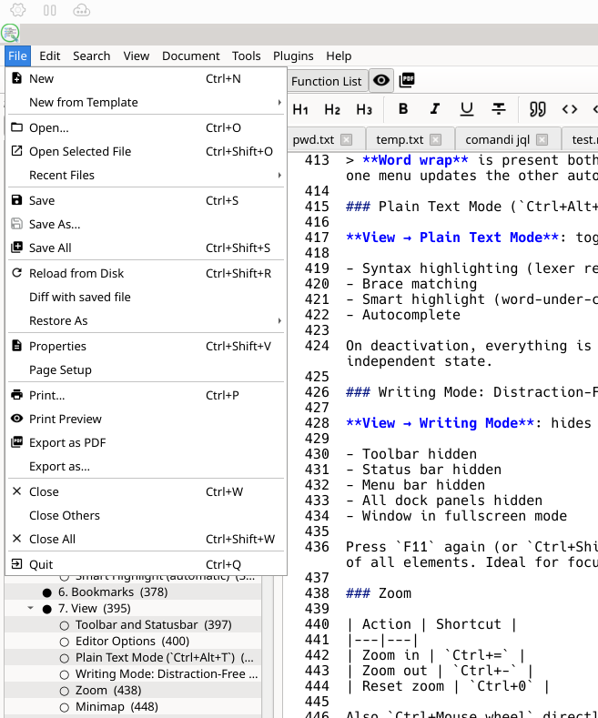
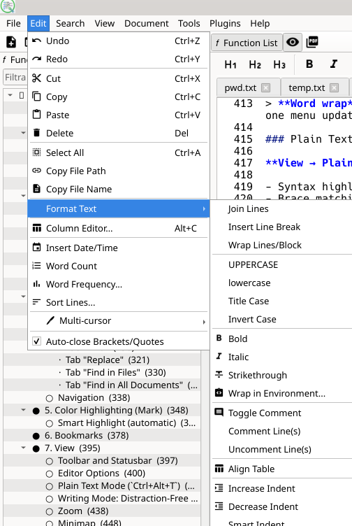
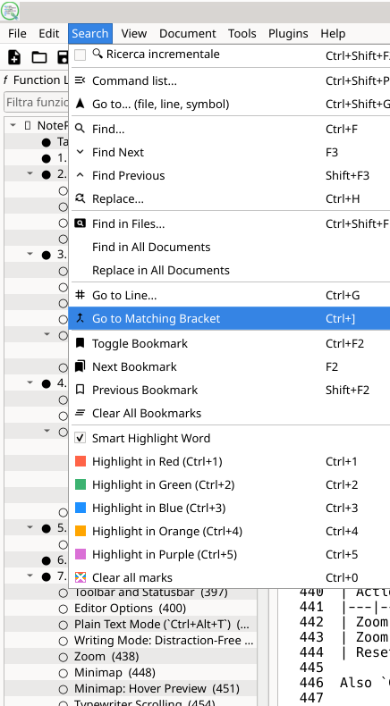
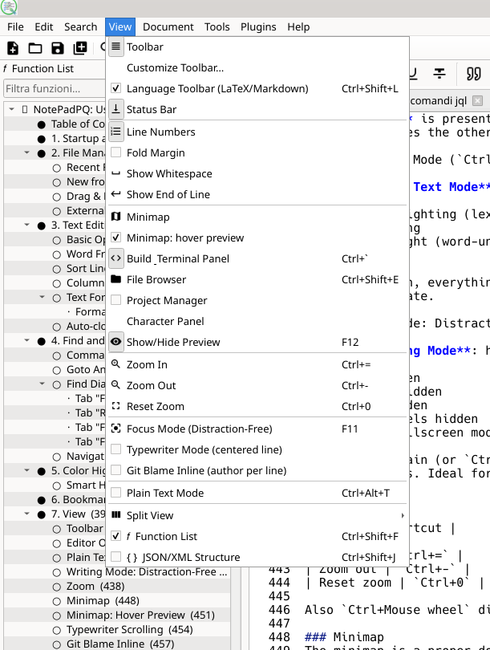
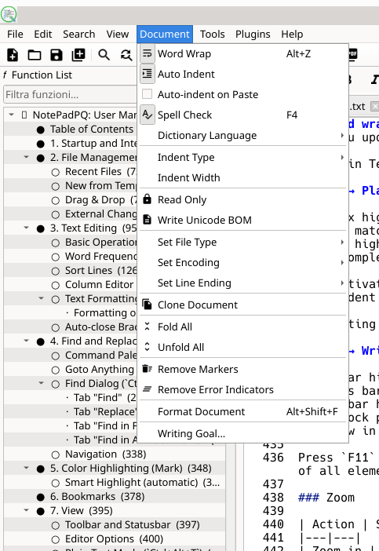
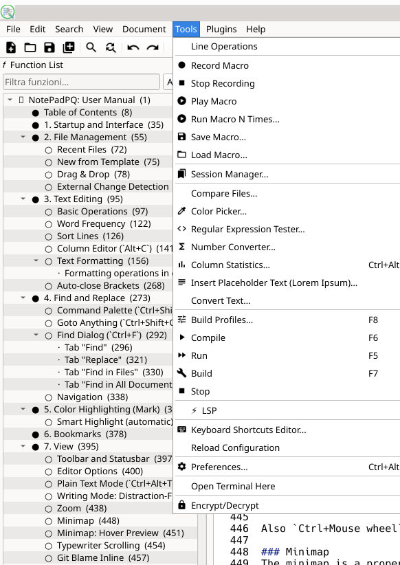

# NotePadPQ: Manuale d'uso

> Versione 1.8.2: Editor di testo avanzato basato su **QScintilla/PyQt6**
> Piattaforme: Linux, Windows, FreeBSD

---

## Indice

1. [Avvio e interfaccia](#1-avvio-e-interfaccia)
2. [Gestione file](#2-gestione-file)
3. [Modifica testo](#3-modifica-testo)
4. [Cerca e Sostituisci](#4-cerca-e-sostituisci)
5. [Evidenziazione colori (Mark)](#5-evidenziazione-colori-mark)
6. [Bookmark](#6-bookmark)
7. [Visualizzazione](#7-visualizzazione) *(incl. Barra del linguaggio Markdown/LaTeX)*
8. [Documento](#8-documento)
9. [Strumenti](#9-strumenti)
10. [Plugin](#10-plugin)
23. [Editor Rich Text](#23-editor-rich-text)
24. [Search PQ](#24-search-pq)
25. [Terminal](#25-terminal)
11. [Pannelli laterali e inferiori](#11-pannelli-laterali-e-inferiori)
12. [Multi-cursore](#12-multi-cursore)
13. [Split View](#13-split-view)
14. [Sessioni e ripristino](#14-sessioni-e-ripristino)
15. [Preferenze](#15-preferenze)
16. [Istanza singola](#16-istanza-singola)
17. [Supporto LaTeX](#17-supporto-latex)
18. [Espressioni regolari: riferimento completo](#18-espressioni-regolari--riferimento-completo)
19. [Scorciatoie da tastiera: riepilogo](#19-scorciatoie-da-tastiera--riepilogo)
20. [LSP: Language Server Protocol](#20-lsp--language-server-protocol)
21. [AI Assistant](#21-ai-assistant)
22. [Foglio di Calcolo](#22-foglio-di-calcolo)

---

## 1. Avvio e interfaccia

```bash
python main.py                    # apre con sessione precedente o tab vuoto
python main.py file1.py file2.md  # apre i file indicati
```

Se NotePadPQ è già aperto, i file vengono inviati alla sessione esistente senza aprirne una seconda; vedi [sezione 16](#16-istanza-singola).

L'interfaccia è composta da:

- **Menubar**: File / Modifica / Cerca / Visualizza / Documento / Strumenti / Plugin / Aiuto (la voce **Aiuto → Manuale** apre il manuale nell'editor come tab normale; **F1** apre l'aiuto contestuale alla parola sotto al cursore)
- **Toolbar**: azioni comuni con icone (set selezionabile: Lucide, Material, Sistema)
- **Tab bar**: un tab per ogni file aperto; i file modificati mostrano `*` nel titolo
- **Editor**: area di testo principale con syntax highlighting, numeri di riga, fold margin, margine simboli (bookmark)
- **Statusbar**: riga/colonna, encoding, line ending, zoom, modalità inserimento; con testo selezionato mostra `(selezione: N caratteri / M byte, K righe)`
- **Pannelli dock**: File Browser, Gestione Progetti, Function List, Anteprima, Pannello compilazione e terminale

---

## 2. Gestione file



| Azione | Scorciatoia |
|---|---|
| Nuovo file | `Ctrl+N` |
| Apri file | `Ctrl+O` |
| Apri file selezionato nell'editor | `Shift+Ctrl+O` |
| Salva | `Ctrl+S` |
| Salva con nome | (nessuna) |
| Salva tutto | `Shift+Ctrl+S` |
| Ricarica da disco | `Shift+Ctrl+R` |
| Proprietà file | `Shift+Ctrl+V` |
| Stampa | `Ctrl+P` |
| Chiudi tab | `Ctrl+W` |
| Chiudi tutti | `Shift+Ctrl+W` |
| Esci | `Ctrl+Q` |

### File recenti
**File → File recenti** mostra gli ultimi file aperti. Clicca per riaprirli. Il numero massimo è configurabile nelle Preferenze.
Un click destro su una voce permette di **fissarla** in cima alla lista o rimuovere il fissaggio.

### Switch rapido tra tab (`Ctrl+Tab`)
Tieni premuto `Ctrl` e premi `Tab` per aprire il popup dei tab in ordine di ultimo utilizzo (MRU). Premi nuovamente `Tab` per avanzare, `Shift+Tab` per tornare indietro, quindi rilascia `Ctrl` per confermare; `Esc` annulla.

### Nuovo da modello
**File → Nuovo da modello** crea un file con intestazione pronta per: Python, HTML, LaTeX, Markdown, Bash, C/C++, JavaScript.

### Drag & Drop
Trascina uno o più file direttamente sulla finestra o sull'editor per aprirli.

### Rilevamento modifica esterna
NotePadPQ monitora i file aperti e reagisce in due modi distinti:

**File modificato da un altro programma**: appare un dialog con tre opzioni:
- **Ricarica**: scarta le modifiche locali e ricarica da disco
- **Confronta**: apre il dialog Compare tra la versione in memoria e quella su disco
- **Sovrascrivi**: scrive la versione in memoria sovrascrivendo il file su disco

**File eliminato dal disco**: appare un dialog separato ("Il file X è stato eliminato") con due opzioni:
- **Chiudi il tab**: chiude il tab corrispondente
- **Mantieni aperto** *(default)*: il tab rimane aperto con il contenuto in memoria (non salvato su disco)

### File grandi e modalità paginata
I file oltre 200 MB vengono caricati progressivamente e aperti in modalità paginata, senza caricare tutto il contenuto in memoria. La barra di stato mostra pagina, percentuale, offset e riga globale approssimativa.

- **◀ Pag. prec. / Pag. succ. ▶**: naviga tra le pagine; se la pagina corrente è modificata viene chiesto se salvarla, scartarla o annullare.
- **Vai a…**: salta a una percentuale del file.
- **Ctrl+G**: in un file paginato apre il dialog per raggiungere una riga globale.
- **Salva / Salva con nome**: scrivono in streaming senza ricostruire l'intero file in RAM.

Le operazioni che richiedono l'intero documento, come alcune trasformazioni globali e l'ordinamento di tutte le righe, sono disabilitate o limitate alla pagina corrente.

---

## 3. Modifica testo



### Operazioni base

| Azione | Scorciatoia |
|---|---|
| Annulla | `Ctrl+Z` |
| Ripeti | `Ctrl+Y` |
| Taglia | `Ctrl+X` |
| Copia | `Ctrl+C` |
| Incolla | `Ctrl+V` |
| Seleziona tutto | `Ctrl+A` |
| Elimina selezione | `Del` |
| Copia percorso file | (nessuna) |
| Copia nome file | (nessuna) |
| Inserisci data/ora | (nessuna) |
| Conta parole | (nessuna) |
| Frequenza parole | (nessuna) |
| Ordina righe (dialog) | (nessuna) |
| Column Editor | `Alt+C` |

**Copia percorso file / Copia nome file**: copia negli appunti il percorso completo del file corrente oppure solo il nome (senza percorso). Utile per incollare il riferimento in un terminale o in un altro documento.

**Inserisci data/ora**: inserisce la data e ora corrente alla posizione del cursore nel formato ISO `YYYY-MM-DD HH:MM:SS` (es. `2026-05-12 14:30:00`).

**Conta parole**: mostra un dialog con il numero di caratteri, parole e righe. Se è attiva una selezione, conta solo il testo selezionato; altrimenti conta l'intero documento.

### Frequenza parole

**Modifica → Frequenza parole** analizza il documento (o la selezione) e mostra una tabella con le 50 parole più frequenti ordinate per numero di occorrenze. La tabella riporta anche il totale di parole nel testo e il numero di parole distinte (uniche). Le parole vengono confrontate in minuscolo (case-insensitive). Utile per trovare ridondanze in testi tecnici o letterari.

### Ordina righe

**Modifica → Ordina righe** apre un dialog con cinque criteri di ordinamento:

| Criterio | Effetto |
|---|---|
| Alfabetico crescente (A→Z) | Ordine lessicografico standard |
| Alfabetico decrescente (Z→A) | Ordine inverso |
| Per lunghezza crescente | Le righe più corte prima |
| Per lunghezza decrescente | Le righe più lunghe prima |
| Casuale | Mischia le righe in ordine casuale |

L'ordinamento si applica alla selezione (se attiva) o all'intero documento.  
Ulteriori operazioni sulle righe (rimuovi duplicati, rimuovi righe vuote, ecc.) sono in **Strumenti → Line Operations**.

### Column Editor (`Alt+C`)

Apre un dialog per inserire valori su più righe alla stessa colonna. La colonna di inserimento corrisponde alla colonna iniziale della selezione corrente (o alla posizione del cursore se non c'è selezione). Il dialog ha due modalità:

**Modalità Numeri**: genera una sequenza numerica con le seguenti opzioni:
- **Valore iniziale**: il numero con cui iniziare (può essere negativo)
- **Incremento**: di quanto aumenta (o diminuisce) ogni riga
- **Formato**: Decimale, Esadecimale, Ottale, Binario
- **Padding**: larghezza minima con zeri iniziali (es. padding=3 → `001`, `002`)
- **Prefisso / Suffisso**: testo aggiunto prima/dopo ogni numero (es. prefisso `0x` → `0x1A`)

**Modalità Testo**: inserisce lo stesso testo fisso su tutte le righe dell'intervallo selezionato.

Una preview mostra in tempo reale i valori che verranno inseriti prima di confermare.

### Formattazione testo

Accessibile da **Modifica → Formatta**:

| Azione | Scorciatoia |
|---|---|
| Unisci righe | (nessuna) |
| Vai a capo forzato | (nessuna) |
| Spezza righe lunghe a N colonne | (nessuna) |
| MAIUSCOLO | (nessuna) |
| minuscolo | (nessuna) |
| Prima Lettera Maiuscola | (nessuna) |
| Inverti maiuscolo/minuscolo | `Ctrl+Alt+U` |
| Attiva/disattiva commento | `Ctrl+E` |
| Commenta righe | (nessuna) |
| Decommenta righe | (nessuna) |
| Indenta | `Ctrl+Shift+I` |
| Deindenta | `Ctrl+U` |
| Indentazione intelligente | (nessuna) |
| Rimuovi spazi finali | (nessuna) |
| Tab → spazi | (nessuna) |
| Spazi → tab | (nessuna) |
| Grassetto (Markdown/LaTeX) | `Ctrl+B` |
| Corsivo (Markdown/LaTeX) | `Ctrl+I` |
| Barrato (Markdown/LaTeX) | `Ctrl+Shift+X` |
| Avvolgi in Ambiente / Tag HTML | `Alt+E` |
| Avvolgi selezione in virgolette/parentesi/backtick | (nessuna) |
| Allinea Tabella (Markdown/LaTeX) | `Alt+T` |

> **Nota: A capo automatico vs. Spezza righe:**  
> **Visualizza / Documento → A capo automatico** (`Alt+Z`) è una visualizzazione: il testo appare mandato a capo a schermo senza modificare il file.  
> **Modifica → Formatta → Spezza righe lunghe** inserisce fisicamente `\n` nel testo; il file viene modificato. Usare con attenzione.

#### Dettaglio delle operazioni di formattazione

**Unisci righe**: unisce in una sola riga tutte le righe selezionate, separandole con uno spazio. Le righe vuote vengono ignorate. Opera sulla selezione oppure, se non c'è selezione, sull'intero documento. Esempio: tre righe `alfa`, `beta`, `gamma` diventano `alfa beta gamma`.

**Vai a capo forzato**: inserisce un carattere di nuova riga (`\n`) alla posizione esatta del cursore, spingendo il testo a destra sulla riga successiva. Equivalente a premere Invio, ma accessibile come azione di menu (utile nelle macro).

**Spezza righe lunghe a N colonne**: apre un dialog che chiede la larghezza target in colonne (default 80, min 20, max 500). Rifluisce il testo selezionato (o l'intero documento) distribuendo le parole sulle righe in modo che nessuna superi la larghezza indicata. I paragrafi separati da righe vuote vengono preservati come blocchi separati. Questa operazione **modifica fisicamente il file**, a differenza di "A capo automatico".

**MAIUSCOLO**: converte tutto il testo selezionato in lettere maiuscole. Esempio: `Ciao Mondo` → `CIAO MONDO`. Senza selezione non ha effetto.

**minuscolo**: converte tutto il testo selezionato in lettere minuscole. Esempio: `Ciao Mondo` → `ciao mondo`.

**Prima Lettera Maiuscola**: converte la prima lettera di ogni parola in maiuscolo e le restanti in minuscolo (Title Case). Esempio: `ciao bel mondo` → `Ciao Bel Mondo`.

**Inverti maiuscolo/minuscolo** (`Ctrl+Alt+U`): scambia maiuscole e minuscole carattere per carattere nel testo selezionato. Esempio: `Ciao` → `cIAO`, `ALPHA beta` → `alpha BETA`. Particolarmente utile per correggere testo digitato con il tasto CAPS LOCK attivo per errore.

**Attiva/disattiva commento** (`Ctrl+E`): analizza la prima riga selezionata (o la riga corrente) per decidere automaticamente se commentare o decommentare l'intera selezione:
- Se la prima riga è già commentata → rimuove il commento da tutte le righe selezionate
- Se la prima riga non è commentata → aggiunge il commento a tutte le righe selezionate

Il prefisso di commento dipende dal linguaggio del file corrente:

| Linguaggio | Prefisso |
|---|---|
| Python, Bash, Ruby, R | `#` |
| C, C++, Java, JavaScript, TypeScript | `//` |
| LaTeX | `%` |
| SQL, Lua, Haskell | `--` |
| VHDL | `--` |

L'indentazione viene preservata: il commento viene inserito dopo gli spazi iniziali, non all'inizio assoluto della riga. Le righe vuote vengono saltate.

**Commenta righe**: aggiunge sempre il prefisso di commento alle righe selezionate, indipendentemente dal loro stato attuale. A differenza del toggle, non verifica se le righe siano già commentate.

**Decommenta righe**: rimuove il prefisso di commento dalle righe selezionate (se presente). Non ha effetto sulle righe già prive di commento.

**Indenta** (`Ctrl+Shift+I`): aggiunge un livello di indentazione alla riga corrente. Se c'è una selezione multi-riga, indenta tutte le righe comprese. La larghezza dell'indentazione (tab o spazi) segue le impostazioni del documento (Documento → Tipo indentazione e Larghezza indentazione).

**Deindenta** (`Ctrl+U`): rimuove un livello di indentazione dalla riga corrente o da tutte le righe selezionate, rispettando la larghezza tab configurata.

**Indentazione intelligente**: adatta l'indentazione della riga corrente al contesto del codice circostante tramite il motore di auto-indent nativo di QScintilla. Utile per riallineare una riga dopo averla spostata manualmente.

**Rimuovi spazi finali**: percorre ogni riga del documento (o della selezione) e rimuove tutti gli spazi e tab presenti in fondo alla riga, prima del terminatore di riga. Non tocca il contenuto delle righe né gli spazi iniziali di indentazione. Questa operazione è anche eseguibile automaticamente al salvataggio tramite la preferenza "Rimuovi spazi in coda al salvataggio".

**Tab → spazi**: converte ogni carattere di tabulazione (`\t`) in N spazi, dove N è la larghezza tab configurata per il documento corrente (visibile nella statusbar e modificabile da Documento → Larghezza indentazione). Opera sull'intero documento.

**Spazi → tab**: apre un dialog che chiede la dimensione del tab da usare. Converte i gruppi di spazi iniziali di ogni riga in tabulazioni: solo gli spazi di indentazione a inizio riga vengono convertiti, quelli nel mezzo del testo rimangono invariati. I gruppi incompleti (es. 3 spazi con tab da 4) rimangono come spazi.

**Grassetto** (`Ctrl+B`): avvolge il testo selezionato nel markup appropriato per il linguaggio corrente:
- **Markdown**: `**testo selezionato**`
- **LaTeX**: `\textbf{testo selezionato}`

Senza selezione inserisce i delimitatori vuoti (`****` o `\textbf{}`) e posiziona il cursore all'interno, pronto per digitare. Non ha effetto su altri tipi di file.

**Corsivo** (`Ctrl+I`): funziona come Grassetto ma per il corsivo:
- **Markdown**: `*testo*`
- **LaTeX**: `\textit{testo}`

**Barrato** (`Ctrl+Shift+X`): applica la formattazione barrato:
- **Markdown**: `~~testo~~`
- **LaTeX**: `\sout{testo}` (richiede `\usepackage{ulem}` nel preambolo)

**Avvolgi selezione**: quando digiti una virgoletta, parentesi o backtick con testo selezionato, la selezione viene racchiusa nella coppia corrispondente. Se la selezione contiene già delimitatori compatibili, questi vengono gestiti senza creare duplicati.

**Avvolgi in Ambiente / Tag HTML** (`Alt+E`): chiede il nome di un ambiente (LaTeX) o tag (HTML). In base al tipo di file:
- **LaTeX** (e per default): genera `\begin{nome}` ... `\end{nome}` con il testo selezionato indentato di 4 spazi all'interno
- **HTML / Markdown**: genera `<nome>` ... `</nome>`

Senza selezione crea l'ambiente vuoto e posiziona il cursore sulla riga interna indentata, pronta per la digitazione. Esempio: digitare `itemize` in un file LaTeX con del testo selezionato produce:
```latex
\begin{itemize}
    testo selezionato
\end{itemize}
```

**Allinea Tabella** (`Alt+T`): allinea verticalmente le colonne di una tabella selezionata aggiungendo spazi per portare ogni cella alla larghezza della colonna più larga. Il separatore viene scelto automaticamente:
- **Markdown**: separatore `|`; la riga separatrice (`|---|---|`) viene estesa con trattini
- **LaTeX**: separatore `&`; il terminatore di riga `\\` viene preservato
- **File generici e testo**: il separatore viene rilevato automaticamente contando quale tra `|`, `&` e `tab` è più presente nelle righe selezionate

È necessario selezionare le righe della tabella prima di attivare la funzione. Se nel testo generico non viene trovato nessun separatore riconoscibile, appare un avviso nella statusbar.

### Auto-chiusura parentesi
**Modifica → Auto-chiusura parentesi** (toggle): chiude automaticamente `(`, `[`, `{`, `"`, `'` quando li digiti.

---

## 4. Cerca e Sostituisci



### Elenco comandi: Command Palette (`Ctrl+Shift+P`)

Apre una palette fuzzy-search su tutti i comandi dell'editor. Digita una parola qualsiasi del nome del comando, naviga con `↑`/`↓`, premi `Invio` per eseguire. Utile per accedere a funzioni senza memorizzare la scorciatoia.

### Vai a...: Goto Anything (`Ctrl+Shift+G`)

Navigazione rapida stile Sublime Text. Apre una palette che si comporta diversamente in base al prefisso digitato:

| Prefisso | Comportamento |
|---|---|
| *(niente)* | Ricerca fuzzy tra i **file aperti** per nome o percorso |
| `:42` | Salta alla **riga 42** del file corrente |
| `@nomeFunc` | Salta al **simbolo** (def/class/function) nel file corrente |
| `>testo` | Cerca tra i **comandi** (come la Command Palette) |

Naviga con `↑`/`↓`, conferma con `Invio`, chiudi con `Esc`.

### Dialog Cerca (`Ctrl+F`)

Il dialog ha 4 tab.

#### Tab "Cerca"

**Opzioni disponibili:**

| Opzione | Effetto |
|---|---|
| Maiuscole/minuscole | Distingue `Foo` da `foo` |
| Parola intera | Trova solo `ciao` e non `ciaocom` |
| Espressione regolare | Abilita la sintassi regex Python |
| Cerca circolare | Riparte dall'inizio/fine al termine del documento |
| Nella selezione | Cerca solo nel testo selezionato |

**Pulsanti:**

- **Trova successivo**: trova la prossima occorrenza (`F3`)
- **Trova precedente**: trova l'occorrenza precedente (`Shift+F3`)
- **Segna tutto**: evidenzia tutte le occorrenze con un bordo arancione
- **Conta**: popola la lista con tutte le occorrenze e mostra il totale

**Lista occorrenze:**  
Si popola automaticamente durante la digitazione (dopo 2 caratteri) e tramite il pulsante Conta. Doppio clic su una riga salta alla posizione corrispondente nel documento.

**Manuale regex:**  
Appare automaticamente quando si attiva "Espressione regolare"; vedi anche [sezione 18](#18-espressioni-regolari--riferimento-completo).

#### Tab "Sostituisci"

Stesse opzioni del tab Cerca più:

- **Sostituisci**: sostituisce l'occorrenza selezionata e passa alla successiva
- **Sostituisci tutto**: sostituisce tutte le occorrenze nel documento

Nel campo "Sostituisci con" puoi usare `\1`, `\2`, ... per riferirsi ai gruppi catturati dalla regex.

#### Tab "Cerca nei file"

Cerca (e opzionalmente sostituisce) in tutti i file di una directory, con filtro estensioni e opzione ricorsiva. I risultati mostrano file e righe; doppio clic apre il file alla riga corrispondente.

Il campo **Sostituisci con** abilita due modalità di sostituzione:

- **↔ Sostituisci nei file** — sostituisce tutte le corrispondenze in tutti i file corrispondenti (con richiesta di conferma prima di modificare i file su disco). I file già aperti nell'editor vengono aggiornati automaticamente.
- **↻ Sostituisci uno per uno** — apre ogni file e mostra ogni corrispondenza evidenziata nell'editor; per ciascuna si può scegliere **Sostituisci**, **Salta**, **Sostituisci tutti** (rimanenti senza ulteriore conferma) o **Annulla**. Al termine, i file modificati vengono salvati automaticamente.

#### Tab "Cerca in tutti i documenti"

Cerca (e opzionalmente sostituisce) in tutti i file aperti nei tab.

### Navigazione

| Azione | Scorciatoia |
|---|---|
| Vai alla riga | `Ctrl+G` |
| Vai alla parentesi corrispondente | `Ctrl+]` |
| Ricerca incrementale inline | `Ctrl+Shift+F2` |

---

## 5. Evidenziazione colori (Mark)

Accessibile da **Cerca → Evidenzia in [colore]** o con le scorciatoie:

| Scorciatoia | Colore |
|---|---|
| `Ctrl+1` | Rosso |
| `Ctrl+2` | Verde |
| `Ctrl+3` | Blu |
| `Ctrl+4` | Arancione |
| `Ctrl+5` | Viola |
| `Ctrl+0` | Rimuovi tutti i mark |

**Come funziona:**

- **Con testo selezionato** → evidenzia/rimuove il mark sul testo selezionato (toggle)
- **Senza selezione** → marca tutte le occorrenze della parola sotto il cursore

I mark sono indipendenti tra loro: puoi avere contemporaneamente testo rosso, verde e blu. Gli indicatori disegnano un bordo colorato **sotto** il testo; il testo rimane sempre completamente leggibile indipendentemente dal tema.

### Smart Highlight (automatico)

Quando il cursore si ferma su una parola per più di 300ms, tutte le sue occorrenze vengono evidenziate automaticamente con un box grigio-blu tenue. Il sistema è ottimizzato per non interferire con la digitazione: non scatta mai mentre si scrive, si aggiorna solo quando la parola sotto il cursore cambia, e usa un singolo passaggio sul testo senza rallentare l'editor anche su documenti di grandi dimensioni.

È separato dai 5 colori manuali e non interferisce con essi.

**Attivazione/disattivazione:** **Cerca → Evidenziazione automatica parola** (voce con spunta). Lo stato viene salvato tra le sessioni.

---

## 6. Bookmark

I bookmark segnano righe di interesse con un cerchio colorato nel margine sinistro dell'editor.

| Azione | Scorciatoia |
|---|---|
| Attiva/disattiva bookmark sulla riga corrente | `Ctrl+F2` |
| Toggle bookmark via click | Click sul margine simboli |
| Prossimo bookmark | `F2` |
| Bookmark precedente | `Shift+F2` |
| Rimuovi tutti i bookmark | Menu Cerca |

La navigazione è circolare: dall'ultimo bookmark torna al primo e viceversa.  
I bookmark vengono salvati nella sessione e ripristinati alla riapertura del file.

---

## 7. Visualizzazione



### Toolbar e Statusbar
**Visualizza → Barra strumenti** e **Visualizza → Barra di stato**: mostrano/nascondono./nascondono.

### Opzioni editor

| Azione | Scorciatoia |
|---|---|
| Numeri di riga | (nessuna) |
| Margine fold (piegatura) | (nessuna) |
| Mostra spazi bianchi | (nessuna) |
| Mostra fine riga (¶) | (nessuna) |
| A capo automatico | `Alt+Z` |
| Minimap | (nessuna) |
| Modalità macchina da scrivere | (nessuna) |
| Git Blame inline | (nessuna) |

> **A capo automatico** è presente sia in **Visualizza** che in **Documento**: sono la stessa azione: spuntarla in un menu aggiorna l'altra automaticamente.

### Modalità testo semplice (`Ctrl+Alt+N`)

**Visualizza → Modalità testo semplice**: toggle per tab. Quando attivo, disabilita sul tab corrente:

- Syntax highlighting (lexer rimosso)
- Brace matching
- Smart highlight (evidenziazione parola sotto cursore)
- Autocompletamento

Alla disattivazione, tutto viene ripristinato al linguaggio originale del file. Ogni tab mantiene il proprio stato indipendentemente.

### Modalità scrittura: Distraction-Free (`F11`)

**Visualizza → Modalità scrittura**: nasconde tutto tranne l'editor e va in schermo intero:

- Toolbar nascosta
- Statusbar nascosta
- Menubar nascosta
- Tutti i pannelli dock nascosti
- Finestra in modalità schermo intero

Premi di nuovo `F11` (oppure `Ctrl+Shift+F11` o `Ctrl+F11`) per uscire e ripristinare la visibilità precedente di tutti gli elementi. Ideale per sessioni di scrittura concentrata.

### Zoom

| Azione | Scorciatoia |
|---|---|
| Zoom in | `Ctrl+=` |
| Zoom out | `Ctrl+-` |
| Zoom reset | `Ctrl+0` |

Anche `Ctrl+Rotella mouse` direttamente nell'editor.

### Minimap
La minimap è un pannello dock a tutti gli effetti, come File Browser, Anteprima e gli altri pannelli. Può essere spostata, flottata, agganciata a qualsiasi lato (alto, basso, sinistra, destra) o staccata come finestra indipendente. Per attivarla: **Visualizza → Minimap**. Una volta visibile, trascina la barra del titolo per riposizionarla come qualsiasi altro pannello.

### Minimap: anteprima hover
Quando abilitata (**Visualizza → Minimap: anteprima hover**, oppure in **Preferenze → Editor**), tenere il cursore fermo sulla minimap per circa 300ms mostra un popup flottante con l'anteprima del codice nella posizione corrispondente.

### Modalità macchina da scrivere
**Visualizza → Modalità macchina da scrivere**: quando attiva, la riga del cursore viene mantenuta sempre centrata verticalmente sullo schermo. Utile per sessioni di scrittura prolungate.

### Git Blame inline
**Visualizza → Git Blame inline**: mostra, sotto la riga in cui si trova il cursore, l'autore, l'età relativa ("3 giorni fa") e il messaggio dell'ultimo commit git che ha toccato quella riga. Usa le annotazioni di QScintilla. Funziona solo sui file all'interno di un repository git. Può essere abilitato dal menu Visualizza o da **Preferenze → Editor**.

### Barra del linguaggio (`Visualizza → Language Toolbar`)

Una toolbar contestuale che appare automaticamente quando il file aperto è **Markdown** o **LaTeX**. Contiene i pulsanti più comuni per quel formato, con icone Lucide uniformi alla toolbar principale.

**Markdown** — in ordine, da sinistra a destra:

| Gruppo | Pulsanti |
|---|---|
| Titoli | H1, H2, H3 |
| Formattazione carattere | Grassetto, Corsivo, Sottolineato, Barrato |
| Blocchi | Citazione, Codice inline, Blocco codice |
| Liste | Lista puntata, Lista numerata, Lista task, Separatore (`---`) |
| Elementi | Tabella, Link, Immagine |
| Allineamento | Sinistra, Centro, Destra |

Tutti i pulsanti operano sulla selezione corrente o inseriscono il segnaposto nella posizione del cursore. La toolbar si aggiorna automaticamente quando si apre un nuovo file o si salva un file con estensione `.md`.

**LaTeX** — mostra i pulsanti per gli ambienti più comuni (begin/end, align, equazione, lista, tabella, etc.) contestualmente al cursore.

### Anteprima (`F12`)
Apre il pannello Anteprima affiancato all'editor. Supporta:

- **Markdown**: rendering HTML in background, non blocca l'editor durante la digitazione. Supporta formule matematiche LaTeX (`$...$`, `$$...$$`) tramite MathJax e diagrammi Mermaid (blocchi ` ```mermaid `) tramite Mermaid.js — entrambi richiedono connessione internet e vengono caricati automaticamente se presenti nel documento. Il rendering Mermaid è attivabile/disattivabile da **Preferenze → Anteprima**.
- **HTML**: preview diretta nel widget web integrato
- **LaTeX**: albero della struttura navigabile (sezioni, label, figure, tabelle)
- **reStructuredText**: rendering via docutils
- **PDF**: visualizzazione con PyMuPDF, scorrimento continuo attivo per default, navigazione pagine, zoom e SyncTeX

L'anteprima si aggiorna automaticamente con un delay configurabile (default 500ms). Non si aggiorna se il pannello è nascosto (risparmio CPU). Per Markdown, il tipo viene ricalcolato anche quando un documento senza nome viene salvato con estensione `.md`.

Nel visualizzatore PDF sono disponibili ricerca del testo, selezione e copia, navigazione da tastiera tra i risultati e lente d'ingrandimento.

### Anteprima hover (passaggio del mouse)

Tenendo il cursore fermo per mezzo secondo su determinati elementi, NotePadPQ mostra un popup fluttuante:

- **Immagini**: posiziona il mouse su `\includegraphics{...}`, `` o `` per vedere l'anteprima dell'immagine. Supporta PNG, JPG e anche la prima pagina dei file PDF vettoriali.
- **Formule matematiche**: nei file LaTeX e Markdown, passa il mouse sopra una formula (`$E=mc^2$`, `$$...$$`, `\[...\]`, `\begin{equation}...\end{equation}`) per vederla renderizzata ad alta risoluzione con sfondo scuro.

> Queste funzionalità richiedono le librerie opzionali `pymupdf` (per i PDF) e `matplotlib` (per le equazioni); vedi [sezione 17](#17-supporto-latex).

---

## 8. Documento



### Impostazioni documento corrente

- **Tipo indentazione**: Tab o Spazi
- **Larghezza indentazione**: numero di spazi
- **Indentazione automatica**: re-indenta automaticamente la nuova riga in base alla precedente
- **Auto-indenta su incolla**: quando si incolla testo con più righe (`Ctrl+V`), le righe vengono riallineate all'indentazione del contesto corrente. Disattivabile dal menu Documento se non desiderato.
- **Sola lettura**: blocca le modifiche
- **Scrivi BOM**: aggiunge Byte Order Mark per UTF-8/UTF-16
- **A capo automatico** (`Alt+Z`): manda a capo il testo a schermo senza modificare il file
- **Controllo Ortografico (`F4`)**: attiva la sottolineatura a zig-zag rossa per le parole errate. La lingua del dizionario è indipendente dalla lingua dell'interfaccia e si seleziona da **Documento → Lingua dizionario** (Italiano, English, Deutsch, Français, Español). Il click destro su una parola sottolineata mostra fino a 8 suggerimenti di correzione, "Aggiungi al dizionario" e "Ignora tutto". Ignora le sigle interamente maiuscole e le parole di meno di 3 lettere.
- **Lingua dizionario**: sottomenu di Documento che seleziona la lingua dello spell checker indipendentemente dalla lingua dell'interfaccia. La scelta viene salvata tra le sessioni.
- **Tipografia intelligente**: converte automaticamente i caratteri "grezzi" in varianti tipografiche corrette: `"..."` → `"..."`, `'...'` → `'...'`, `--` → `—`, `...` → `…`. Non si attiva dentro blocchi di codice. Attivabile da **Documento → Tipografia intelligente** o da **Preferenze → Editor → Scrittura**.
- **Focus paragrafo**: attenua il testo fuori dal paragrafo corrente (delimitato da righe vuote) per favorire la concentrazione. Il colore di attenuazione si adatta automaticamente al tema chiaro/scuro. Attivabile da **Documento → Focus paragrafo**. Si aggiorna in tempo reale mentre si scrive e al cambio tab.
- **Segna/desegna attività (`Ctrl+Shift+L`)**: su una riga di task list Markdown (`- [ ] testo` o `- [x] testo`), alterna tra completato e non completato. Funziona con i marcatori `-`, `*`, `+`.
- **Modalità tail**: segue automaticamente la fine del file mentre arrivano nuove righe (utile per log e output).

### Tipo di file (syntax highlighting)

**Documento → Imposta tipo di file**: seleziona manualmente il linguaggio di colorazione. NotePadPQ rileva automaticamente il tipo dal suffisso del file e dallo shebang (`#!/usr/bin/env python3`).

La voce **Automatico** (in cima al menu) ri-esegue il rilevamento automatico basandosi sul suffisso del file, sul nome file speciale (Makefile, Dockerfile, .gitignore…) e sul contenuto (shebang, `<?xml`, `\\documentclass`, ecc.).

**Linguaggi con lexer nativo QScintilla** (veloci, con code folding): Bash/Shell, Batch, C/C++, C#, CMake, CSS, Diff, Fortran, HTML, INI/Config, Java, JavaScript, JSON, LaTeX, Lua, Makefile, Markdown, Pascal, Perl, PostScript, Python, reStructuredText, Ruby, SPICE, SQL, TypeScript, Verilog, VHDL, XML, YAML.

**Linguaggi aggiuntivi tramite Pygments** (copertura sintassi più precisa): Dart, Elixir, Go, Haskell, Julia, Kotlin, PHP, R, Rust, Scala, Swift, TOML.

L'apertura di un file con estensione `.go`, `.rs`, `.php`, `.swift`, `.kt`, `.scala`, `.dart`, `.r`, `.toml`, `.hs`, `.ex`, `.jl` attiva automaticamente il lexer Pygments corrispondente.

### Codifica (encoding)

**Documento → Imposta codifica**: cambia l'encoding per il prossimo salvataggio. Encoding supportati: UTF-8, UTF-8 BOM, Latin-1, CP1252, UTF-16 LE/BE, GB2312.

### Terminatori di riga

**Documento → Imposta terminatori**: LF (Unix), CRLF (Windows), CR (Mac). Puoi anche convertire i terminatori del documento corrente alla nuova modalità.

### Operazioni documento

| Azione | Effetto |
|---|---|
| Clona documento | Apre una copia del file in un nuovo tab |
| Rimuovi spazi finali | Elimina gli spazi in fondo a ogni riga |
| Tab → Spazi | Converte le tabulazioni in spazi |
| Spazi → Tab | Converte i gruppi di spazi in tabulazioni |
| Piega tutto | Chiude tutti i blocchi piegabili |
| Espandi tutto | Apre tutti i blocchi piegabili |

---

## 9. Strumenti



### Preferenze (`Ctrl+Alt+P`)
Apre il dialog di configurazione; vedi [sezione 15](#15-preferenze).

### Build / Compilazione
Esegue il comando associato al tipo di file corrente e mostra l'output nel pannello "Output compilazione".

| Azione | Scorciatoia |
|---|---|
| Esegui | `F5` |
| Compila | `F6` |
| Build | `F7` |
| Stop compilazione | pulsante Stop nel pannello |
| Profili di compilazione | `F8` |

#### Profili di compilazione e variabili

I profili di compilazione si configurano da **Build → Profili di compilazione** (`F8`). 12 profili predefiniti (Python, Python uv, C/C++, LaTeX, Rust, Go, Bash, JavaScript, Make) e possibilità di crearne di personalizzati illimitati. Ogni profilo associa un'estensione file a uno o più comandi (Compila, Esegui, Build).

Nei comandi sono disponibili le seguenti variabili, accettate sia nella forma `${VAR}` che `$(VAR)`:

| Variabile | Descrizione | Esempio |
|---|---|---|
| `${FILE}` | Percorso completo del file | `/home/utente/doc/tesi.tex` |
| `${DIR}` | Cartella contenente il file | `/home/utente/doc` |
| `${FILENAME}` | Nome del file con estensione | `tesi.tex` |
| `${BASENAME}` | Nome del file senza estensione | `tesi` |
| `${BASEFILE}` | Percorso completo senza estensione | `/home/utente/doc/tesi` |
| `${EXT}` | Estensione del file con punto | `.tex` |
| `${LINE}` | Riga corrente del cursore | `42` |
| `${COL}` | Colonna corrente del cursore | `7` |
| `${OUTDIR}` | Directory degli artefatti di build | `/home/utente/doc/build` |
| `${ROOT}` | File root del progetto LaTeX | `/home/utente/doc/main.tex` |

#### Nuove funzionalità avanzate

**Variabili d'ambiente per profilo**: definisci variabili d'ambiente personalizzate nel dialog profili (una `CHIAVE=valore` per riga). Utile per `PATH`, `VIRTUAL_ENV`, `JAVA_HOME`, ecc.

**Hook pre/post build**: comandi eseguiti prima e dopo la build principale (es. `source venv/bin/activate` prima, `./cleanup.sh` dopo).

**Pipeline multi-step**: definisci passi di build sequenziali nella sezione Pipeline del dialog. Formato: `nome | comando | stop_on_error`. Una barra di progresso mostra il passo corrente.

**Modalità interattiva (PTY)**: il toggle `PTY` nella toolbar abilita il supporto per processi interattivi. Appare un campo input sotto il log per inviare testo al processo in esecuzione (`npm init`, `ssh`, REPL Python).

**Compila al salvataggio**: attiva dal menu Build o Preferenze per eseguire automaticamente la build al salvataggio del file.

**Errori unificati**: unisce le diagnostiche LSP con gli errori di build in un'unica lista ordinabile. Attivabile dal menu Build.

**Test regex live**: modificando la regex errori nel dialog profili, i match vengono mostrati istantaneamente su un output di esempio con anteprima file e numero di riga.

**Configurazione di progetto**: crea un file `.notepadpq-build.json` nella root del progetto con profili e task condivisi. Caricato automaticamente aprendo file in quella cartella.

**Contesto LaTeX multi-file**: NotePadPQ risolve `% !TEX root`, `.latexmkrc`, `main.tex` e i file inclusi. Il root risolto viene usato per build, PDF, log e SyncTeX. I profili possono definire una `output_directory` e il backend `bib_backend` (`auto`, `bibtex`, `biber`, `none`).

**Compilazione su RAM disk**: nel dialog profili, la checkbox **Compila su RAM disk (tmpfs)** redirige la build sotto `$XDG_RUNTIME_DIR` (tipicamente `/run/user/<uid>` su Linux con systemd/logind), riducendo l'I/O su disco durante la compilazione. Al termine, `.pdf` e `.synctex.gz` vengono ricopiati automaticamente nella `output_directory` configurata (o accanto al `.tex` se vuota), così anteprima, SyncTeX e strumenti esterni continuano a trovarli nel posto consueto. Se `XDG_RUNTIME_DIR` non è disponibile (Windows, sessioni senza systemd/logind) la build prosegue normalmente nella directory di sempre, con un avviso nel pannello di output.

**Compila durante la modifica**: l'opzione nel menu Build avvia una build LaTeX dopo una pausa configurabile nella digitazione. Il debounce evita processi duplicati e l'opzione è disattivata di default.

**Build concorrenti**: esegui una build nel pannello principale e un task nel tab Task contemporaneamente — ognuno ha il suo worker indipendente.

**Draft Mode LaTeX**: dal menu Build abilita la modalità Draft per inserire `-draftmode` nei comandi `pdflatex`, `xelatex` o `lualatex`. Verifica il documento senza produrre un PDF.

**Pulizia file ausiliari**: puoi eliminare i file ausiliari LaTeX prima e/o dopo la compilazione. L'opzione **Mantieni SyncTeX** conserva `.synctex.gz`, così la sincronizzazione cursore ↔ PDF resta disponibile.

**Navigazione errori**: dopo una compilazione con errori usa `Alt+↑` e `Alt+↓`, oppure i pulsanti ▲/▼ nel pannello, per passare all'errore precedente o successivo.

Esempio: compilazione LaTeX con pdflatex:
```
pdflatex -interaction=nonstopmode -synctex=1 ${FILE}
```

Esempio: conversione con pandoc:
```
pandoc ${FILE} -o ${BASEFILE}.pdf
```

Esempio: script che usa cartella e nome base:
```
cd ${DIR} && python ${FILENAME}
```

L'output appare nel pannello inferiore in tempo reale. Gli errori sono cliccabili: un click porta il cursore alla riga corrispondente nel file.

### Macro

Registra e riproduce sequenze di tasti:

| Azione | Funzione |
|---|---|
| Avvia/Ferma registrazione | Registra ogni tasto premuto nell'editor |
| Riproduci | Esegue la macro una volta |
| Riproduci N volte | Esegue la macro N volte consecutive |
| Salva su file | Salva la macro come file `.json` |
| Carica da file | Carica una macro salvata |

### Altri strumenti

| Strumento | Funzione |
|---|---|
| **Traduttore colori** | Seleziona un colore e visualizza: nome HTML/CSS, `#HEX` maiusc/minusc, `rgb(r,g,b)`, `rgb(r%,g%,b%)`, `hsl(h,s%,l%)`; pulsante Inserisci e Copia per ogni formato |
| **Lorem Ipsum** | Genera testo segnaposto con opzioni: numero di paragrafi, frasi per paragrafo, separatore, primo paragrafo classico; anteprima e inserimento nel documento |
| **Tester Regex** | Dialog interattivo per testare espressioni regolari su testo di prova |
| **Convertitore numerico** | Conversione tra decimale, esadecimale, binario, ottale |
| **Statistiche colonna** | Analisi statistica dei valori numerici nella colonna corrente |
| **Editor scorciatoie** | Personalizzazione dei tasti di scelta rapida |
| **Sessioni con nome** | Salva e ripristina gruppi di file come sessioni nominate |

### Line Operations (Strumenti → Line Operations)

Operazioni avanzate sulle righe del documento. Si applicano alla selezione (se presente) o all'intero documento.

**Ordinamento:**

| Voce | Effetto |
|---|---|
| Ordina A→Z | Ordine lessicografico crescente (case-sensitive) |
| Ordina Z→A | Ordine lessicografico decrescente |
| Ordina per lunghezza (↑) | Righe più corte prima |
| Ordina per lunghezza (↓) | Righe più lunghe prima |
| Ordina casualmente | Permutazione casuale delle righe |

**Duplicati:**

| Voce | Effetto |
|---|---|
| Rimuovi duplicati (ordinato) | Rimuove le righe duplicate dopo aver ordinato; il risultato è ordinato |
| Rimuovi duplicati (ordine originale) | Mantiene la prima occorrenza di ogni riga e rimuove le successive, preservando l'ordine originale |
| Rimuovi righe uniche | Mantiene solo le righe che compaiono più di una volta (rimuove i singleton) |
| Mantieni solo righe uniche | Mantiene solo le righe che compaiono esattamente una volta (rimuove i duplicati) |

**Righe vuote:**

| Voce | Effetto |
|---|---|
| Rimuovi righe vuote | Elimina le righe che non contengono nessun carattere |
| Rimuovi righe con soli spazi | Elimina le righe composte unicamente da spazi e/o tab |

**Altro:**

| Voce | Effetto |
|---|---|
| Rimuovi ogni N-esima riga | Apre un dialog: chiede N, poi elimina la riga 1, 1+N, 1+2N, ... (utile per dati tabulati con righe di intestazione periodiche) |

---

## 10. Plugin

I plugin vengono caricati automaticamente dalla cartella `plugins/`. Per installarli, copiali in `plugins/` oppure inseriscili in `plugins_to_copy/` e riesegui `setup.sh`.

Tutti i plugin mostrano icone Lucide nel menu Plugin (stesso stile della toolbar principale). Se le icone non sono state ancora scaricate, usa **Aiuto → Scarica icone** oppure il banner che appare all'avvio.

| Plugin | Scorciatoia | Funzione |
|---|---|---|
| **Clipboard History** | `Ctrl+Shift+V` | Cronologia degli appunti con possibilità di incollare elementi precedenti |
| **Compare & Merge** | `F7` | Confronto modificabile a due o tre vie con syntax highlighting e scroll sincronizzato |
| **Database** | — | Client SQL per SQLite, PostgreSQL, MySQL con generazione query AI |
| **Encrypt/Decrypt** | `Ctrl+Shift+E` / `Ctrl+Shift+W` | Cifratura AES-256-GCM e ChaCha20-Poly1305 del testo selezionato o dell'intero file |
| **FTP Browser** | — | Sfoglia e modifica file su server FTP |
| **Editor Rich Text** | — | Editor WYSIWYG per .docx, .odt, .rtf, .html basato su Jodit (vedi [sezione 23](#23-editor-rich-text)) |
| **Foglio di Calcolo** | — | Editor completo per CSV, XLSX, XLS, ODS (vedi [sezione 22](#22-foglio-di-calcolo)) |
| **Git Integration** | — | Pannello Git completo (vedi sotto) |
| **Hex Viewer** | `Ctrl+Alt+H` | Visualizza il file corrente in formato esadecimale |
| **PDF Viewer** | — | Visualizza file PDF in un tab dedicato |
| **Search PQ** | `Ctrl+Alt+F` | Ricerca e sostituzione avanzata nel documento: modalità TEXT/REGEXP/LIKE, coda risultati, filtro inline, sostituzione (vedi [sezione 24](#24-search-pq)) |
| **Terminal** | `Ctrl+Alt+T` | Terminale xterm.js con PTY nativo come pannello dock indipendente (vedi [sezione 25](#25-terminal)) |
| **Web Search** | — | Ricerca web e Wikipedia sul testo selezionato dal menu contestuale |

### REST Client

Il plugin REST Client offre un editor di richieste HTTP con wizard guidato, importazione cURL, collection persistenti (`.http`) e ambienti con variabili `{{VAR}}`.

- Metodi HTTP, parametri, header e body JSON/XML/form-data/multipart con upload di file.
- Autenticazione Nessuna, Bearer, Basic, API Key e OAuth 2.0 con richiesta automatica del token.
- Timeout configurabile, verifica SSL e gestione dei redirect; pulsante Stop per annullare richieste in corso.
- Script **Pre-request** per preparare variabili e test post-risposta con `pm.test(...)`, status, header, JSON, testo e tempo di risposta.
- **Collection Runner**: seleziona le richieste, l'ambiente e il ritardo tra richieste; esegue in sequenza e consente di interrompere.
- Generazione di snippet cURL, Python e JavaScript dalla richiesta corrente.

### Compare & Merge

Il confronto supporta modifica inline dei pannelli, syntax highlighting, diff a livello di carattere, navigazione tra le differenze, undo e scroll sincronizzato. Quando sono disponibili tre versioni puoi usare il confronto/merge a tre vie con una base comune.

### Plugin Git: dettaglio

Il pannello Git (`Plugin → Git Panel`) si aggiorna automaticamente al cambio di tab e rileva il repository dal percorso del file aperto. Ha 5 tab:

**Status**: elenco dei file modificati con indicatore colore (M=giallo, A=verde, D=rosso, ?=grigio). Click destro per: `git add`, `git reset HEAD`, `git checkout --`, apri nell'editor, blame, apri su GitHub/GitLab.

**Log**: ultimi 60 commit con hash, data, autore, messaggio. Filtrabile per branch. Click destro per: mostra diff completo, copia SHA, checkout, cherry-pick.

**Diff**: diff colorato (verde=aggiunto, rosso=rimosso, blu=header hunk) del file corrente o dell'intero repo, con opzione staged.

**Branch**: lista branch locali e remote. Doppio clic per checkout. Pulsanti: Nuova, Merge, Rebase, Elimina. Click destro per push al remote.

**Config**: nome e email correnti, `git config --local` completa, pulsante per il dialog credenziali.

**Azioni rapide** (barra superiore): Pull (con opzione `--rebase`), Push (con opzione `--force-with-lease`), Commit (dialog con selezione file e opzione amend), Stash, Fetch.

**Configurazione credenziali** (`Plugin → Git: Configura utente & token` oppure tab Config):

- Nome e email Git locale (per il repo corrente) e globale
- Token GitHub: salvato in keyring o `~/.config/notepadpq/git_tokens.json`
- Token GitLab: con supporto URL self-hosted

Con i token configurati è possibile creare Pull Request (GitHub) e Merge Request (GitLab) direttamente dal pannello. Richiede `PyGithub` e/o `python-gitlab` (installati dallo script di setup).

---

## 11. Pannelli laterali e inferiori

Tutti i pannelli sono dock widget: possono essere spostati, ridimensionati, staccati come finestre flottanti o riagganciati trascinando il titolo.

### File Browser (`Ctrl+Shift+E`)
Pannello sinistro con la struttura di directory. Doppio clic su un file per aprirlo nell'editor.

### Gestione Progetti (`Visualizza → Gestione progetti`)
Pannello dock stile PSPad per organizzare file in progetti. Il progetto viene salvato come file `.npqproj` (JSON).

- **Toolbar**: Nuovo, Apri, Salva progetto; +File (aggiunge file al gruppo selezionato), +Gruppo (crea un gruppo), Rimuovi
- **Albero**: gruppi espandibili con i file associati; doppio clic per aprire il file
- **Menu contestuale** (tasto destro): apri file, aggiungi file/gruppo, rimuovi
- I file vengono salvati con il percorso assoluto; il progetto è portabile copiando sia il `.npqproj` che i file referenziati

### Function List (`Ctrl+Shift+F`)
Pannello con la lista di funzioni, classi e metodi del file corrente. Si aggiorna automaticamente durante la digitazione.

- **Aggiornamento lazy**: se il pannello è nascosto, il refresh viene posticipato al momento dell'apertura (nessun consumo CPU inutile)
- **Filtro**: ricerca incrementale per nome funzione
- **Ordinamento**: ordine di apparizione nel file (default) o alfabetico (pulsante A↓)
- **Doppio clic**: salta direttamente alla riga nel file
- **Context menu**: vai alla riga, copia nome funzione

Linguaggi con parser dedicato: Python, JavaScript/TypeScript, C/C++, Java, Bash, SQL, LaTeX, Markdown.

### Include List
Il pannello **Include List** elenca immagini, file inclusi e riferimenti BibTeX del documento LaTeX/Markdown, evidenziando gli elementi mancanti o non usati. Il tooltip delle immagini mostra una miniatura al passaggio del mouse, anche per gli elementi trovati nella cartella di riferimento ma non ancora inclusi. Il menu contestuale permette di saltare alla riga, aprire il file o inserire il riferimento.

### Pannello compilazione (`` Ctrl+` ``)

Un unico dock inferiore con tre tab. Il terminale e i risultati di ricerca sono stati spostati in plugin dock indipendenti (vedi [sezione 24](#24-search-pq) e [sezione 25](#25-terminal)).

**Tab "Output compilazione"**: output testuale del comando build con colorazione errori (rosso), warning (giallo) e info (blu). La lista errori è cliccabile: click su un errore salta alla riga nel file sorgente. Dopo una compilazione LaTeX riuscita, il PDF viene rilevato automaticamente per il pannello Anteprima.

**Tab "Errori"**: lista errori ordinabile con colonne: File, Riga, Messaggio, Origine. Con "Errori unificati" attivo (menu Build), le diagnostiche LSP vengono fuse insieme agli errori di build.

**Tab "⚡ Task"**: task runner rapido per comandi arbitrari:
- **Auto-scoperta** da 7+ strumenti di progetto: `Makefile`, `package.json` (npm scripts), `pyproject.toml`, `Cargo.toml`, `CMakeLists.txt`, `Gradle` (`build.gradle`), `Docker Compose`/`Dockerfile`, `justfile`
- Doppio click su un task scoperto per eseguirlo
- Campo testo per comandi manuali (es. `pytest`, `cargo test`, `make lint`)
- **Toggle PTY** per programmi interattivi con campo input inline
- Output colorato con rilevamento errori/warning

**Tab "⚡ Diagnostics"**: lista errori/warning emessi dai Language Server (LSP):
- Raggruppati per file, con severità (ERR/WARN/INFO/HINT)
- Doppio click → salta al file e alla riga esatta

---

## 12. Multi-cursore

Il multi-cursore permette di modificare simultaneamente più punti del testo.

| Azione | Scorciatoia |
|---|---|
| Seleziona prossima occorrenza | `Ctrl+D` |
| Seleziona tutte le occorrenze | `Ctrl+Shift+D` |
| Aggiungi cursore sopra | `Ctrl+Alt+↑` |
| Aggiungi cursore sotto | `Ctrl+Alt+↓` |
| Inserisci numeri incrementali | `Ctrl+Shift+Alt+C` |
| Rimuovi cursori extra | `Esc` |

**Uso tipico:** seleziona una parola → premi `Ctrl+D` più volte per aggiungere le occorrenze successive → digita per sostituirle tutte simultaneamente.

---

## 13. Split View

Divide l'area editor in due pannelli per lavorare su due file (o due punti dello stesso file) contemporaneamente.

| Azione | Scorciatoia |
|---|---|
| Split verticale (affiancati) | `Ctrl+Alt+2` |
| Split orizzontale (sopra/sotto) | `Ctrl+Alt+3` |
| Ruota orientazione split | `Ctrl+Alt+R` |
| Sposta tab nell'altro pannello | `Ctrl+Alt+M` |
| Sincronizza cursore tra pannelli | Menu Visualizza → Split View |
| Rimuovi split | `Ctrl+Alt+1` |

---

## 14. Sessioni e ripristino

NotePadPQ salva automaticamente la sessione alla chiusura:

- File aperti (percorso, posizione cursore, encoding)
- Layout dock widget (posizione e dimensione dei pannelli)
- Stato dei bookmark

Al prossimo avvio i file vengono riaperti automaticamente (se abilitato in Preferenze → File → Ripristina sessione).

**Autobackup:** se abilitato nelle Preferenze, salva una copia `.bak` di ogni file modificato a intervalli regolari nella cartella configurata.

**Auto-save su perdita fuoco:** se abilitato nelle Preferenze → File → Auto-salvataggio, salva silenziosamente tutti i file modificati con un percorso su disco ogni volta che la finestra perde il fuoco (es. passando a un'altra applicazione).

**Sessioni con nome:** tramite **Strumenti → Sessioni con nome** puoi salvare e ripristinare gruppi di file come sessioni nominate indipendenti dalla sessione automatica.

---

## 15. Preferenze

Apri con `Ctrl+Alt+P` oppure **Strumenti → Preferenze**. Le modifiche possono essere applicate immediatamente con **Applica** senza chiudere il dialog.

### Scheda Editor
- Font e dimensione
- Larghezza tab e tipo indentazione (tab/spazi)
- Indentazione automatica
- La sezione Visualizzazione presenta le opzioni in un layout a 2 colonne. I checkbox includono: Numeri di riga, Margine code folding, Mostra spazi/tab, Mostra fine riga, A capo automatico, Minimap, Minimap: anteprima hover, Modifiche Git a margine, Git Blame inline
- Pannelli visibili all'avvio (compilazione, struttura documento)
- **Scrittura**: gruppo con due opzioni per Markdown e testo:
  - *Tipografia intelligente*: conversione automatica di virgolette, em dash ed ellissi
  - *Focus paragrafo corrente*: attiva l'attenuazione del testo fuori dal paragrafo

### Scheda Aspetto
- **Tema attivo**: selezionabile dal combo; il cambio si applica immediatamente a tutti gli editor aperti
- **Editor tema**: modifica i colori del tema corrente con anteprima in tempo reale
- **Importa / Esporta tema**: formato JSON, per condividere temi tra installazioni
- **Set di icone toolbar**: Lucide (lineari, moderne), Material (Google, piene), Sistema (icone native OS). Se il set non è presente localmente, viene scaricato automaticamente da internet al momento della selezione.

### Scheda File
- Encoding predefinito (UTF-8, UTF-8 BOM, Latin-1, CP1252, UTF-16, GB2312)
- Line ending predefinito (LF, CRLF, CR)
- Backup al salvataggio (`.bak`)
- Rimuovi spazi in coda al salvataggio
- Aggiungi newline a fine file
- Ripristina sessione all'avvio
- Numero massimo file recenti
- **Autobackup periodico**: intervallo in minuti e cartella di destinazione
- **Auto-salvataggio**: salva automaticamente i file modificati quando la finestra perde il fuoco

### Scheda Autocompletamento
- Abilita/disabilita autocompletamento
- Sorgenti: parole nel documento, tutti i tab aperti, snippet per linguaggio, dizionari API, LSP
- Soglia di attivazione (numero minimo di caratteri)

### Scheda Anteprima
- Abilita pannello anteprima laterale
- Sincronizzazione cursore editor ↔ anteprima
- Ritardo aggiornamento in millisecondi
- **Rendering diagrammi Mermaid**: abilita/disabilita il rendering automatico dei blocchi ` ```mermaid ` (richiede connessione internet)

### Scheda Compilazione
- **Salva automaticamente prima di compilare**: salva il file prima di eseguire un comando di build
- **Pannello sempre visibile**: il pannello Build rimane aperto in ogni momento
- **Compila al salvataggio**: esegue automaticamente la build quando salvi un file
- **Errori unificati (LSP + Build)**: unisce le diagnostiche LSP con gli errori di build in un'unica vista
- **Max righe output**: limite configurabile per il log di build (default 10000) per evitare problemi di memoria

### Scheda Lingua
- Seleziona la lingua dell'interfaccia tra: Italiano, English, Deutsch, Français, Español
- Il cambio viene applicato immediatamente senza riavvio

---

## 16. Istanza singola

NotePadPQ gestisce l'istanza singola tramite socket locale. Se è già aperto e si tenta di avviarne una seconda (ad esempio con "Apri con..." dal file manager), il file viene inviato alla finestra già aperta e la seconda istanza termina immediatamente.

La finestra esistente viene portata automaticamente in primo piano anche se era minimizzata.

```bash
# Se NotePadPQ è già aperto, questo apre il file nella sessione esistente
python main.py nuovo_file.py
```

Funziona automaticamente su Linux, Windows e macOS senza alcuna configurazione.

---

## 17. Supporto LaTeX

NotePadPQ ha un supporto LaTeX completo, ma le funzionalità **avanzate** richiedono librerie opzionali. Lo script `setup.sh` chiede interattivamente se installarle: scegli il componente **[1] LaTeX avanzato** quando richiesto. Se hai già TeX Live installato, `synctex` è già disponibile.

### Funzionalità sempre disponibili (nessuna dipendenza extra)
- **Syntax highlighting** LaTeX completo
- **Code folding** di ambienti (`\begin{...}` / `\end{...}`)
- **Autocompletamento contestuale**: digitando `\cite{` → chiavi BibTeX; `\ref{` → label; `\begin{` → ambienti; `\usepackage{` → pacchetti; `[` → opzioni comando/ambiente/pacchetto
- **Autocompletamento per pacchetto**: quando il documento usa `\usepackage{multicol}`, `\usepackage{tabularx}`, `\usepackage{longtable}`, `\usepackage{tabulary}` ecc., vengono suggeriti automaticamente i comandi specifici del pacchetto (es. `\columnbreak`, `\endhead`, `\endfirsthead`, template colonne `X`, `lX`, `LCR`…)
- **Build panel**: profili di compilazione configurabili (pdflatex, xelatex, lualatex, latexmk, ecc.)
- **Errori cliccabili**: click su un errore nell'output di compilazione salta alla riga nel sorgente
- **Scorciatoie markup**: `Ctrl+B` → `\textbf{...}`, `Ctrl+I` → `\textit{...}`, `Ctrl+Shift+X` → `\sout{...}`
- **Struttura documento** (Function List): sezioni, label, figure, tabelle del file `.tex`
- **Supporto multi-file**: label, chiavi BibTeX e comandi custom estratti dall'intero progetto seguendo `\input{}`, `\include{}`, `\subfile{}`
- **Popup ambienti LaTeX**: si attiva già digitando `\be` o `\en`; rinominando il nome di un ambiente viene sincronizzata automaticamente anche la coppia `\begin{...}` / `\end{...}`.
- **BibTeX Wizard**: da **LaTeX → BibTeX Wizard** crea voci bibliografiche guidate, genera la chiave e cerca i dati bibliografici da un DOI tramite Crossref; puoi copiare o inserire direttamente la voce risultante.
- **Checker bilanciamento**: rileva `\begin{}`/`\end{}` sbilanciati in tempo reale con marcatori nel gutter
- **Checker colonne tabella**: negli ambienti `tabular`, `tabular*`, `tabularx`, `tabulary`, `array`, `longtable`, `supertabular`, `xltabular`, confronta il numero di colonne dichiarate nella column spec (es. `{lXXXXXXX}`) con il numero di colonne effettive di ogni riga del corpo. Se una riga ha **più** colonne del dichiarato, sottolinea in ambra solo la parte in eccesso (dall'ultima `&` di troppo in poi); se la column spec dichiara **più** colonne di quelle usate da tutte le righe, sottolinea solo le lettere (`X`, `l`, `c`, `r`, `p`…) in eccesso nella column spec stessa. `\multicolumn{N}{...}{...}` viene conteggiato correttamente come N colonne.

### Funzionalità che richiedono librerie opzionali

| Funzionalità | Libreria necessaria | Installazione |
|---|---|---|
| Anteprima PDF (hover su `\includegraphics`) | `pymupdf` | `pip install pymupdf` |
| Anteprima PDF nel pannello Anteprima | `pymupdf` | `pip install pymupdf` |
| Rendering equazioni hover (`$...$`, `$$...$$`) | `matplotlib` | `pip install matplotlib` |
| Calcolo simbolico | `sympy` | `pip install sympy` |
| SyncTeX (cursore editor ↔ posizione PDF) | `synctex` | incluso in TeX Live |

**Installazione tramite setup.sh** (consigliato):
```bash
bash setup.sh   # seleziona [1] LaTeX avanzato quando richiesto
```

**Installazione manuale:**
```bash
pip install pymupdf matplotlib sympy
```

Su **Arch Linux**:
```bash
sudo pacman -S python-pymupdf python-matplotlib python-sympy texlive-bin
```

> Su Debian/Ubuntu, se `pip` è bloccato dall'ambiente gestito dal sistema, `setup.sh` propone automaticamente di usare un virtualenv dedicato (`<progetto>/.venv`).

Le funzionalità opzionali si attivano automaticamente se le librerie sono presenti; non è necessaria nessuna configurazione aggiuntiva.

### Strumenti progetto e navigazione semantica

Il menu dinamico **LaTeX** include strumenti costruiti sulle infrastrutture
esistenti del progetto, del checker e della build:

- **Palette simboli**: ricerca comandi LaTeX divisi per lettere greche,
  operatori, relazioni, frecce, delimitatori e font, con indicazione del
  pacchetto spesso necessario.
- **Chooser citazioni**: cerca le chiavi BibTeX in tutto il progetto corrente e
  inserisce la chiave selezionata senza duplicare il BibTeX Wizard.
- **Navigazione semantica**: Ctrl+click o hover su `\ref`, `\pageref`, `\eqref`,
  `\hyperref`, label e citazioni. Il parser multi-file locale è usato quando
  texlab non è disponibile; la navigazione LSP esistente resta disponibile.
- **Dashboard progetto**: mostra root risolta, numero di sorgenti, percorsi
  output/PDF, profilo selezionato, salute del progetto, tool ausiliari e stato
  della toolchain.
- **Riferimenti globali**: analizza definizioni, riferimenti, citazioni, label
  duplicate/inutilizzate, inclusioni e asset mancanti nel progetto risolto.
  Il doppio click porta alla posizione nel sorgente.
- **Toolchain**: mostra percorsi e versioni di engine LaTeX, latexmk,
  BibTeX/Biber, SyncTeX, texdoc, ChkTeX, lacheck, latexindent e tool indice.
- **Visualizzatore PDF esterno**: nelle preferenze Anteprima puoi indicare un
  comando come `zathura {PDF}` o `SumatraPDF.exe {PDF}`. Lasciandolo vuoto viene
  usato il viewer predefinito del sistema; il token `{PDF}` viene sostituito
  come argomento sicuro.

### Strumenti LaTeX esterni

Il checker interno continua a funzionare indipendentemente. Da **LaTeX →
Strumenti progetto** puoi eseguire esplicitamente gli strumenti opzionali:

- **ChkTeX** o **lacheck**: le diagnostiche vengono convertite in una lista
  navigabile.
- **latexindent**: formatta il documento solo dopo un subprocess riuscito; in
  caso di errore il testo originale resta invariato e la sostituzione è una
  singola operazione di undo.
- **texdoc** e **CTAN**: la documentazione di comandi/pacchetti è disponibile
  dal menu contestuale dell'editor; i tooltip statici offline restano il
  fallback.

Per una toolchain completa sono consigliati anche `pdflatex`, `xelatex`,
`lualatex`, `latexmk`, `bibtex`, `biber`, `synctex`, `texdoc`, `chktex`,
`lacheck`, `latexindent`, `makeindex` e `makeglossaries`. Su Arch Linux il
pacchetto `texlive-meta` copre la maggior parte della distribuzione; per
BibLaTeX, formattazione e LSP installa:

```bash
sudo pacman -S biber perl-yaml-tiny perl-file-homedir texlab
```

`perl-yaml-tiny` e `perl-file-homedir` sono necessari perché lo script
`latexindent` possa avviarsi.
`texlab` è opzionale: il parser locale di NotePadPQ mantiene navigazione e
completamento di base anche senza server LSP.

### Indici, glossari e ricette

Il menu LaTeX può inserire `\makeindex`, `\makeglossaries` e
`\makenomenclature`, oppure eseguire i relativi processori sulla directory
output configurata. Nel menu Build è disponibile l'opzione **tool ausiliari
automatici**; quando attiva, i comandi nel sorgente vengono rilevati e la
sequenza diventa:

```text
LaTeX → makeindex/makeglossaries/nomencl → LaTeX finale
```

La finestra **Ricette LaTeX** seleziona il profilo attivo e ne mostra comandi e
pipeline. È costruita sopra i profili globali e di progetto già esistenti, che
restano compatibili.

### Assistenti tabelle ed equazioni

Nel menu **LaTeX** sono disponibili due strumenti complementari:

- **Assistente LaTeX**: genera equazioni, ambienti e tabelle con contenuto
  modificabile nelle celle. L'anteprima del codice generato è ampia e può
  essere corretta prima di inserirla nel documento.
- **Tabella rapida**: configura velocemente ambiente, allineamenti, bordi,
  merge, caption e label. È indicata quando serve definire la struttura della
  tabella senza compilare manualmente ogni cella.

I due strumenti non sono duplicati: il primo è orientato al contenuto e alla
generazione di più tipi di codice, il secondo alla configurazione visuale del
layout tabellare.

### Autocompletamento pacchetti configurabile

I file `.cwl` in stile TeXstudio vengono caricati in modo lazy dalle directory
built-in, utente, configurate e di progetto. L'autocompletamento statico esistente
resta il fallback. Le directory aggiuntive si configurano nelle preferenze
LaTeX o tramite la variabile d'ambiente `NOTEPADPQ_CWL_DIRS`; i file corrotti
vengono ignorati.

### Drag & drop immagini

Trascinando PNG, JPEG, SVG, PDF o altre immagini supportate sull'editor LaTeX
si apre l'assistente figura esistente con il percorso già compilato. Dopo la
conferma vengono generati `\includegraphics`, dimensioni, ambiente `figure`,
caption e label secondo le opzioni scelte; il percorso viene reso relativo al
progetto quando possibile e `graphicx` viene assicurato nel preambolo. I drop
su altri linguaggi mantengono il normale comportamento di apertura file.

---

## 18. Espressioni regolari: riferimento completo

Le regex usano la sintassi Python (`re` module). Disponibili ovunque sia presente l'opzione "Espressione regolare". Il manuale inline appare automaticamente nel dialog Cerca quando si attiva la spunta.

### Metacaratteri base

| Pattern | Significato |
|---|---|
| `.` | Qualsiasi carattere eccetto newline |
| `\d` | Cifra decimale `[0-9]` |
| `\D` | Non-cifra |
| `\w` | Carattere "parola" `[a-zA-Z0-9_]` |
| `\W` | Non-carattere parola |
| `\s` | Spazio bianco (spazio, tab, `\n`, `\r`) |
| `\S` | Non-spazio bianco |
| `\b` | Confine di parola (tra `\w` e `\W`) |
| `\B` | Non-confine di parola |
| `\n` | Newline |
| `\t` | Tab |

### Quantificatori

| Pattern | Significato |
|---|---|
| `*` | 0 o più volte (greedy) |
| `+` | 1 o più volte (greedy) |
| `?` | 0 o 1 volta |
| `*?` | 0 o più volte (non-greedy) |
| `+?` | 1 o più volte (non-greedy) |
| `{n}` | Esattamente n volte |
| `{n,}` | Almeno n volte |
| `{n,m}` | Da n a m volte |

### Ancore

| Pattern | Significato |
|---|---|
| `^` | Inizio riga |
| `$` | Fine riga |

### Classi di caratteri

| Pattern | Significato |
|---|---|
| `[abc]` | Uno tra a, b, c |
| `[^abc]` | Nessuno tra a, b, c |
| `[a-z]` | Qualsiasi lettera minuscola |
| `[A-Z]` | Qualsiasi lettera maiuscola |
| `[0-9]` | Qualsiasi cifra |
| `[a-zA-Z0-9]` | Alfanumerico |

### Gruppi e alternativa

| Pattern | Significato |
|---|---|
| `(...)` | Gruppo catturante |
| `(?:...)` | Gruppo non catturante |
| `(?P<n>...)` | Gruppo con nome |
| `a\|b` | Alternativa: a oppure b |

### Riferimenti (nel campo Sostituisci)

| Pattern | Significato |
|---|---|
| `\1`, `\2` | Valore del gruppo 1, 2, ... |
| `\g<n>` | Valore del gruppo con nome |

### Esempi pratici

| Cerca | Sostituisci | Effetto |
|---|---|---|
| `\d+` | `NUM` | Sostituisce tutti i numeri con `NUM` |
| `\bdef\s+(\w+)` | `def \1` | Normalizza spazi dopo `def` |
| `(\w+)@(\w+)\.(\w+)` | `[\1 at \2 dot \3]` | Offusca email |
| `^\s+` | `` | Rimuove spazi iniziali da ogni riga |
| `\s+$` | `` | Rimuove spazi finali da ogni riga |
| `^(.+)$` | `> \1` | Aggiunge `>` a ogni riga (citazione) |
| `  +` | ` ` | Riduce spazi multipli a uno |
| `#.*$` | `` | Rimuove commenti Python (semplificato) |

---

## 19. Scorciatoie da tastiera: riepilogo

### File

| Scorciatoia | Azione |
|---|---|
| `Ctrl+N` | Nuovo file |
| `Ctrl+O` | Apri |
| `Ctrl+S` | Salva |
| `Shift+Ctrl+S` | Salva con nome / Salva tutto |
| `Ctrl+W` | Chiudi tab |
| `Shift+Ctrl+W` | Chiudi tutti |
| `Ctrl+Q` | Esci |
| `Shift+Ctrl+R` | Ricarica da disco |
| `Ctrl+P` | Stampa |
| `Ctrl+Tab` | Switch rapido tra tab (ordine MRU) |

### Modifica

| Scorciatoia | Azione |
|---|---|
| `Ctrl+Z` | Annulla |
| `Ctrl+Y` | Ripeti |
| `Ctrl+X` / `C` / `V` | Taglia / Copia / Incolla |
| `Ctrl+A` | Seleziona tutto |
| `Ctrl+E` | Attiva/disattiva commento |
| `Ctrl+Shift+I` | Indenta |
| `Ctrl+U` | Deindenta |
| `Ctrl+Alt+U` | Inverti maiuscolo/minuscolo |
| `Ctrl+B` | Grassetto (Markup) |
| `Ctrl+I` | Corsivo (Markup) |
| `Ctrl+Shift+X` | Barrato (Markup) |
| `Alt+E` | Avvolgi in Ambiente / Tag |
| `Alt+T` | Allinea Tabella |

### Cerca e navigazione

| Scorciatoia | Azione |
|---|---|
| `Ctrl+Shift+P` | **Elenco comandi (Command Palette)** |
| `Ctrl+Shift+G` | **Vai a… (file aperto / riga / simbolo / comando)** |
| `Ctrl+F` | Apri dialog Cerca |
| `Ctrl+H` | Apri dialog Sostituisci |
| `F3` | Trova successivo |
| `Shift+F3` | Trova precedente |
| `Ctrl+Shift+F2` | Ricerca incrementale inline |
| `Ctrl+G` | Vai alla riga |
| `Ctrl+]` | Vai alla parentesi corrispondente |
| `Alt+↑` / `Alt+↓` | Errore build precedente / successivo |

### Evidenziazione colori

| Scorciatoia | Azione |
|---|---|
| `Ctrl+1` | Evidenzia in Rosso |
| `Ctrl+2` | Evidenzia in Verde |
| `Ctrl+3` | Evidenzia in Blu |
| `Ctrl+4` | Evidenzia in Arancione |
| `Ctrl+5` | Evidenzia in Viola |
| `Ctrl+0` | Rimuovi tutti i mark |

### Bookmark

| Scorciatoia | Azione |
|---|---|
| `Ctrl+F2` | Toggle bookmark riga corrente |
| `F2` | Prossimo bookmark |
| `Shift+F2` | Bookmark precedente |

### Visualizzazione

| Scorciatoia | Azione |
|---|---|
| `Alt+Z` | A capo automatico |
| `Ctrl+=` | Zoom in |
| `Ctrl+-` | Zoom out |
| `Ctrl+0` | Zoom reset |
| `F11` | **Modalità scrittura (distraction-free)** |
| `F12` | Anteprima |
| `Ctrl+Shift+E` | File Browser |
| `Ctrl+Shift+F` | Function List |
| `` Ctrl+` `` | Pannello compilazione e terminale |
| `Ctrl+Alt+N` | Modalità testo semplice (per tab) |
| `Ctrl+Alt+T` | Apri terminale integrato |
| `F4` | Controllo ortografico |
| `Ctrl+Shift+L` | Segna/desegna attività (task list Markdown `[ ]` ↔ `[x]`) |

### Multi-cursore

| Scorciatoia | Azione |
|---|---|
| `Ctrl+D` | Seleziona prossima occorrenza |
| `Ctrl+Shift+D` | Seleziona tutte le occorrenze |
| `Ctrl+Alt+↑` | Aggiungi cursore sopra |
| `Ctrl+Alt+↓` | Aggiungi cursore sotto |
| `Ctrl+Shift+Alt+C` | Inserisci numeri incrementali |
| `Esc` | Rimuovi cursori extra |

### Split View

| Scorciatoia | Azione |
|---|---|
| `Ctrl+Alt+1` | Rimuovi split |
| `Ctrl+Alt+2` | Split verticale |
| `Ctrl+Alt+3` | Split orizzontale |
| `Ctrl+Alt+R` | Ruota orientazione |
| `Ctrl+Alt+M` | Sposta tab nell'altro pannello |

### Altro

| Scorciatoia | Azione |
|---|---|
| `Ctrl+Alt+P` | Preferenze |
| `Insert` | Modalità sovrascrittura |
| `F6` | Compila |
| `F7` | Build |
| `F8` | Profili di build |
| `Ctrl+F12` | LSP: Vai alla definizione |
| `Shift+F12` | LSP: Mostra riferimenti |
| `Shift+F6` | LSP: Rinomina simbolo |
| `Alt+Shift+F` | LSP: Formatta documento |
| `Ctrl+Alt+A` | Apri/chiudi pannello AI Assistant |
| `F1` | Aiuto contestuale (apre il manuale alla parola sotto al cursore) |

---

## 20. LSP: Language Server Protocol

Il client LSP si attiva automaticamente quando apri un file il cui linguaggio ha un server installato.

### Server supportati

| Linguaggio | Server | Installazione |
|---|---|---|
| Python | `pylsp` | `pip install python-lsp-server` |
| C/C++ | `clangd` | `apt install clangd` / `pacman -S clang` |
| Rust | `rust-analyzer` | `rustup component add rust-analyzer` |
| Go | `gopls` | `go install golang.org/x/tools/gopls@latest` |
| TypeScript/JS | `typescript-language-server` | `npm i -g typescript-language-server` |
| LaTeX | `texlab` | scarica da github.com/latex-lsp/texlab |

### Funzionalità

| Funzionalità | Come usarla |
|---|---|
| **Diagnostics** (errori/warning) | Automatico: tab "⚡ Diagnostics" nel pannello inferiore |
| **Hover** (documentazione) | Tieni il mouse fermo su un simbolo per 400ms |
| **Vai alla definizione** | `Ctrl+F12` o Strumenti → LSP |
| **Mostra riferimenti** | `Shift+F12` |
| **Rinomina simbolo** | `Shift+F6` → inserisci nuovo nome |
| **Formatta documento** | `Alt+Shift+F` |

---

## 21. AI Assistant

Il plugin AI Assistant (attivabile da Plugin Manager) aggiunge un pannello dock con chat AI.

**Apertura:** `Ctrl+Alt+A` oppure menu Plugin → AI Assistant.

### Provider supportati

| Provider | Modelli principali | Chiave API |
|---|---|---|
| **Anthropic (Claude)** | Lista dinamica dalla chiave inserita | console.anthropic.com |
| **OpenAI (ChatGPT)** | GPT-5, GPT-4.1/4o e modelli serie o | platform.openai.com |
| **Google Gemini** | Gemini 2.5 e modelli precedenti | aistudio.google.com |
| **DeepSeek** | DeepSeek V4, incluso thinking | platform.deepseek.com |
| **Ollama (locale)** | Lista dinamica dai modelli installati | nessuna (locale) |
| **LlamaCPP (locale)** | Modelli dal server `llama-server` | nessuna (locale) |

> **Nota Anthropic:** l'abbonamento *Claude Pro* (claude.ai) dà accesso alla chat web. Le API richiedono credito separato da console.anthropic.com.

> **Modelli dinamici:** per i provider cloud e i server locali il combo modelli si aggiorna automaticamente interrogando l'API al cambio provider. Il pulsante **↻** forza il ricaricamento manuale. Se il provider non è raggiungibile viene mostrata la lista statica di default.

### Configurazione

1. Apri il pannello con `Ctrl+Alt+A`
2. Clicca **⚙** per aprire le impostazioni
3. Incolla la chiave API del provider desiderato
4. Seleziona provider e modello dal pannello; il combo si aggiorna automaticamente con i modelli disponibili per la chiave inserita

### Utilizzo

| Azione | Come |
|---|---|
| Chiedi sul file corrente | Pulsante **📄 Chiedi sul file** |
| Chiedi sulla selezione | Seleziona testo → **✏ Chiedi sulla selezione** |
| Azioni rapide | Pulsanti Spiega / Refactoring / Docstring / Correggi bug |
| Menu contestuale | Tasto destro nell'editor → 🤖 Chiedi all'AI |
| System prompt | Clicca **▶ System prompt** per personalizzare il comportamento |
| Extended Thinking | Disponibile sui modelli che espongono il ragionamento, inclusi Claude Opus e DeepSeek V4 Pro |
| Invio messaggio | `Ctrl+Invio` oppure pulsante ▶ Invia |
| Allegati | Allega file di testo o immagini dai pulsanti del pannello (il supporto immagini dipende dal provider) |
| Slash command | Usa i comandi rapidi disponibili nel campo chat |
| Risposta | Interrompi lo streaming, rigenera la risposta o visualizza la stima token |

### Interazione con l'editor

| Elemento | Funzione |
|---|---|
| **✏ Inline edit** *(checkbox)* | Se attivo, dopo l'invio la risposta AI sostituisce il testo selezionato nell'editor (o l'intero file se nulla è selezionato) |
| **⬇ Al file** *(pulsante)* | Applica l'ultima risposta AI all'editor attivo; se la risposta contiene un blocco di codice, viene estratto automaticamente |
| **📄 Nuovo tab** *(pulsante)* | Apre l'ultima risposta AI in un nuovo tab vuoto |
| **📋 Copia** *(pulsante)* | Copia la risposta Markdown originale, preservando codice, LaTeX, indentazione e a capo |
| **Diff** | Mostra le modifiche prima di applicare una risposta all'editor |

### Pannello Pensieri

Quando si usa Extended Thinking (Anthropic) o un modello Ollama con tag `<think>`, appare automaticamente un pannello **Pensieri** collassabile sopra la risposta. Il pannello si nasconde automaticamente con "Pulisci chat".

### Streaming

Claude (Anthropic) risponde in streaming: il testo appare progressivamente mentre viene generato. Gli altri provider mostrano la risposta completa al termine.

---

---

## 22. Foglio di Calcolo

Il plugin Foglio di Calcolo apre file CSV, TSV, XLSX, XLSM, XLS e ODS in un tab dedicato con funzionalità di editing, ordinamento, filtro, formule e grafici.

### Apertura file

I file con estensione `.csv`, `.tsv`, `.xlsx`, `.xlsm`, `.xls`, `.ods` vengono aperti automaticamente come foglio di calcolo quando li apri con **File → Apri**, trascini nell'editor o li riapri dalla sessione precedente.

Puoi anche usare **Plugin → Foglio di calcolo → Apri foglio…** per scegliere il file manualmente.

**CSV/TSV: Wizard di importazione:**  
Al primo caricamento di un file CSV o TSV appare un wizard con:
- Scelta del separatore di colonna: `,` `;` `\t` `|` `\` spazio o personalizzato
- Checkbox "Prima riga come intestazione"
- Combo codifica testo (UTF-8, Latin-1, Windows-1252, …), rilevata automaticamente con chardet
- Anteprima testo grezzo (prime 15 righe) e anteprima tabella aggiornata in tempo reale

**File multi-foglio (XLSX/XLS):**  
Se il file contiene più di un foglio, viene proposto un dialog di selezione foglio prima del caricamento.

### Interfaccia

```
[ filename.xlsx ]  [+ Riga] [+ Colonna] [− Righe sel.] [🔍 Filtro] [💾 Salva] [📤 Esporta] [📊 Grafico]
[ fx ▾ ] [ A1 ] [ formula bar .............................................. ]
───────────────────────────────────────────────────────────────────────────────
   A  Nome      B  Età      C  Città
1  Mario        30          Roma
2  Anna         25          Milano
───────────────────────────────────────────────────────────────────────────────
[ Stato: Selezione 2r×3c | Somma: 55 | Media: 27,5 | Min: 25 | Max: 30 ]
[ Foglio1 ] [ Foglio2 ] [ Foglio3 ]     ← barra fogli (se multi-foglio)
```

**Intestazioni colonne:** ogni colonna mostra la lettera stile Excel (A, B, C, … Z, AA, AB, …) seguita dal nome dell'intestazione, così puoi costruire formule come `=SUM(A1:A10)` sapendo esattamente quale lettera corrisponde a quale colonna.

**Barra formula (fx):**
- La casella a sinistra mostra l'indirizzo della cella corrente (es. `B3`)
- La barra testo mostra il contenuto grezzo della cella: se è una formula, mostra `=SUM(A1:A5)` anziché il risultato calcolato
- La barra è **editabile**: clicca su una cella, scrivi o modifica il contenuto/formula, premi **Invio** per confermare, **Esc** per annullare

**Pulsante "fx ▾":** apre un menu a cascata con tutte le funzioni disponibili raggruppate per categoria. Ogni voce ha un tooltip con firma ed esempio. Cliccando una funzione, il template (es. `=SUM(`) viene inserito nella formula bar alla posizione del cursore.

**Barra fogli** (visibile solo per file multi-foglio): pulsanti in fondo al widget per passare da un foglio all'altro senza riaprire il file. Il foglio attivo è evidenziato.

### Formule

Le formule iniziano con `=`. Digitale nella cella o nella formula bar.

#### Inserimento guidato

1. Clicca sulla cella di destinazione
2. Clicca sulla formula bar (o inizia a digitare `=` direttamente nella cella)
3. Scrivi la formula: `=SUM(` oppure usa **fx ▾** per scegliere la funzione dal menu
4. **Click-to-insert-reference:** mentre digiti una formula (il testo inizia con `=`), clicca su un'altra cella per inserire automaticamente le sue coordinate (es. `B3`) nella formula bar alla posizione del cursore; la selezione rimane sulla cella originale, e la formula verrà confermata lì.
5. Premi **Invio** per confermare

#### Riferimenti cella

| Sintassi | Significato |
|---|---|
| `A1` | Cella colonna A, riga 1 |
| `$A$1` | Riferimento assoluto |
| `A1:B5` | Range da A1 a B5 |

#### Operatori

| Operatore | Significato | Esempio |
|---|---|---|
| `+` `-` `*` `/` | Aritmetica | `=A1+B1*2` |
| `^` | Potenza | `=A1^2` |
| `&` | Concatena stringhe | `=A1&" "&B1` |
| `=` `<>` `<` `>` `<=` `>=` | Confronto | `=A1>0` |

#### Funzioni disponibili

> I nomi delle funzioni sono in **inglese**.

**Matematica**

| Funzione | Descrizione | Esempio |
|---|---|---|
| `SUM(range)` | Somma | `=SUM(A1:A10)` |
| `AVERAGE(range)` | Media | `=AVERAGE(B1:B5)` |
| `MIN(range)` | Minimo | `=MIN(C1:C100)` |
| `MAX(range)` | Massimo | `=MAX(C1:C100)` |
| `COUNT(range)` | Celle numeriche | `=COUNT(A1:A50)` |
| `COUNTA(range)` | Celle non vuote | `=COUNTA(A1:A50)` |
| `ABS(n)` | Valore assoluto | `=ABS(A1)` |
| `ROUND(n, dec)` | Arrotonda | `=ROUND(A1,2)` |
| `SQRT(n)` | Radice quadrata | `=SQRT(A1)` |
| `INT(n)` | Parte intera | `=INT(3.7)` → 3 |

**Testo**

| Funzione | Descrizione | Esempio |
|---|---|---|
| `LEN(testo)` | Lunghezza stringa | `=LEN(A1)` |
| `CONCAT(…)` | Unisce stringhe | `=CONCAT(A1," ",B1)` |
| `UPPER(testo)` | Maiuscolo | `=UPPER(A1)` |
| `LOWER(testo)` | Minuscolo | `=LOWER(A1)` |
| `TRIM(testo)` | Rimuove spazi | `=TRIM(A1)` |
| `LEFT(testo,n)` | Primi n caratteri | `=LEFT(A1,3)` |
| `RIGHT(testo,n)` | Ultimi n caratteri | `=RIGHT(A1,4)` |
| `MID(testo,start,n)` | Sottostringa | `=MID(A1,2,5)` |

**Logica**

| Funzione | Descrizione | Esempio |
|---|---|---|
| `IF(cond,vero,falso)` | Condizione | `=IF(A1>0,"positivo","negativo")` |

#### Errori formula

| Codice | Causa |
|---|---|
| `#DIV/0!` | Divisione per zero |
| `#REF!` | Riferimento circolare |
| `#NOME?` | Funzione non riconosciuta |
| `#ERRORE` | Errore di sintassi generico |

Le celle contenenti formule sono visualizzate in azzurro; la barra fx mostra sempre la formula grezza (`=SUM(A1:A5)`) mentre la cella mostra il risultato calcolato.

### Ordinamento

- **Click su intestazione colonna** : ordina per quella colonna (primo click ASC ↑, secondo DESC ↓, terzo rimuove l'ordinamento)
- **Shift+Click** : aggiunge la colonna all'ordinamento multi-colonna; le frecce nell'intestazione mostrano priorità (↑1, ↓2, …)
- L'ordinamento distingue valori numerici da testo

### Filtro (`Ctrl+F`)

Clicca **🔍 Filtro** o premi `Ctrl+F` per aprire la barra filtri. Scegli la colonna (o "Tutte") e digita il testo da cercare. Il contatore mostra quante righe corrispondono sul totale. **✗ Pulisci** rimuove il filtro.

### Editing celle

- **Doppio click** o **tasto qualsiasi** su una cella avvia l'editing inline
- **Invio** / **Tab** confermano e spostano alla cella successiva
- **Esc** annulla l'editing
- **Drag intestazione colonna** : sposta la colonna in un'altra posizione
- **Drag intestazione riga** : sposta la riga in un'altra posizione
- **Tasto destro su intestazione colonna** → "Rinomina colonna…"

### Operazioni righe/colonne

| Pulsante | Funzione |
|---|---|
| **+ Riga** | Inserisce una riga vuota sotto l'ultima selezionata |
| **+ Colonna** | Aggiunge una colonna vuota a destra |
| **− Righe sel.** | Elimina le righe selezionate |

### Barra di stato

Mostra statistiche sulla selezione corrente: dimensione (`Nr × Nc`), Somma, Media, Min, Max, conteggio valori numerici. Si aggiorna automaticamente al cambiare della selezione.

### Grafici

Seleziona le celle da visualizzare, poi clicca **📊 Grafico**. Nella finestra grafico:

- Scegli il tipo: **Barre**, **Linea**, **Torta**
- Se la prima colonna della selezione non è numerica, viene usata come etichette sull'asse X; le colonne successive sono le serie
- Se tutte le colonne sono numeriche, l'asse X usa i numeri di riga
- Il grafico della torta usa solo la prima serie numerica (max 12 valori)
- **💾 Salva immagine…** esporta il grafico come PNG, SVG o PDF

> Richiede `matplotlib`: `pip install matplotlib`

### Salvataggio ed esportazione

| Azione | Scorciatoia / pulsante |
|---|---|
| Salva (stesso formato) | `Ctrl+S` oppure **💾 Salva** |
| Salva come / Esporta in altro formato | **📤 Esporta/Salva come…** |

**Formati supportati in lettura:** CSV, TSV, XLSX, XLSM, XLS (sola lettura), ODS  
**Formati supportati in scrittura:** CSV, TSV, XLSX, ODS

Il dialog "Salva come" aggiorna automaticamente l'estensione proposta quando cambi il filtro formato. Per i file `.xls` (formato legacy sola lettura) viene proposto automaticamente il salvataggio in XLSX.

**Dipendenze richieste:**

| Formato | Libreria | Installazione |
|---|---|---|
| XLSX / XLSM (lettura + scrittura) | `openpyxl` | `pip install openpyxl` |
| XLS (sola lettura) | `xlrd` | `pip install xlrd` |
| ODS (scrittura) | `odfpy` | `pip install odfpy` |
| Rilevamento encoding CSV | `chardet` | già incluso in requirements.txt |

---

---

## 23. Editor Rich Text

Il plugin **Editor Rich Text** apre documenti `.doc`, `.docx`, `.odt`, `.rtf` e `.html` in un tab WYSIWYG completo, basato su **Jodit 4** (MIT) incorporato via QWebEngineView.

### Apertura file

I file con estensione `.doc`, `.docx`, `.odt`, `.rtf` vengono aperti automaticamente come documento rich text quando li apri con **File → Apri** o li trascini nell'editor.

Puoi anche usare **Plugin → Editor Rich Text → Apri documento…** per scegliere il file manualmente, oppure **Nuovo documento** per creare un documento vuoto.

### Interfaccia

La toolbar superiore dell'editor offre:

| Pulsante | Funzione |
|---|---|
| 💾 Salva | Salva nel formato originale (`Ctrl+S`) |
| 📁 Salva come… | Sceglie formato e percorso (`Ctrl+Shift+S`) |
| 📄 Esporta PDF | Esporta il documento come PDF tramite Qt |
| ✎ Apri come testo | Converte l'HTML corrente in un nuovo tab testo |

La barra degli strumenti di Jodit (integrata nell'area editor) include: grassetto, corsivo, sottolineato, barrato, apice/pedice, liste, rientri, font, dimensione, colore, tabelle, immagini, link, allinea, annulla/ripristina, cerca, sorgente HTML, schermo intero.

### Formati supportati

| Formato | Lettura | Scrittura | Dipendenza |
|---|---|---|---|
| `.html` / `.htm` | nativo | nativo | — |
| `.docx` | `mammoth` | `htmldocx` / `python-docx` | `pip install mammoth htmldocx` |
| `.doc` (Word 97-2003) | `libreoffice` + `mammoth` | — | LibreOffice di sistema |
| `.odt` / `.rtf` | `pandoc` | `pandoc` | pandoc di sistema |
| `.pdf` | — | Qt (stampa) | PyQt6-WebEngine |

> **Nota scrittura `.doc`**: il formato binario Word 97-2003 è obsoleto e non supportato in scrittura. Per salvare usa `.docx` o `.odt`.

### Prima installazione — Jodit

Gli asset di Jodit sono inclusi in `ui/assets/jodit/`. Se mancassero (installazione manuale incompleta) usa **Plugin → Editor Rich Text → Scarica dipendenze Jodit…** per scaricarli automaticamente via internet.

### Dipendenze opzionali

```bash
pip install mammoth htmldocx        # lettura/scrittura DOCX
pip install PyQt6-WebEngine         # obbligatoria per il widget
# pandoc: installazione di sistema per ODT/RTF
# libreoffice: installazione di sistema per .doc (Word 97-2003)
```

#### Cosa succede se LibreOffice non è installato?

Se apri un file `.doc` senza LibreOffice installato, NotePadPQ mostra un messaggio di errore:

> *"LibreOffice non trovato — installa libreoffice per aprire file .doc"*

Il file **non** viene aperto come testo grezzo: il formato `.doc` è binario e illeggibile senza conversione. Per aprire il file hai due opzioni:
- Installa LibreOffice (`sudo pacman -S libreoffice-still` / `sudo apt install libreoffice` / `sudo dnf install libreoffice`)
- Converti prima il file in `.docx` con LibreOffice o Word, poi aprilo normalmente

#### Cosa succede se pandoc non è installato?

Per i file `.odt` e `.rtf`, se né `pypandoc` né il comando `pandoc` sono disponibili, NotePadPQ mostra:

> *"pandoc non trovato — installa pandoc per aprire file ODT/RTF"*

Installa pandoc con: `sudo pacman -S pandoc` / `sudo apt install pandoc` / `sudo dnf install pandoc`

---

## 24. Search PQ


Il plugin **Search PQ** (`Ctrl+Alt+F`, oppure **Plugin → Search PQ**) apre un pannello dock dedicato alla ricerca e sostituzione avanzata nel documento corrente. Il pannello non si apre automaticamente durante una ricerca normale: va attivato esplicitamente.

### Modalità di ricerca

| Modalità | Sintassi | Comportamento |
|---|---|---|
| **TEXT** (default) | parole separate da spazio | AND implicito; prefisso `-` o `!` per NOT (es. `jira -bug` → righe con "jira" ma senza "bug") |
| `.*` | espressione regolare Python | sintassi `re` completa |
| `%LIKE%` | SQL LIKE | `%` = sequenza qualsiasi, `_` = singolo carattere |

Opzioni aggiuntive: **Aa** (case-sensitive) e **\b** (confini di parola).

La ricerca parte automaticamente dopo 300 ms dal termine della digitazione (debounce) e si riavvia immediatamente a ogni cambio di opzione.

### Albero dei risultati

I risultati sono raggruppati per file. Un click singolo su una riga naviga direttamente alla posizione nel documento. La riga di intestazione (in blu) mostra parametri e statistiche della ricerca; cliccandola ripristina i valori nei campi di ricerca.

### Coda risultati (Queue)

Il checkbox **+ Queue**: se attivo, ogni nuova ricerca viene aggiunta all'albero senza cancellare le precedenti, creando una cronologia visuale. Cliccare un'intestazione blu precedente ne ripristina i parametri nei campi.

### Filtro inline

Campo di filtro live sull'albero già popolato, nelle stesse tre modalità (TEXT/regexp/LIKE).

### Sostituzione

Il campo **Sostituisci con:** è sempre visibile. I pulsanti **Sostituisci** (occorrenza selezionata) e **Sostituisci tutto** operano sul documento corrente.

### Menu contestuale

Tasto destro su una riga: copia testo riga, posizione, tutte le occorrenze o CSV; naviga occorrenza precedente ▲ / successiva ▼.

---

## 25. Terminal

Il plugin **Terminal** (`Ctrl+Alt+T`, oppure **Plugin → Terminal**) espone il terminale integrato (xterm.js + shell con PTY nativo) come pannello dock indipendente, riposizionabile e flottante come qualsiasi altro pannello.

- Si sincronizza automaticamente con la directory del file aperto nell'editor al cambio tab.
- Supporta qualsiasi programma interattivo: vim, python REPL, ssh, git, compilatori.
- Nessuna dipendenza esterna; funziona su Linux, Windows e macOS.

Il pannello può essere agganciato a qualsiasi lato della finestra (alto, basso, sinistra, destra) o staccato come finestra indipendente trascinando la barra del titolo.

---

*Manuale aggiornato: NotePadPQ 1.8.2*
