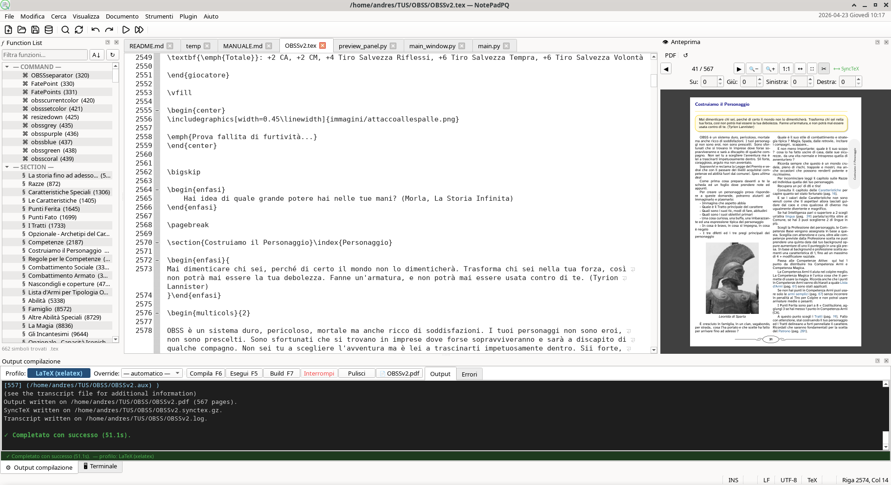
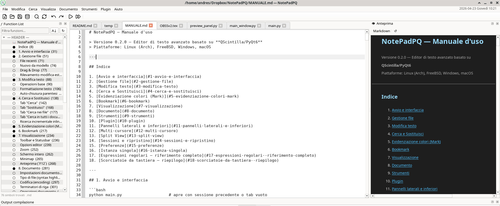

<div align="center">


# NotePadPQ

**Un editor di testo avanzato, moderno e multipiattaforma — costruito con Python e PyQt6**

[](https://python.org)
[](https://riverbankcomputing.com/software/pyqt/)
[](EUPL-1.2%20EN.txt)
[]()
[]()

[🇮🇹 Italiano](#-italiano) · [🇬🇧 English](#-english) · [💖 Dona / Donate](https://www.paypal.com/donate/?business=azanzani%40gmail.com&currency_code=EUR)

</div>

---

# 🇮🇹 Italiano

## Cos'è NotePadPQ?

NotePadPQ è un editor di testo avanzato, libero e open source, pensato per sviluppatori, scrittori tecnici e appassionati. Ispirato alla potenza di Notepad++ ma costruito con tecnologie moderne e multipiattaforma, offre un'interfaccia pulita e un set di funzionalità professionale — senza rinunciare alla leggerezza.

Scritto interamente in **Python 3** con **PyQt6** e **QScintilla**, gira nativamente su Linux, Windows e macOS.

---

## ✨ Funzionalità principali

### 📝 Editor avanzato
- **Syntax highlighting** per oltre 30 linguaggi: Python, JavaScript, TypeScript, C/C++, Java, C#, Bash, SQL, LaTeX, Markdown, HTML, CSS, XML, JSON, YAML, Ruby, Perl, Lua, Pascal, Fortran, Verilog e molti altri.
- **Code folding** — collassa blocchi di codice, classi e funzioni direttamente nel margine.
- **Smart Highlight** — al posizionamento del cursore su una parola, tutte le sue occorrenze vengono evidenziate automaticamente in tutto il documento, in modo fluido e senza rallentare la digitazione.
- **Numeri di riga dinamici** — la larghezza si adatta automaticamente alla dimensione del file.
- **Minimap** laterale per navigazione rapida nei file lunghi.
- **Word wrap** configurabile (`Alt+Z`).
- **Autocompletamento** intelligente: parole nel documento, snippet per linguaggio, dizionari API, supporto LSP.
- **Auto-chiusura** di parentesi, virgolette e tag.
- **Mostra spazi/tab** e caratteri di fine riga.
- **Scorciatoie Markup**: `Ctrl+B` (Grassetto), `Ctrl+I` (Corsivo), `Ctrl+Shift+X` (Barrato) — funzionano in Markdown (`**`, `*`, `~~`) e LaTeX (`\textbf`, `\textit`, `\sout`).

### 🗂️ Gestione tab e split view
- **Tab multipli** con drag & drop, indicatore di modifica, ripristino sessione all'avvio.
- **Split view** orizzontale e verticale (`Ctrl+Alt+2` / `Ctrl+Alt+3`).
- **Clona tab** per lavorare sulla stessa vista in due posizioni.

### 🔍 Ricerca, navigazione e palette comandi
- **Command Palette** (`Ctrl+Shift+P`) — accesso fuzzy-search a tutti i comandi dell'editor.
- **Goto Anything** (`Ctrl+Shift+G`) — navigazione rapida stile Sublime: file aperti, `:riga`, `@simbolo`, `>comando`.
- Trova/Sostituisci con **espressioni regolari** (sintassi Python completa).
- **Cerca in tutti i file** aperti nei tab contemporaneamente.
- **Cerca nei file** su disco con filtro estensione e ricerca ricorsiva.
- **Ricerca incrementale** inline (`Ctrl+Shift+F2`).
- **Vai alla riga** (`Ctrl+G`) e vai alla parentesi corrispondente.
- **Bookmark** su righe: aggiungi (`Ctrl+F2`), naviga (`F2` / `Shift+F2`), rimuovi.
- **Mark con 5 colori** distinti per evidenziare blocchi (`Ctrl+1..5`).

### 🛠️ Strumenti di editing
- **Multi-cursore**: seleziona occorrenza successiva (`Ctrl+D`), tutte le occorrenze (`Ctrl+Shift+D`), aggiungi cursore sopra/sotto (`Ctrl+Alt+↑↓`), inserisci numeri incrementali.
- **Macro**: registra, salva, carica ed esegui N volte.
- **Conversione caso**: MAIUSCOLO, minuscolo, Title Case, Invert Case.
- **Commenta/decommenta** righe (`Ctrl+E`) con rilevamento automatico del linguaggio.
- **Indentazione** smart, tabs↔spazi. **Auto-indenta su incolla**: le righe incollate si riallineano automaticamente al contesto del cursore.
- **Ordina righe** con 5 criteri: alfabetico, inverso, per lunghezza, casuale.
- **Frequenza parole**: analisi delle occorrenze sul documento o sulla selezione.
- **Allineamento tabelle** Markdown/LaTeX, **avvolgimento** in ambienti/tag.
- Color picker, tester regex interattivo, convertitore numerico (dec/hex/bin/oct).

### 🏗️ Pannello Build
- **Profili di build** configurabili per linguaggio (LaTeX, Python, C/C++, Markdown, ecc.).
- **Variabili nei comandi**: `${FILE}` (percorso completo), `${DIR}` (cartella), `${BASENAME}` (nome senza estensione), `${BASEFILE}` (percorso senza estensione), `${FILENAME}`, `${EXT}`, `${LINE}`, `${COL}`. Accettate anche nella forma `$(VAR)`.
- **Output in tempo reale** con lista errori cliccabile — click su un errore salta direttamente alla riga.
- **Rilevamento PDF automatico**: il pulsante anteprima si abilita istantaneamente se è presente un PDF già compilato.
- **Salvataggio automatico** prima della compilazione.

### 👁️ Pannello Anteprima
- **Anteprima live** di Markdown, HTML, reStructuredText, LaTeX (struttura), PDF.
- **Hover preview**: passa il mouse su `\includegraphics{...}`, `` o `` per vedere l'anteprima dell'immagine in un popup — supporta anche i PDF vettoriali.
- **Rendering equazioni** matematiche inline con hover (file LaTeX/Markdown con `$...$`, `$$...$$`, `\[...\]`).
- **SyncTeX**: sincronizzazione bidirezionale cursore editor ↔ posizione nel PDF.
- **Smart Crop**: elimina automaticamente i margini bianchi dei PDF (`✂`).
- Zoom con `Ctrl+Rotella`, navigazione pagine con la rotella.

### 💻 Terminale integrato
- Terminale completo basato su **PTY nativo** nel pannello inferiore (`` Ctrl+` ``).
- Supporta qualsiasi programma interattivo: vim, python REPL, ssh, git, compilatori.
- Nessuna dipendenza esterna — funziona su tutti i sistemi supportati.

### 🔌 Sistema Plugin

| Plugin | Funzione |
|--------|----------|
| **Clipboard History** | Cronologia degli appunti con selezione rapida |
| **Compare & Merge** | Confronto visuale side-by-side tra due file o versioni |
| **Encrypt/Decrypt** | Cifratura/decifratura con AES-256-GCM e ChaCha20-Poly1305 |
| **FTP Browser** | Navigazione e modifica file su server FTP |
| **Git Integration** | Stato repo, commit, diff, branch, PR/MR direttamente dall'editor |
| **Hex Viewer** | Visualizzazione esadecimale dei file binari |

### 🌍 Interfaccia e UI
- **Multilingua**: 5 lingue (Italiano, English, Deutsch, Français, Español) cambiabili a caldo.
- **Temi**: editor di temi integrato con anteprima live; importa/esporta in JSON.
- **Set icone**: Lucide, Material, Sistema — download automatico al primo utilizzo.
- **Orologio live** nella barra dei menu con data e ora localizzate.
- **Controllo ortografico** (`F4`) — spell checker in tempo reale con sottolineatura rossa per IT, EN, DE, FR, ES. Lingua del dizionario selezionabile indipendentemente dalla lingua dell'interfaccia (menu Documento → Lingua dizionario). Click destro su una parola evidenziata per suggerimenti, "Aggiungi al dizionario" o "Ignora tutto".
- **Modalità testo semplice** (`Ctrl+Alt+T`) — disabilita highlighting, brace matching e autocomplete per tab, ripristinabile in un click.
- **Modalità scrittura distraction-free** (`F11`) — schermo intero senza toolbar, statusbar, menubar né pannelli. Ripristino completo all'uscita.
- **Sessioni**: ripristino automatico all'avvio di tutti i file, posizioni cursore e layout pannelli. Auto-save opzionale su perdita del fuoco.
- **Istanza singola**: aprire un file da file manager lo invia alla finestra già aperta.

---

## 🚀 Installazione

### Setup automatico (consigliato)

```bash
git clone https://github.com/buzzqw/NotePadPQ.git
cd NotePadPQ
bash setup.sh
python main.py
```

Lo script rileva il sistema operativo (Arch Linux, apt, dnf, Windows) e installa le dipendenze base in modo nativo.

### Installazione manuale

**Dipendenze base** (sempre richieste):
```bash
pip install PyQt6 PyQt6-QScintilla PyQt6-WebEngine chardet markdown docutils pyspellchecker PyGithub python-gitlab keyring
```

**Dipendenze LaTeX** (opzionali — solo se usi NotePadPQ per scrivere/compilare LaTeX):
```bash
pip install pymupdf matplotlib sympy
# synctex: incluso in TeX Live (pacchetto di sistema)
```

> Se hai già TeX Live installato per compilare LaTeX, hai già tutto il necessario. Le funzionalità LaTeX avanzate (anteprima PDF hover, rendering equazioni, SyncTeX) si attivano automaticamente se le librerie sono presenti.

### Avvio

```bash
python main.py                    # apre con sessione precedente
python main.py file1.py file2.md  # apre i file specificati
```

---

## 🖥️ Screenshot



---

# 🇬🇧 English

## What is NotePadPQ?

NotePadPQ is an advanced, free and open source text editor built with **Python 3**, **PyQt6**, and **QScintilla**. Inspired by Notepad++ but cross-platform and modern, it offers a professional feature set without sacrificing performance.

Runs natively on Linux, Windows, and macOS.

---

## ✨ Key Features

### 📝 Advanced Editor
- **Syntax highlighting** for 30+ languages.
- **Smart Highlight** — all occurrences of the word under the cursor are highlighted automatically, with no typing lag.
- **Dynamic line numbers** — column width adapts to file size automatically.
- **Code folding**, minimap, word wrap, auto-indent, auto-close brackets.
- **Markup shortcuts**: `Ctrl+B`, `Ctrl+I`, `Ctrl+Shift+X` work natively in Markdown and LaTeX.
- **LSP support**, API dictionaries, snippet completion.

### 🔍 Search, Navigation & Command Palette
- **Command Palette** (`Ctrl+Shift+P`) — fuzzy-search over all editor commands.
- **Goto Anything** (`Ctrl+Shift+G`) — Sublime-style quick navigation: open files, `:line`, `@symbol`, `>command`.
- Full regex search (Python syntax) with capture group replacement.
- Search across all open tabs, search in files on disk.
- Inline incremental search (`Ctrl+Shift+F2`), Go to line (`Ctrl+G`).
- **5-color Mark** system for highlighting blocks of text (`Ctrl+1..5`).
- **Bookmarks** with keyboard navigation (`F2` / `Shift+F2`).

### 🏗️ Build Panel
- Configurable build profiles per language (LaTeX, Python, C/C++, Markdown, etc.).
- **Command variables**: `${FILE}` (full path), `${DIR}` (directory), `${BASENAME}` (name without extension), `${BASEFILE}` (full path without extension), `${FILENAME}`, `${EXT}`, `${LINE}`, `${COL}`. Also accepted as `$(VAR)`.
- Real-time output with **clickable error list** — click an error to jump to the line.
- Automatic PDF detection after successful LaTeX compilation.

### 👁️ Preview Panel
- **Live preview** for Markdown, HTML, reStructuredText, LaTeX, PDF.
- **Hover preview**: mouse over image paths to see a floating thumbnail — including vector PDF.
- **Math equation rendering** on hover in LaTeX/Markdown files.
- **SyncTeX**: bidirectional sync between editor cursor and PDF position.
- **Smart Crop**: auto-trim PDF white margins.

### 💻 Integrated Terminal
- Full terminal based on native PTY (`` Ctrl+` ``).
- Supports any interactive program: vim, Python REPL, ssh, compilers.

### 🔌 Plugin System
| Plugin | Function |
|--------|----------|
| **Clipboard History** | Multi-entry clipboard with quick selection |
| **Compare & Merge** | Visual side-by-side file comparison |
| **Encrypt/Decrypt** | AES-256-GCM and ChaCha20-Poly1305 encryption |
| **FTP Browser** | Browse and edit files on FTP servers |
| **Git Integration** | Full Git panel: status, log, diff, branch, PR/MR |
| **Hex Viewer** | Hexadecimal view of binary files |

### 🌍 Interface
- **5 languages**: Italian, English, German, French, Spanish — switch at runtime.
- **Theme editor** with live preview, import/export JSON.
- **Icon sets**: Lucide, Material, System — auto-downloaded on first use.
- **Spell checker** (`F4`) — real-time spell checking with red squiggles for IT, EN, DE, FR, ES. Dictionary language is selectable independently from the UI language (Document → Dictionary Language). Right-click a highlighted word for suggestions, "Add to dictionary", or "Ignore all".
- **Plain text mode** (`Ctrl+Alt+T`) — disable highlighting, brace matching and autocomplete per tab.
- **Distraction-free writing mode** (`F11`) — fullscreen with all UI elements hidden. Fully restored on exit.
- **Session restore**: all files, cursor positions, and panel layout restored at startup. Optional auto-save on focus loss.
- **Single instance**: opening files from the file manager sends them to the running window.

---

## 🚀 Installation

### Automated Setup (recommended)

```bash
git clone https://github.com/buzzqw/NotePadPQ.git
cd NotePadPQ
bash setup.sh
python main.py
```

### Manual Installation

**Core dependencies** (always required):
```bash
pip install PyQt6 PyQt6-QScintilla PyQt6-WebEngine chardet markdown docutils pyspellchecker PyGithub python-gitlab keyring
```

**LaTeX optional** (only if you write/compile LaTeX):
```bash
pip install pymupdf matplotlib sympy
# synctex: included in TeX Live
```

> If you already have TeX Live for LaTeX compilation, all advanced LaTeX features (PDF hover preview, equation rendering, SyncTeX) activate automatically.

---

## 💖 Support the project

NotePadPQ is developed in spare time with passion. If you find it useful, consider a small donation — it helps keep the project alive.

<div align="center">

[](https://www.paypal.com/donate/?business=azanzani%40gmail.com&currency_code=EUR)

</div>

---

<div align="center">

Fatto con ❤️ in Italia · Made with ❤️ in Italy

**[⬆ Torna su / Back to top](#notepadpq)**

</div>
