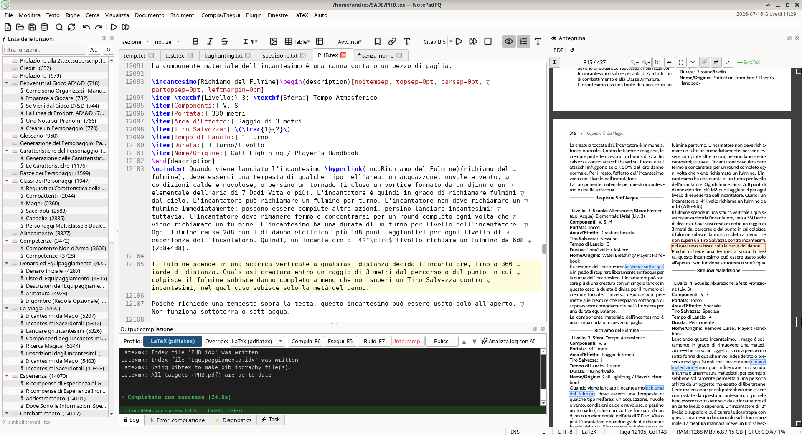

<div align="center">


# NotePadPQ

**One editor. Every language. Every workflow.**

*A modern, cross-platform powerhouse built with Python and PyQt6 — advanced editing, AI assistant, live previews, plugin ecosystem, and much more.*

[](https://python.org)
[](https://riverbankcomputing.com/software/pyqt/)
[](EUPL-1.2%20EN.txt)
[]()
[]()

[🇬🇧 English](#-english) · [🇮🇹 Italiano](#-italiano) · [💖 Dona / Donate](https://www.paypal.com/cgi-bin/webscr?cmd=_donations&business=azanzani@gmail.com&item_name=Support+NotePadPQ+Project)

</div>

---


# 🇬🇧 English

## What is NotePadPQ?

NotePadPQ is an advanced, free and open source text editor built with **Python 3**, **PyQt6**, and **QScintilla**. Inspired by Notepad++ but cross-platform and modern, it offers a professional feature set without sacrificing performance.

Runs natively on Linux, Windows, and FreeBSD.

> 💡 **NotePadPQ is not just a text editor.** It's a complete writing and development environment: from code to LaTeX documents, from Markdown to spreadsheets, from database queries to AI-assisted editing — all in one window.

---

## 🏆 Why NotePadPQ?

| Feature | NotePadPQ | Notepad++ | Sublime Text | VS Code | TeXStudio |
|---|:---:|:---:|:---:|:---:|:---:|
| Truly cross-platform (Linux/Win/BSD) | ✅ | ❌ (Win only) | ✅ | ✅ | ✅ (no BSD) |
| Free & open source | ✅ | ✅ | ❌ | ✅ (core) | ✅ |
| Native LaTeX support + PDF preview | ✅ | ❌ | ❌ | via ext | ✅ |
| Built-in AI assistant (multi-provider) | ✅ | ❌ | ❌ | via ext | ❌ |
| Live Markdown/HTML/PDF preview | ✅ | ❌ | via ext | via ext | PDF only |
| Spreadsheet & rich text editor | ✅ | ❌ | ❌ | ❌ | ❌ |
| Integrated database browser | ✅ | ❌ | ❌ | via ext | ❌ |
| Git integration panel (status/log/diff/branch/PR) | ✅ | ❌ | via ext | ✅ | ❌ |
| Integrated native terminal (PTY) | ✅ | ❌ | via ext | ✅ | ❌ |
| Built-in REST/HTTP client | ✅ | ❌ | via ext | via ext | ❌ |
| Native LSP support (go to def, rename, hover) | ✅ | ❌ | via ext | ✅ | ❌ |
| Recover unsaved buffers on startup | ✅ | ✅ | ✅ | ✅ | ✅ |
| Lightweight (pure Python, no Electron) | ✅ | ✅ | ✅ | ❌ | ✅ (C++/Qt) |

---

## ✨ Key Features

### 📝 Advanced Editor
- **Syntax highlighting** for 40+ languages: native QScintilla lexers (Python, JavaScript, TypeScript, C/C++, Java, C#, Bash, SQL, LaTeX, Markdown, HTML, CSS, XML, JSON, YAML, Ruby, Perl, Lua, Pascal, Fortran, Verilog…) plus Pygments-backed lexers (Go, Rust, PHP, Swift, Kotlin, Scala, Dart, R, TOML, Haskell, Elixir, Julia). **Auto-detect** from extension, filename, or content.
- **Code folding**: collapse code blocks, classes, and functions from the gutter.
- **Smart Highlight**: all occurrences of the word under the cursor are highlighted automatically, with no typing lag.
- **Dynamic line numbers**: column width adapts to file size automatically.
- **Minimap** sidebar for quick navigation in long files.
- **Word wrap** configurable (`Alt+Z`).
- **Smart autocomplete**: words in document, per-language snippets, API dictionaries, LSP support.
- **Auto-close** brackets, quotes, and tags.
- **Show whitespace/tabs** and end-of-line characters.
- **Markup shortcuts**: `Ctrl+B` (Bold), `Ctrl+I` (Italic), `Ctrl+Shift+X` (Strikethrough): work natively in Markdown (`**`, `*`, `~~`) and LaTeX (`\textbf`, `\textit`, `\sout`).
- **Session restore**: unsaved (untitled) editor buffers are automatically recovered at the next startup, so you never lose work in progress.

### 🗂️ Tab Management & Split View
- **Multiple tabs** with drag & drop, modification indicator, session restore at startup.
- **Horizontal and vertical split view** (`Ctrl+Alt+2` / `Ctrl+Alt+3`).
- **Clone tab** to work on the same file at two positions simultaneously.
- **Project Manager** (PSPad-style): group files into named projects saved as `.npqproj` (JSON); toolbar to create groups, add/remove files; double-click to open.

### 🔍 Search, Navigation & Command Palette
- **Command Palette** (`Ctrl+Shift+P`): fuzzy-search over all editor commands.
- **Goto Anything** (`Ctrl+Shift+G`): Sublime-style quick navigation: open files, `:line`, `@symbol`, `>command`.
- Find/Replace with full **regular expressions** (Python syntax) and capture group substitution.
- **Search across all open tabs** simultaneously.
- **Search in files** on disk with extension filter and recursive search.
- **Inline incremental search** (`Ctrl+Shift+F2`).
- **Go to line** (`Ctrl+G`) and jump to matching bracket.
- **Bookmarks**: add (`Ctrl+F2`), navigate (`F2` / `Shift+F2`), remove.
- **5-color Mark** system for highlighting blocks of text (`Ctrl+1..5`).

### 🛠️ Editing Tools
- **Multi-cursor**: select next occurrence (`Ctrl+D`), all occurrences (`Ctrl+Shift+D`), add cursor above/below (`Ctrl+Alt+↑↓`), insert incremental numbers.
- **Macros**: record, save, load, and run N times.
- **Case conversion**: UPPERCASE, lowercase, Title Case, Invert Case.
- **Comment/uncomment** lines (`Ctrl+E`) with automatic language detection.
- **Smart indentation**, tabs↔spaces. **Auto-indent on paste**: pasted lines align automatically to the cursor context.
- **Sort lines** by 5 criteria: alphabetical, reverse, by length, random.
- **Word frequency**: occurrence analysis on the document or selection.
- **Table alignment** for Markdown/LaTeX, **wrap in environment/tag**.
- **Smart LaTeX environment popup**: typing `\begin`/`\end` suggests environments — most-used first for `\begin`, currently-open (innermost first) for `\end` — with a single correctly-paired insertion (no duplicate/mismatched `\end{}`).
- **Color Translator**: pick a color and get HTML/CSS name, `#HEX`, `rgb()`, `rgb(%)`, `hsl()`: insert or copy each format individually.
- **Lorem Ipsum generator**: insert placeholder text with configurable paragraphs, sentences, and separator.
- Interactive regex tester, numeric converter (dec/hex/bin/oct).

### 🏗️ Build Panel
- Configurable **build profiles** per language: 13 built-in (Python, C/C++, LaTeX, Rust, Go, Bash, JavaScript, Make) + unlimited user-defined profiles.
- **Command variables**: `${FILE}` (full path), `${DIR}` (directory), `${BASENAME}` (name without extension), `${BASEFILE}` (full path without extension), `${FILENAME}`, `${EXT}`, `${LINE}`, `${COL}`. Also accepted as `$(VAR)`.
- **Extended task discovery**: auto-detects tasks from Makefile, `package.json`, `pyproject.toml`, `Cargo.toml`, `CMakeLists.txt`, `Gradle` (`build.gradle`), `Docker Compose`, `Dockerfile`, `justfile`.
- **Project-level config** (`.notepadpq-build.json`): share build profiles and tasks with your team via Git.
- **Environment variables** per profile: set custom `PATH`, `VIRTUAL_ENV`, `JAVA_HOME`, etc.
- **Pre/post build hooks**: commands executed before and after the main build (e.g. activate virtualenv, cleanup scripts).
- **Multi-step pipeline**: define sequential build steps (`lint → compile → test → deploy`) with per-step error handling.
- **Interactive (PTY) mode**: run interactive programs (`npm init`, `ssh`, Python REPL) directly from the build panel.
- **Concurrent builds**: run multiple tasks simultaneously; each task tab has its own independent worker.
- **Unified errors view**: merge LSP diagnostics with build errors in a single sortable error list.
- Real-time output with **clickable error list**; click an error to jump directly to the line.
- **Configurable output limit**: prevent memory issues with very large build logs.
- **Automatic PDF detection**: the preview button activates instantly if a compiled PDF is already present.
- **Auto-save** before compilation, **build-on-save** option, Keep `.synctex.gz` option (sync survives aux-file cleanup).

### 👁️ Preview Panel
- **Live preview** for Markdown, HTML, reStructuredText, LaTeX (structure), PDF.
- **Hover preview**: mouse over `\includegraphics{...}`, ``, or `` to see a floating image thumbnail (including vector PDF).
- **Math equation rendering** on hover in LaTeX/Markdown files (`$...$`, `$$...$$`, `\[...\]`). MathJax 3 also renders formulas inside the live Markdown preview (auto-detected, requires internet).
- **Mermaid diagrams**: ` ```mermaid ` blocks in Markdown are automatically rendered as diagrams in the preview panel via Mermaid.js (requires internet; toggle in Preferences → Preview).
- **SyncTeX**: bidirectional sync between editor cursor and PDF position — click in the editor, the PDF jumps to the right page and vice versa.
- **Smart Crop**: auto-trim PDF white margins (`✂`).
- Zoom with `Ctrl+Wheel`, page-by-page navigation with the scroll wheel.
- **Print as PDF** (raw text) and **Export as PDF** (rendered Markdown) — two distinct, clearly labelled actions.

> 💡 The LaTeX workflow in NotePadPQ is unmatched: Function List for document navigation, SyncTeX bidirectional sync, inline equation hover preview, and a full Build Panel — all in one window.

### 💻 Integrated Terminal (plugin)
- Full terminal based on **native PTY** as an independent dock panel (`Ctrl+Alt+T` from the Plugin menu).
- Supports any interactive program: vim, Python REPL, ssh, git, compilers.
- Automatically syncs with the directory of the file open in the editor.
- No external dependencies; works on all supported platforms.

### ⚡ LSP: Language Server Protocol

Native Language Server integration: real-time errors/warnings, hover documentation, go to definition, find references, rename symbol, format document.

Supported servers: `pylsp` (Python), `clangd` (C/C++), `rust-analyzer` (Rust), `gopls` (Go), `typescript-language-server` (TS/JS), `texlab` (LaTeX).

### ⚡ Task Runner

Dedicated tab in the bottom panel with **auto-discovery of project tasks** from 7+ tools: Makefile, `npm scripts`, `pyproject.toml`, Cargo, CMake, Gradle, Docker Compose, and justfile. Interactive (PTY) mode with inline input for interactive programs.

### 🤖 AI Assistant (plugin)

Dock panel with multi-provider AI chat:

| Provider | Special features |
|---|---|
| **Anthropic Claude** | SSE streaming, Extended Thinking (Opus), **dynamic model list** from the API key |
| **OpenAI** | GPT-4o, GPT-4o-mini, o3-mini |
| **Google Gemini** | gemini-2.0-flash, gemini-1.5-pro |
| **Ollama** | Local models auto-detected (no key, no cost) |

Contextual actions (Explain, Refactor, Docstring, Fix bug, Unit tests, Review) directly from right-click in the editor. Bring-your-own-key; each provider has its own configurable API key.

### 🔌 Plugin System

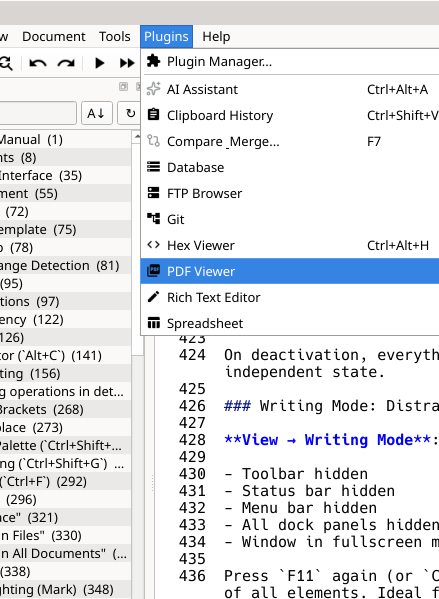

*The Plugins menu displays the full extension ecosystem available*

| Plugin | Function |
|--------|----------|
| **AI Assistant** | Multi-provider AI chat with streaming, Extended Thinking, and dynamic model list |
| **Clipboard History** | Multi-entry clipboard with quick selection |
| **Compare & Merge** | Visual side-by-side file comparison |
| **Database** | Browser and query editor for SQLite, PostgreSQL, MySQL/MariaDB with AI SQL generation |
| **Encrypt/Decrypt** | AES-256-GCM and ChaCha20-Poly1305 encryption |
| **Rich Text Editor** | WYSIWYG editor for .doc, .docx, .odt, .rtf, .html powered by Jodit 4 |
| **Spreadsheet** | Full CSV, TSV, XLSX, XLS, XLSM, ODS editor with sort, filter, formulas, and charts |
| **Code Formatter** | Format Document/Selection for Python (black/ruff), JS/TS/HTML/CSS (prettier), C/C++ (clang-format), Rust (rustfmt), Go (gofmt), JSON/XML (built-in); format-on-save option (`Ctrl+Alt+F`) |
| **FTP Browser** | Browse and edit files on FTP/SFTP servers; **SSH** interactive terminal (paramiko); **SMB** mount helper — detects if share is already mounted, otherwise mounts via `mount.cifs` (Linux), `net use` (Windows), `mount_smbfs` (macOS) with credentials and domain/workgroup |
| **Git Integration** | Full Git panel: status, log, diff, branch, PR/MR |
| **Hex Viewer** | Hexadecimal view of binary files |
| **REST Client** | Integrated HTTP/REST client with 4-step wizard, collection manager, environment variables (dev/staging/prod), Bearer/Basic/API-Key auth, JSON/XML pretty-print (`Ctrl+Alt+R`) |
| **Search PQ** | Dock panel for advanced search and replace: TEXT mode (AND/NOT), regexp, LIKE; result queue, inline filter, context menu (`Ctrl+Alt+F`) |
| **Terminal** | xterm.js+PTY terminal as an independent dock panel, synced with the open file's directory (`Ctrl+Alt+T`) |
| **Web Search** | Web and Wikipedia search on selected text directly from the context menu |

### 🌍 Interface
- **6 languages**: Italian, English, German, French, Spanish, Polish; switch at runtime.
- **17 built-in themes** + theme editor with live preview; import/export JSON.
- **Icon sets**: Lucide, Material, System; auto-downloaded on first use.
- **Live clock** in the menu bar with localized date and time.
- **Spell checker** (`F4`): real-time spell checking with red squiggles for IT, EN, DE, FR, ES. Dictionary language is selectable independently from the UI language (Document → Dictionary Language). Right-click a highlighted word for suggestions, "Add to dictionary", or "Ignore all".
- **Smart typography**: auto-converts `"..."` → `"..."`, `'...'` → `'...'`, `--` → `—`, `...` → `…` (toggle in Document menu or Preferences).
- **Paragraph focus**: dims text outside the current paragraph to aid concentration, adapts to light/dark themes (toggle in Document menu).
- **Toggle task** (`Ctrl+Shift+L`): flips `- [ ]` ↔ `- [x]` on Markdown task list lines.
- **YAML front matter highlight**: the `---` block at the top of Markdown files is highlighted with a subtle background tint.
- **Plain text mode** (`Ctrl+Alt+N`): disable highlighting, brace matching and autocomplete per tab, restorable in one click.
- **Distraction-free writing mode** (`F11`): fullscreen with toolbar, statusbar, menubar, and panels hidden. Fully restored on exit.
- **Session restore**: all files, cursor positions, and panel layout restored at startup. Optional auto-save on focus loss.
- **Single instance**: opening files from the file manager sends them to the running window.

---

## 🚀 Installation

### 📦 AppImage (Linux — no installation required)

The easiest way to run NotePadPQ on Linux is to download the ready-to-run **AppImage** from the [latest release](https://github.com/buzzqw/NotePadPQ/releases/latest):

```bash
# Download (replace x.y.z with the actual version)
wget https://github.com/buzzqw/NotePadPQ/releases/latest/download/NotePadPQ-x.y.z-x86_64.AppImage
chmod +x NotePadPQ-x.y.z-x86_64.AppImage
./NotePadPQ-x.y.z-x86_64.AppImage
```

No Python, no pip, no dependencies — everything is bundled inside the AppImage.

### Automated Setup (recommended)

```bash
git clone https://github.com/buzzqw/NotePadPQ.git
cd NotePadPQ
bash setup.sh
python main.py
```

The script auto-detects the OS (Arch Linux, Debian/Ubuntu, Fedora, Windows, FreeBSD) and installs the base dependencies. It then **interactively asks which optional components to install**:

| # | Component | Packages |
|---|-----------|----------|
| 1 | Advanced LaTeX | `pymupdf`, `matplotlib`, `sympy` |
| 2 | Spreadsheet | `openpyxl`, `xlrd`, `odfpy` |
| 3 | Rich Text (WYSIWYG) | `mammoth`, `htmldocx` |

Enter the numbers of the components you want (e.g. `1 3`), `a` for all, or `n` for none.

> 💡 **Debian/Ubuntu note:** if `pip` is blocked by the system package manager (*externally-managed environment*), the script automatically offers to install the packages inside a dedicated **virtualenv** (`<project>/.venv`) and updates the `.desktop` launcher accordingly.

### Manual Installation

**Core dependencies** (always required):
```bash
pip install PyQt6 PyQt6-QScintilla PyQt6-WebEngine chardet markdown docutils pygments pyspellchecker PyGithub python-gitlab keyring
```

**Rich Text Editor plugin** (optional):
```bash
pip install mammoth htmldocx   # DOCX read/write
# pandoc: system-level install for ODT/RTF
# libreoffice: system-level install for .doc (Word 97-2003)
```

**Database plugin** (optional):
```bash
pip install psycopg2-binary    # PostgreSQL
pip install pymysql            # MySQL/MariaDB
pip install cx_Oracle          # Oracle
# SQLite: included in Python standard library
```

**LaTeX optional** (only if you write/compile LaTeX):
```bash
pip install pymupdf matplotlib sympy
# synctex: included in TeX Live
```

> If you already have TeX Live for LaTeX compilation, all advanced LaTeX features (PDF hover preview, equation rendering, SyncTeX) activate automatically.

**Code Formatter plugin** (optional — install only the formatters you need):
```bash
pip install black ruff             # Python formatters (ruff used as fallback)
npm i -g prettier                  # JS / TS / HTML / CSS
apt install clang-format           # C / C++ (or brew install clang-format)
rustup component add rustfmt       # Rust
# gofmt is included in the Go toolchain
# JSON and XML are formatted using Python stdlib (always available)
```

---

## 🖥️ Screenshots

### 🔬 LaTeX: editor + Function List + live PDF + Build Panel

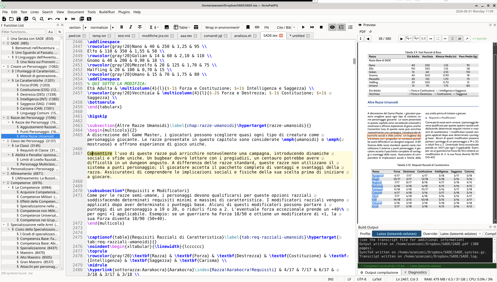

*SADE.tex: a 380-page LaTeX document open in NotePadPQ. Function List on the left with 290 navigable symbols (sections, subsections, commands), editor with syntax highlighting in the centre, live PDF preview on the right with rendered tables. The Build Panel at the bottom shows a completed compilation with SyncTeX written. Bidirectional cursor↔PDF synchronisation is active in real time.*

---

### 📝 LaTeX + Search PQ + integrated Terminal

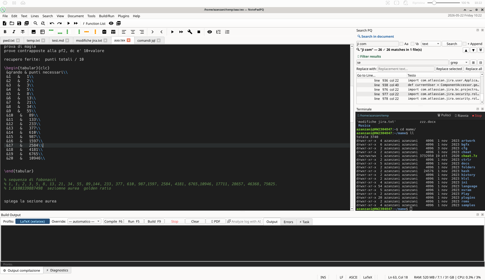

*Complete workflow in a single window: LaTeX editor with syntax highlighting and multi-tab, Search PQ panel on the right with 26 matches found across multiple files, result queue and replace. At the bottom the integrated Terminal (native PTY) with an active shell synced to the project directory and LaTeX Build Panel ready to compile.*

---

### 👁️ Markdown: live preview + Function List + Search PQ


*MANUAL_EN.md open: Function List on the left with 133 navigable symbols (Markdown headings by section), editor with Markdown syntax highlighting in the centre, live HTML preview on the right with rendered headings, links and tables. Search PQ panel shows 26 matches; Terminal at the bottom is synced with the project directory.*

---

### 📄 Standalone PDF viewer

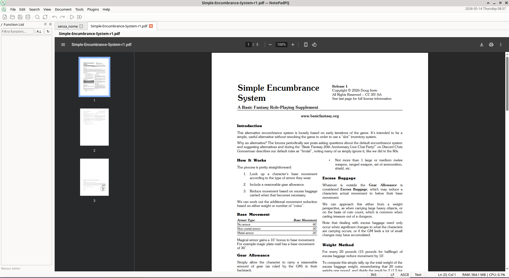

*PDF opened directly as a file in NotePadPQ: page thumbnails in the left sidebar for quick navigation (1/3 pages visible), main view with high-quality rendering at 100%, control bar with zoom, page navigation, download and integrated printing.*

---

### 🏗️ LaTeX: structured Function List + live PDF + SyncTeX

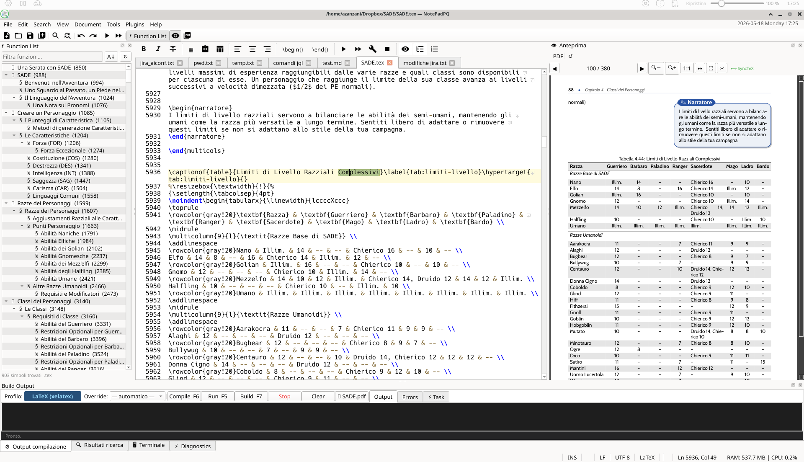

*SADE.tex with over 3,500 lines and 900 symbols in Function List: sections, subsections, §-subsections, commands and references navigable in a hierarchical tree on the left. Editor with LaTeX syntax highlighting in the centre, live PDF preview on the right with complex rendered tables. Build Panel at the bottom with active LaTeX xelatex profile.*

> 💡 The Build Panel supports profiles for LaTeX, Python, C/C++, Markdown and many other languages. Variables like `${FILE}`, `${DIR}`, `${BASENAME}` are automatically expanded in build commands.

---

### 📊 Spreadsheet — multi-sheet XLSX file

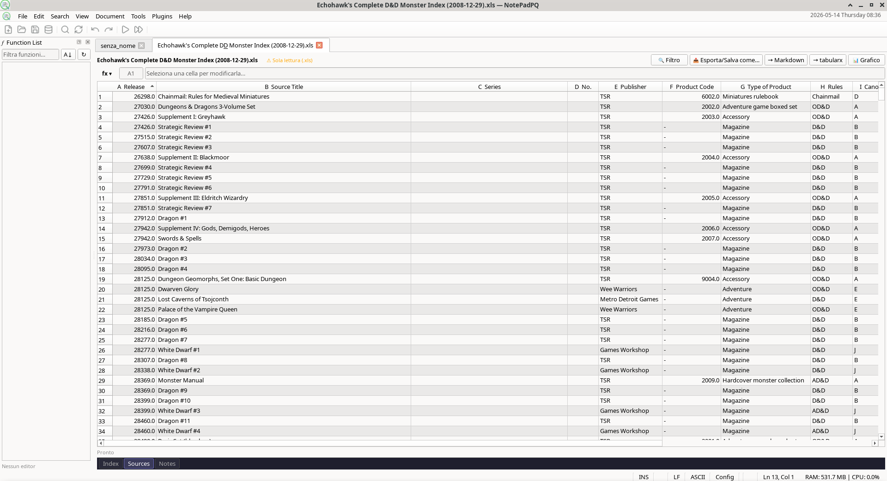

*XLS with 26,000+ records open with multiple tabs (Index, Sources, Notes): sheet navigation, auto-sized columns, pagination. Toolbar with Filter, Export/Save as, Markdown, tabularx and Chart built in.*

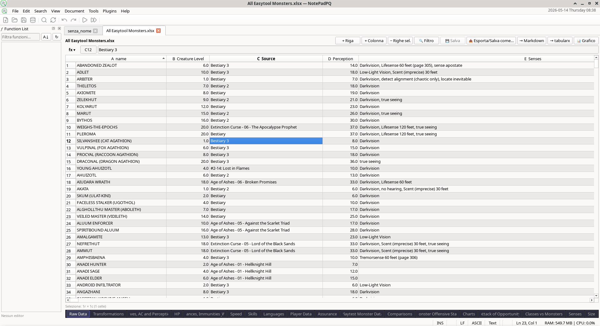

*XLSX with active filter: cell selected with editable content in the formula bar, column sorting, add rows/columns, direct export to Markdown or LaTeX tabularx.*

---

### 📝 WYSIWYG Rich Text Editor — DOCX

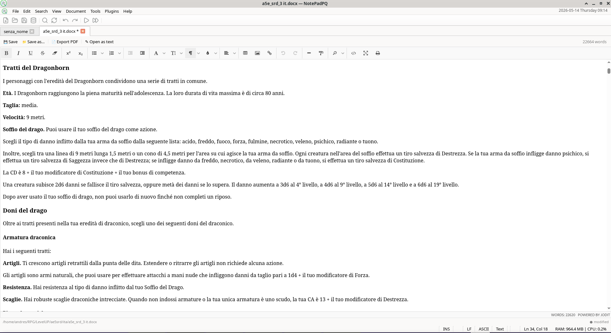

*Italian .docx file with 22,664 words open in WYSIWYG mode with Jodit: bold/italic/strikethrough formatting, lists, headings, tables, links and images. Full toolbar with alignment, text colour, outline, inline code. PDF export and open as source text available.*

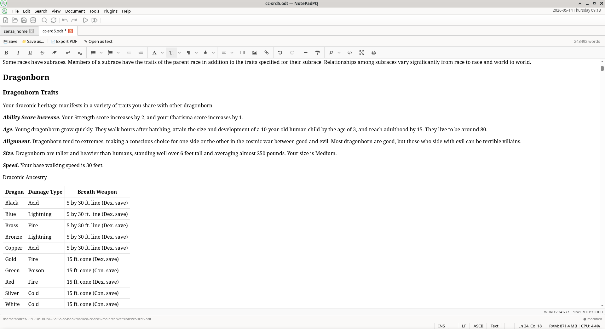

*241,777-word .odt file with rendered tables (Draconic Ancestry), justified text and full formatting. The WYSIWYG editor shows content exactly as it appears when printed.*

---

### 🗄️ Database plugin — SQLite + AI SQL Generation

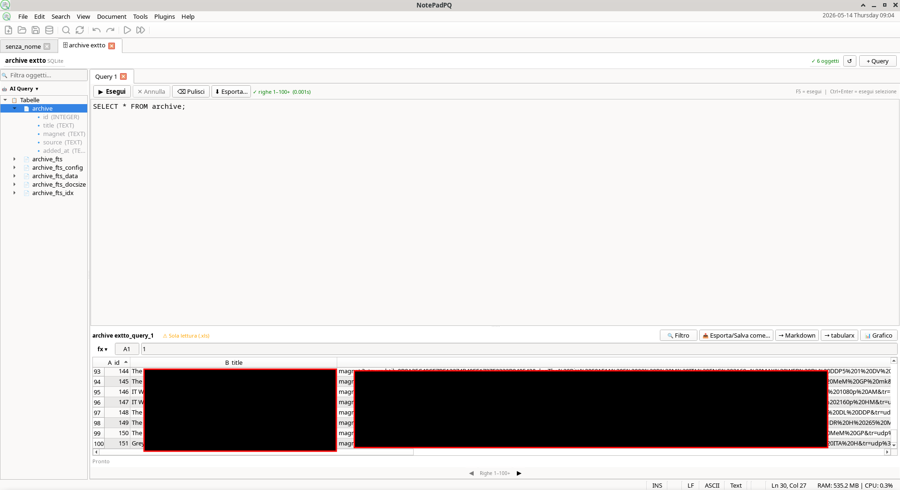

*SQLite database open: schema browser on the left with 6 tables and column structure (id, title, magnet, source, added_at). Query editor in the centre with `SELECT * FROM archive;` returning 100+ rows in 0.001s. The AI Query panel (local Ollama provider, qwen3:4b model) generates SQL from natural language without sending data to remote servers. Results displayed in a spreadsheet grid with filter, export and ◀ ▶ navigation.*

---

### 🔍 Search PQ plugin — advanced multi-file search

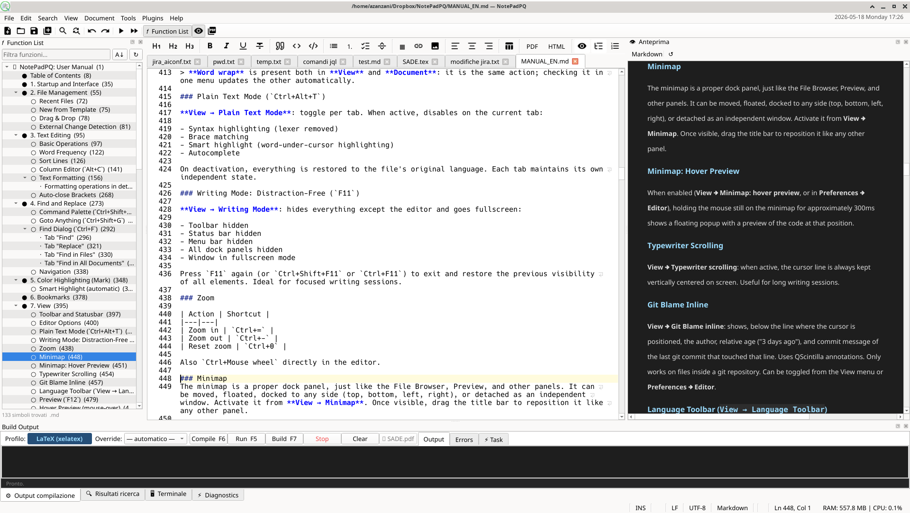

*Search PQ in action on the Markdown user manual: live HTML preview on the right with rendered content (headings, links, formatted tables), Function List on the left with 133 navigable entries, and the Search PQ panel with results organised by file with line number, text and path.*

---

## 🌐 Adding a New Language

NotePadPQ automatically detects available languages by scanning `*.json` files in the `i18n/` folder.
To add a new language (e.g. Polish), just:

1. Copy `i18n/en.json` to `i18n/pl.json`
2. Edit the `meta` field in the new file:
   ```json
   "meta": {
     "language": "pl",
     "name": "Polski",
     "version": "1.0",
     "authors": ["Your name"]
   }
   ```
3. Translate all string values in the file (do not change the JSON keys)
4. Start NotePadPQ: the new language will appear automatically in **Preferences → Interface Language**

No source code changes are needed: the i18n engine discovers languages from the files present in the folder.

## 💖 Support the project

NotePadPQ is developed in spare time with passion. If you find it useful, consider a small donation; it helps keep the project alive.

<div align="center">

[](https://www.paypal.com/cgi-bin/webscr?cmd=_donations&business=azanzani@gmail.com&item_name=Support+NotePadPQ+Project)

</div>

---

<div align="center">

Fatto con ❤️ in Italia · Made with ❤️ in Italy

**[⬆ Torna su / Back to top](#notepadpq)**

</div>

---

# 🇮🇹 Italiano

## Cos'è NotePadPQ?

NotePadPQ è un editor di testo avanzato, libero e open source, pensato per sviluppatori, scrittori tecnici e appassionati. Ispirato alla potenza di Notepad++ ma costruito con tecnologie moderne e multipiattaforma, offre un'interfaccia pulita e un set di funzionalità professionale, senza rinunciare alla leggerezza.

Scritto interamente in **Python 3** con **PyQt6** e **QScintilla**, gira nativamente su Linux, Windows e FreeBSD.

> 💡 **NotePadPQ non è solo un editor di testo.** È un ambiente di lavoro completo: dal codice ai documenti LaTeX, dal Markdown ai fogli di calcolo, dalle query ai database fino alla scrittura assistita dall'AI — tutto in un'unica finestra.

---

## 🏆 Perché NotePadPQ?

| Funzionalità | NotePadPQ | Notepad++ | Sublime Text | VS Code | TeXStudio |
|---|:---:|:---:|:---:|:---:|:---:|
| Veramente multipiattaforma (Linux/Win/BSD) | ✅ | ❌ (solo Win) | ✅ | ✅ | ✅ (no BSD) |
| Libero e open source | ✅ | ✅ | ❌ | ✅ (core) | ✅ |
| Supporto LaTeX nativo + anteprima PDF | ✅ | ❌ | ❌ | via ext | ✅ |
| AI assistant integrato (multi-provider) | ✅ | ❌ | ❌ | via ext | ❌ |
| Anteprima live Markdown/HTML/PDF | ✅ | ❌ | via ext | via ext | solo PDF |
| Editor fogli di calcolo e rich text | ✅ | ❌ | ❌ | ❌ | ❌ |
| Browser database integrato | ✅ | ❌ | ❌ | via ext | ❌ |
| Pannello Git integrato (status/log/diff/branch/PR) | ✅ | ❌ | via ext | ✅ | ❌ |
| Terminale nativo integrato (PTY) | ✅ | ❌ | via ext | ✅ | ❌ |
| Client REST/HTTP integrato | ✅ | ❌ | via ext | via ext | ❌ |
| Supporto LSP nativo (vai a definizione, rename, hover) | ✅ | ❌ | via ext | ✅ | ❌ |
| Recupero buffer non salvati all'avvio | ✅ | ✅ | ✅ | ✅ | ✅ |
| Leggero (Python puro, niente Electron) | ✅ | ✅ | ✅ | ❌ | ✅ (C++/Qt) |

---

## ✨ Funzionalità principali

### 📝 Editor avanzato
- **Syntax highlighting** per oltre 40 linguaggi: lexer nativi QScintilla (Python, JavaScript, TypeScript, C/C++, Java, C#, Bash, SQL, LaTeX, Markdown, HTML, CSS, XML, JSON, YAML, Ruby, Perl, Lua, Pascal, Fortran, Verilog…) più lexer Pygments per Go, Rust, PHP, Swift, Kotlin, Scala, Dart, R, TOML, Haskell, Elixir, Julia. La voce **Automatico** nel menu rileva il linguaggio da estensione, nome file e contenuto.
- **Code folding**: collassa blocchi di codice, classi e funzioni direttamente nel margine.
- **Smart Highlight**: al posizionamento del cursore su una parola, tutte le sue occorrenze vengono evidenziate automaticamente in tutto il documento, in modo fluido e senza rallentare la digitazione.
- **Numeri di riga dinamici**: la larghezza si adatta automaticamente alla dimensione del file.
- **Minimap** laterale per navigazione rapida nei file lunghi.
- **Word wrap** configurabile (`Alt+Z`).
- **Autocompletamento** intelligente: parole nel documento, snippet per linguaggio, dizionari API, supporto LSP.
- **Auto-chiusura** di parentesi, virgolette e tag.
- **Mostra spazi/tab** e caratteri di fine riga.
- **Scorciatoie Markup**: `Ctrl+B` (Grassetto), `Ctrl+I` (Corsivo), `Ctrl+Shift+X` (Barrato): funzionano in Markdown (`**`, `*`, `~~`) e LaTeX (`\textbf`, `\textit`, `\sout`).
- **Recupero buffer non salvati**: i tab aperti non ancora salvati vengono ripristinati automaticamente all'avvio successivo, così non perdi mai il lavoro in corso.

### 🗂️ Gestione tab e split view
- **Tab multipli** con drag & drop, indicatore di modifica, ripristino sessione all'avvio.
- **Split view** orizzontale e verticale (`Ctrl+Alt+2` / `Ctrl+Alt+3`).
- **Clona tab** per lavorare sulla stessa vista in due posizioni.
- **Gestione Progetti** stile PSPad: raggruppa file in progetti salvati come `.npqproj` (JSON); toolbar per creare gruppi, aggiungere/rimuovere file; doppio clic per aprire.

### 🔍 Ricerca, navigazione e palette comandi
- **Command Palette** (`Ctrl+Shift+P`): accesso fuzzy-search a tutti i comandi dell'editor.
- **Goto Anything** (`Ctrl+Shift+G`): navigazione rapida stile Sublime: file aperti, `:riga`, `@simbolo`, `>comando`.
- Trova/Sostituisci con **espressioni regolari** (sintassi Python completa) e sostituzione con gruppi di cattura.
- **Cerca in tutti i file** aperti nei tab contemporaneamente.
- **Cerca e sostituisci nei file** su disco con filtro estensione e ricerca ricorsiva; sostituzione in blocco o una corrispondenza alla volta con conferma interattiva.
- **Ricerca incrementale** inline (`Ctrl+Shift+F2`).
- **Vai alla riga** (`Ctrl+G`) e vai alla parentesi corrispondente.
- **Bookmark** su righe: aggiungi (`Ctrl+F2`), naviga (`F2` / `Shift+F2`), rimuovi.
- **Mark con 5 colori** distinti per evidenziare blocchi (`Ctrl+1..5`).

### 🛠️ Strumenti di editing
- **Multi-cursore**: seleziona occorrenza successiva (`Ctrl+D`), tutte le occorrenze (`Ctrl+Shift+D`), aggiungi cursore sopra/sotto (`Ctrl+Alt+↑↓`), inserisci numeri incrementali.
- **Macro**: registra, salva, carica ed esegui N volte.
- **Conversione caso**: MAIUSCOLO, minuscolo, Title Case, Invert Case.
- **Commenta/decommenta** righe (`Ctrl+E`) con rilevamento automatico del linguaggio.
- **Indentazione** smart, tabs↔spazi. **Auto-indenta su incolla**: le righe incollate si riallineano automaticamente al contesto del cursore.
- **Ordina righe** con 5 criteri: alfabetico, inverso, per lunghezza, casuale.
- **Frequenza parole**: analisi delle occorrenze sul documento o sulla selezione.
- **Allineamento tabelle** Markdown/LaTeX, **avvolgimento** in ambienti/tag.
- **Popup ambienti LaTeX intelligente**: digitando `\begin`/`\end` propone gli ambienti — i più usati per `\begin`, quelli ancora aperti (dal più interno) per `\end` — con inserimento sempre corretto (niente `\end{}` duplicati o spaiati).
- **Traduttore colori**: seleziona un colore e ottieni immediatamente nome HTML/CSS, `#HEX`, `rgb()`, `rgb(%)`, `hsl()`: pulsante inserisci/copia per ogni formato.
- **Generatore Lorem Ipsum**: inserisce testo segnaposto con opzioni (paragrafi, frasi, separatore, primo paragrafo classico).
- Tester regex interattivo, convertitore numerico (dec/hex/bin/oct).

### 🏗️ Pannello Build
- **Profili di build** configurabili per linguaggio: 13 built-in (Python, C/C++, LaTeX, Rust, Go, Bash, JavaScript, Make) + illimitati profili utente.
- **Variabili nei comandi**: `${FILE}` (percorso completo), `${DIR}` (cartella), `${BASENAME}` (nome senza estensione), `${BASEFILE}` (percorso senza estensione), `${FILENAME}`, `${EXT}`, `${LINE}`, `${COL}`. Accettate anche nella forma `$(VAR)`.
- **Task discovery estesa**: rileva automaticamente task da Makefile, `package.json`, `pyproject.toml`, `Cargo.toml`, `CMakeLists.txt`, `Gradle` (`build.gradle`), `Docker Compose`, `Dockerfile`, `justfile`.
- **Configurazione di progetto** (`.notepadpq-build.json`): condividi profili e task build con il team via Git.
- **Variabili d'ambiente** per profilo: imposta `PATH`, `VIRTUAL_ENV`, `JAVA_HOME` personalizzati.
- **Hook pre/post build**: comandi eseguiti prima e dopo la build (es. attivare virtualenv, script di pulizia).
- **Pipeline multi-step**: definisci passi sequenziali (`lint → compile → test → deploy`) con gestione errori per passo.
- **Modalità interattiva (PTY)**: esegui programmi interattivi (`npm init`, `ssh`, REPL Python) direttamente dal pannello build.
- **Build concorrenti**: esegui più task simultaneamente; ogni tab task ha il suo worker indipendente.
- **Errori unificati**: unisci diagnostiche LSP ed errori di build in un'unica lista ordinabile.
- **Output in tempo reale** con lista errori cliccabile; click su un errore salta direttamente alla riga.
- **Limite output configurabile**: previeni problemi di memoria con log di build molto grandi.
- **Rilevamento PDF automatico**: il pulsante anteprima si abilita istantaneamente se è presente un PDF già compilato.
- **Salvataggio automatico** prima della compilazione, opzione **compila al salvataggio**, mantieni `.synctex.gz` (sopravvive alla pulizia file ausiliari).

### 👁️ Pannello Anteprima
- **Anteprima live** di Markdown, HTML, reStructuredText, LaTeX (struttura), PDF.
- **Hover preview**: passa il mouse su `\includegraphics{...}`, `` o `` per vedere l'anteprima dell'immagine in un popup; supporta anche i PDF vettoriali.
- **Rendering equazioni** matematiche inline con hover (file LaTeX/Markdown con `$...$`, `$$...$$`, `\[...\]`). MathJax 3 renderizza anche le formule dentro l'anteprima live Markdown (auto-rilevato, richiede internet).
- **Diagrammi Mermaid**: i blocchi ` ```mermaid ` nel Markdown vengono renderizzati come diagrammi nell'anteprima tramite Mermaid.js (richiede internet; attivabile/disattivabile in Preferenze → Anteprima).
- **SyncTeX**: sincronizzazione bidirezionale cursore editor ↔ posizione nel PDF — clicca nell'editor e il PDF salta alla pagina giusta, e viceversa.
- **Smart Crop**: elimina automaticamente i margini bianchi dei PDF (`✂`).
- Zoom con `Ctrl+Rotella`, navigazione pagina per pagina con la rotella del mouse.
- **Stampa come PDF** (testo grezzo) ed **Esporta come PDF** (Markdown renderizzato) — due azioni distinte e chiaramente etichettate.

> 💡 Il flusso di lavoro LaTeX in NotePadPQ è senza rivali: Function List per navigare il documento, SyncTeX bidirezionale, hover preview delle equazioni, e Build Panel completo — tutto in un'unica finestra.

### 💻 Terminale integrato (plugin)
- Terminale completo basato su **PTY nativo** come pannello dock indipendente (`Ctrl+Alt+T` dal menu Plugin).
- Supporta qualsiasi programma interattivo: vim, python REPL, ssh, git, compilatori.
- Si sincronizza automaticamente con la directory del file aperto nell'editor.
- Nessuna dipendenza esterna; funziona su tutti i sistemi supportati.

### ⚡ LSP: Language Server Protocol

Integrazione nativa con i Language Server: errori/warning in tempo reale, hover con documentazione, vai alla definizione, mostra riferimenti, rinomina simbolo, formatta documento.

Server supportati: `pylsp` (Python), `clangd` (C/C++), `rust-analyzer` (Rust), `gopls` (Go), `typescript-language-server` (TS/JS), `texlab` (LaTeX).

### ⚡ Task Runner

Tab dedicato nel pannello inferiore con **auto-scoperta dei task** da 7+ strumenti: Makefile, `npm scripts`, `pyproject.toml`, Cargo, CMake, Gradle, Docker Compose e justfile. Modalità interattiva (PTY) con input inline per programmi interattivi.

### 🤖 AI Assistant (plugin)

Panel dock con chat AI multi-provider:

| Provider | Funzionalità speciali |
|---|---|
| **Anthropic Claude** | Streaming SSE, Extended Thinking (Opus), **lista modelli dinamica** dalla chiave API |
| **OpenAI** | GPT-4o, GPT-4o-mini, o3-mini |
| **Google Gemini** | gemini-2.0-flash, gemini-1.5-pro |
| **Ollama** | Modelli locali rilevati automaticamente (nessuna chiave, nessun costo) |

Azioni contestuali (Spiega, Refactoring, Docstring, Correggi bug, Test unitari, Review) direttamente da tasto destro nell'editor. Bring-your-own-key; ogni provider ha la propria chiave configurabile.

### 🔌 Sistema Plugin


*Il menu Plugins mostra l'intero ecosistema di estensioni disponibili*

| Plugin | Funzione |
|--------|----------|
| **AI Assistant** | Chat AI multi-provider con streaming, Extended Thinking e lista modelli dinamica |
| **Clipboard History** | Cronologia degli appunti con selezione rapida |
| **Compare & Merge** | Confronto visuale side-by-side tra due file o versioni |
| **Database** | Browser e query editor per SQLite, PostgreSQL, MySQL/MariaDB con AI SQL generation |
| **Editor Rich Text** | Editor WYSIWYG per .doc, .docx, .odt, .rtf, .html basato su Jodit 4 |
| **Encrypt/Decrypt** | Cifratura/decifratura con AES-256-GCM e ChaCha20-Poly1305 |
| **Code Formatter** | Formatta documento/selezione per Python (black/ruff), JS/TS/HTML/CSS (prettier), C/C++ (clang-format), Rust (rustfmt), Go (gofmt), JSON/XML (built-in); opzione format-on-save (`Ctrl+Alt+F`) |
| **Foglio di Calcolo** | Editing completo di CSV, TSV, XLSX, XLS, XLSM, ODS con ordinamento, filtro, formule e grafici |
| **FTP Browser** | Navigazione e modifica file su server FTP/SFTP; terminale **SSH** interattivo (paramiko); helper **SMB** — rileva se la share è già montata, altrimenti la monta via `mount.cifs` (Linux), `net use` (Windows), `mount_smbfs` (macOS) con credenziali, dominio e workgroup |
| **Git Integration** | Stato repo, commit, diff, branch, PR/MR direttamente dall'editor |
| **Hex Viewer** | Visualizzazione esadecimale dei file binari |
| **REST Client** | Client HTTP/REST integrato con wizard guidato 4-step, gestione collection, variabili d'ambiente (dev/staging/prod), auth Bearer/Basic/API-Key, pretty-print JSON/XML (`Ctrl+Alt+R`) |
| **Search PQ** | Pannello dock per ricerca e sostituzione avanzata: modalità TEXT (AND/NOT), regexp, LIKE; coda di risultati, filtro inline, contesto menu (`Ctrl+Alt+F`) |
| **Terminal** | Terminale xterm.js+PTY come pannello dock indipendente, sincronizzato con la directory del file aperto (`Ctrl+Alt+T`) |
| **Web Search** | Ricerca web e Wikipedia sul testo selezionato direttamente dal menu contestuale |

### 🌍 Interfaccia e UI
- **Multilingua**: 6 lingue (Italiano, English, Deutsch, Français, Español, Polski) cambiabili a caldo.
- **Temi**: 17 temi integrati + editor di temi con anteprima live; importa/esporta in JSON.
- **Set icone**: Lucide, Material, Sistema; download automatico al primo utilizzo.
- **Orologio live** nella barra dei menu con data e ora localizzate.
- **Controllo ortografico** (`F4`): spell checker in tempo reale con sottolineatura rossa per IT, EN, DE, FR, ES. Lingua del dizionario selezionabile indipendentemente dalla lingua dell'interfaccia (Documento → Lingua dizionario). Click destro su una parola evidenziata per suggerimenti, "Aggiungi al dizionario" o "Ignora tutto".
- **Tipografia intelligente**: converte automaticamente `"..."` → `"..."`, `'...'` → `'...'`, `--` → `—`, `...` → `…` (attivabile dal menu Documento o Preferenze).
- **Focus paragrafo**: attenua il testo fuori dal paragrafo corrente per favorire la concentrazione, si adatta ai temi chiari/scuri (attivabile dal menu Documento).
- **Segna/desegna attività** (`Ctrl+Shift+L`): alterna `- [ ]` ↔ `- [x]` nelle righe task list Markdown.
- **YAML front matter highlight**: il blocco `---` in cima ai file Markdown viene evidenziato con uno sfondo tenue.
- **Modalità testo semplice** (`Ctrl+Alt+N`): disabilita highlighting, brace matching e autocomplete per tab, ripristinabile in un click.
- **Modalità scrittura distraction-free** (`F11`): schermo intero senza toolbar, statusbar, menubar né pannelli. Ripristino completo all'uscita.
- **Sessioni**: ripristino automatico all'avvio di tutti i file, posizioni cursore e layout pannelli. Auto-save opzionale su perdita del fuoco.
- **Istanza singola**: aprire un file da file manager lo invia alla finestra già aperta.

---

## 🚀 Installazione

### 📦 AppImage (Linux — nessuna installazione richiesta)

Il modo più semplice per usare NotePadPQ su Linux è scaricare l'**AppImage** già pronta dall'[ultima release](https://github.com/buzzqw/NotePadPQ/releases/latest):

```bash
# Scarica (sostituisci x.y.z con la versione attuale)
wget https://github.com/buzzqw/NotePadPQ/releases/latest/download/NotePadPQ-x.y.z-x86_64.AppImage
chmod +x NotePadPQ-x.y.z-x86_64.AppImage
./NotePadPQ-x.y.z-x86_64.AppImage
```

Nessun Python, nessun pip, nessuna dipendenza — tutto è incluso nell'AppImage.

### Setup automatico (consigliato)

```bash
git clone https://github.com/buzzqw/NotePadPQ.git
cd NotePadPQ
bash setup.sh
python main.py
```

Lo script rileva il sistema operativo (Arch Linux, apt, dnf, Windows, FreeBSD) e installa le dipendenze base in modo nativo. Poi **chiede interattivamente quali componenti opzionali installare**:

| # | Componente | Pacchetti |
|---|------------|-----------|
| 1 | LaTeX avanzato | `pymupdf`, `matplotlib`, `sympy` |
| 2 | Foglio di calcolo | `openpyxl`, `xlrd`, `odfpy` |
| 3 | Rich Text (WYSIWYG) | `mammoth`, `htmldocx` |

Inserisci i numeri dei componenti desiderati (es. `1 3`), `a` per tutti, oppure `n` per nessuno.

> 💡 **Nota Debian/Ubuntu:** se `pip` è bloccato dal gestore pacchetti di sistema (*externally-managed environment*), lo script propone automaticamente di installare i pacchetti in un **virtualenv** dedicato (`<progetto>/.venv`) e aggiorna il lanciatore `.desktop` di conseguenza.

### Installazione manuale

**Dipendenze base** (sempre richieste):
```bash
pip install PyQt6 PyQt6-QScintilla PyQt6-WebEngine chardet markdown docutils pygments pyspellchecker PyGithub python-gitlab keyring
```

**Plugin Editor Rich Text** (opzionali):
```bash
pip install mammoth htmldocx   # lettura/scrittura DOCX
# pandoc: installazione di sistema per ODT/RTF
# libreoffice: installazione di sistema per file .doc (Word 97-2003)
```

**Plugin Database** (opzionali):
```bash
pip install psycopg2-binary    # PostgreSQL
pip install pymysql            # MySQL/MariaDB
pip install cx_Oracle          # Oracle
# SQLite: incluso in Python standard library
```

**Dipendenze LaTeX** (opzionali, solo se usi NotePadPQ per scrivere/compilare LaTeX):
```bash
pip install pymupdf matplotlib sympy
# synctex: incluso in TeX Live (pacchetto di sistema)
```

> Se hai già TeX Live installato per compilare LaTeX, hai già tutto il necessario. Le funzionalità LaTeX avanzate (anteprima PDF hover, rendering equazioni, SyncTeX) si attivano automaticamente se le librerie sono presenti.

**Plugin Code Formatter** (opzionale — installa solo i formatter che ti servono):
```bash
pip install black ruff             # Python (ruff usato come fallback)
npm i -g prettier                  # JS / TS / HTML / CSS
apt install clang-format           # C / C++ (oppure brew install clang-format)
rustup component add rustfmt       # Rust
# gofmt è incluso nel toolchain Go
# JSON e XML vengono formattati con la stdlib Python (sempre disponibile)
```

### Avvio

```bash
python main.py                    # apre con sessione precedente
python main.py file1.py file2.md  # apre i file specificati
```

---

## 🖥️ Screenshot

### 🔬 LaTeX: editor + Function List + PDF live + Build Panel


*SADE.tex: un documento LaTeX da 380 pagine aperto in NotePadPQ. Function List a sinistra con 290 simboli navigabili (sezioni, sottosezioni, comandi), editor con syntax highlighting al centro, anteprima PDF live a destra con tabelle renderizzate. In basso il Build Panel mostra la compilazione completata con SyncTeX scritto. La sincronizzazione bidirezionale cursore↔PDF è attiva in tempo reale.*

---

### 📝 LaTeX + Search PQ + Terminal integrato


*Workflow completo in un'unica finestra: editor LaTeX con syntax highlighting e multi-tab, pannello Search PQ a destra con 26 occorrenze trovate su più file, coda risultati e sostituzione. In basso il Terminal integrato (PTY nativo) con shell attiva sincronizzata alla directory del progetto e Build Panel LaTeX pronto alla compilazione.*

---

### 👁️ Markdown: anteprima live + Function List + Search PQ


*Il manuale utente MANUAL_EN.md aperto: a sinistra la Function List con 133 simboli (intestazioni Markdown navigabili per sezione), al centro l'editor con syntax highlighting Markdown, a destra l'anteprima HTML live renderizzata con heading, link e tabelle. Il pannello Search PQ mostra 26 occorrenze con coda risultati; il Terminal in basso è sincronizzato con la directory del progetto.*

---

### 📄 Visualizzatore PDF standalone


*PDF aperto direttamente come file in NotePadPQ: miniature pagine nella barra laterale sinistra per navigazione rapida (1/3 pagine visibili), vista principale con rendering ad alta qualità a 100%, barra di controllo con zoom, navigazione pagina, download e stampa integrati.*

---

### 🏗️ LaTeX: Function List strutturata + PDF live + SyncTeX


*SADE.tex con oltre 3.500 righe e 900 simboli in Function List: sezioni, sottosezioni, §-sottosezioni, comandi e riferimenti navigabili in un albero gerarchico a sinistra. Al centro l'editor con syntax highlighting LaTeX, a destra l'anteprima PDF live con tabelle complesse renderizzate; il simbolo selezionato `Consentire` è evidenziato nell'editor. Build Panel in basso con profilo LaTeX xelatex attivo.*

> 💡 Il Build Panel supporta profili per LaTeX, Python, C/C++, Markdown e molti altri linguaggi. Variabili come `${FILE}`, `${DIR}`, `${BASENAME}` sono espanse automaticamente nei comandi di build.

---

### 📊 Foglio di Calcolo — file XLSX multi-foglio


*XLS da 26000+ record aperto con tab multipli (Index, Sources, Notes): navigazione tra fogli, colonne auto-dimensionate, paginazione. Toolbar con Filtro, Esporta/Salva come, Markdown, tabularx e Grafico integrati.*


*XLSX con filtro attivo: selezione cella con contenuto editabile nella formula bar, ordinamento per colonna, aggiunta righe/colonne, esportazione diretta in Markdown o tabularx LaTeX.*

---

### 📝 Editor Rich Text WYSIWYG — DOCX


*File .docx italiano da 22.664 parole aperto in modalità WYSIWYG con Jodit: formattazione grassetto/corsivo/barrato, elenchi, intestazioni, tabelle, link e immagini. Toolbar completa con allineamento, colore testo, indice, codice inline. Esportazione PDF e apertura come testo sorgente disponibili.*


*File .odt da 241.777 parole con tabelle renderizzate (Draconic Ancestry), testo giustificato e formattazione completa. L'editor WYSIWYG mostra il contenuto esattamente come appare stampato.*

---

### 🗄️ Plugin Database — SQLite + AI SQL Generation


*Database SQLite aperto: browser schema a sinistra con 6 tabelle e struttura colonne (id, title, magnet, source, added_at). Al centro il query editor con `SELECT * FROM archive;` e 100+ righe restituite in 0.001s. Il pannello AI Query (provider Ollama locale, modello qwen3:4b) genera SQL in linguaggio naturale senza inviare dati a server remoti. Risultati visualizzati in griglia spreadsheet con filtro, esportazione e navigazione ◀ ▶.*

---

### 🔍 Plugin Search PQ — ricerca avanzata multi-file


*Search PQ in azione sul documento Markdown del manuale: anteprima HTML live a destra con il contenuto renderizzato (intestazioni, link, tabelle formattate), Function List a sinistra con 133 voci navigabili, pannello Search PQ con risultati organizzati per file con numero di riga, testo e percorso.*

---

## 🌐 Aggiungere una nuova lingua

NotePadPQ rileva automaticamente le lingue disponibili scansionando i file `*.json` nella cartella `i18n/`.
Per aggiungere una nuova lingua (es. polacco) è sufficiente:

1. Copiare `i18n/en.json` in `i18n/pl.json`
2. Modificare il campo `meta` del nuovo file:
   ```json
   "meta": {
     "language": "pl",
     "name": "Polski",
     "version": "1.0",
     "authors": ["Il tuo nome"]
   }
   ```
3. Tradurre tutti i valori stringa nel file (le chiavi JSON non vanno modificate)
4. Avviare NotePadPQ: la nuova lingua comparirà automaticamente nel menu **Impostazioni → Lingua**

Non è necessario modificare il codice sorgente: il sistema i18n scopre le lingue dai file presenti nella cartella.
